## Git的简介及安装

### 环境

- Centos 7.6
- xshell 6
- vmvare 15.5
- git 2.25.1

### 什么是Git

Git是目前世界上最先进的分布式版本控制系统。

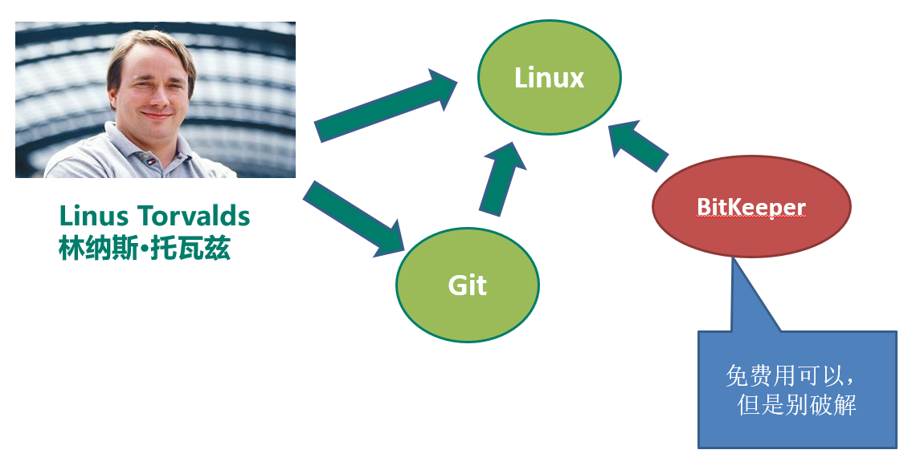

### 版本管理系统能干什么

- 版本还原
- 代码备份
- 冲突解决
- 权限管理
- 协同开发
- 历史追查
- 版本记录
- 分支管理
- 代码审查

### 集中管理型版本管理

经典的集中管理型（CVS、VSS、SVN）

**特点：**

- 实现了大部分开发中对版本管理的需求
- 结构简单，上手容易。

### 分布式版本管理

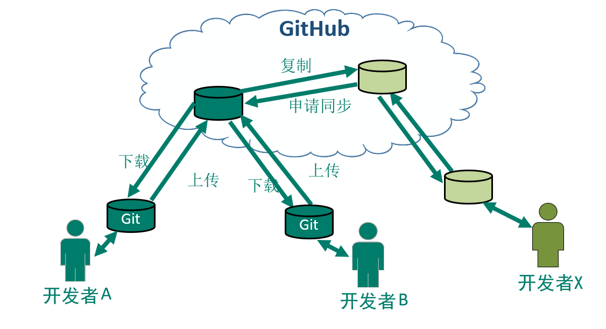

**特点：**

- 容灾能力强
- 本地版本管理
- 异地协作
- 灵活分支

### Git的安装

- 命令行工具：Git for windows

  下载地址：https://git-for-windows.github.io/

- 操作系统中可视化工具：TortoiseGit

  下载地址： https://tortoisegit.org/

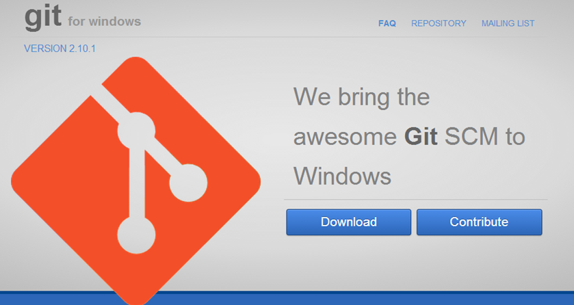

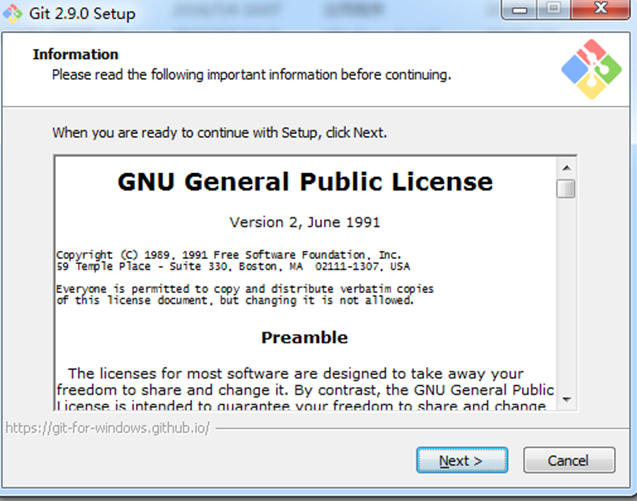

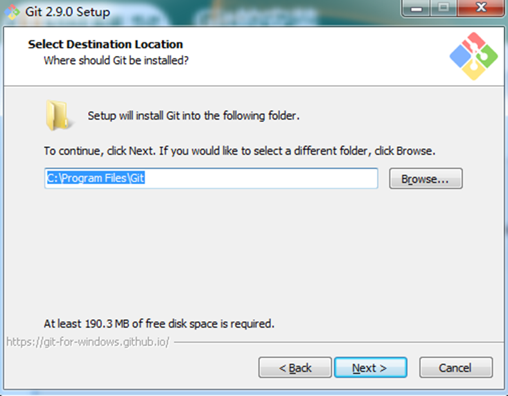

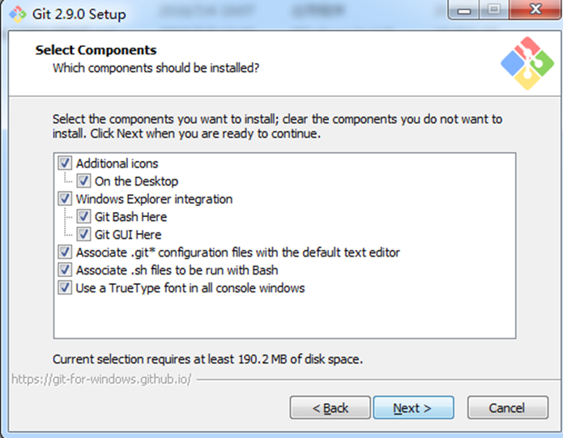

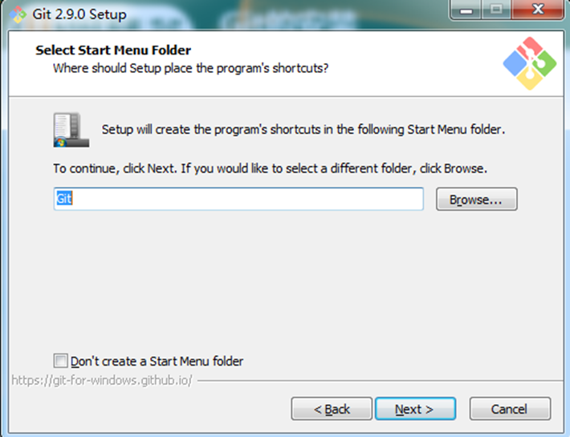

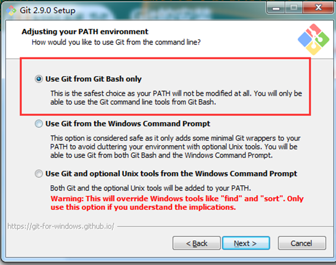

选择Git命令的执行环境，这里推荐选择第一个，就是单独用户Git自己的命令行窗口。

不推荐和windows的命令行窗口混用。

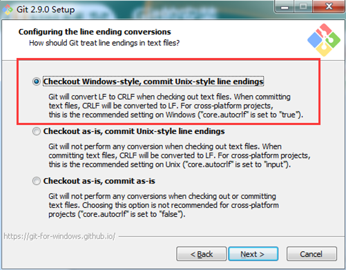

在“Configuring the line ending conversions”选项中，

- 在“Configuring the line ending conversions”选项中，
- 第二个选项：如果是跨平台项目，在Unix系统安装，选择；
- 第三个选项：非跨平台项目，选择。

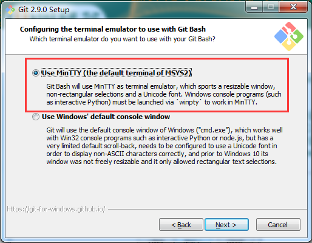

在“terminal emulator”选项中，

- 第一个选项：使用专用的Git窗口（推荐）
- 第二个选项：使用windows的cmd命令行窗口。

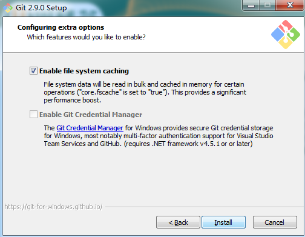

在“Configuring extra”选项中，

- 默认开启文件缓存即可（推荐）

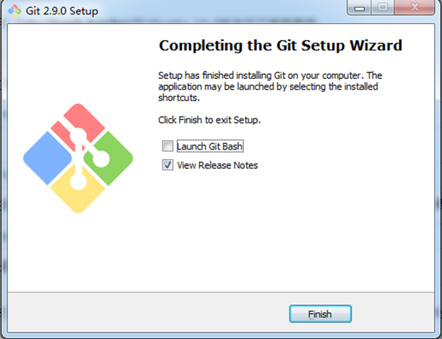

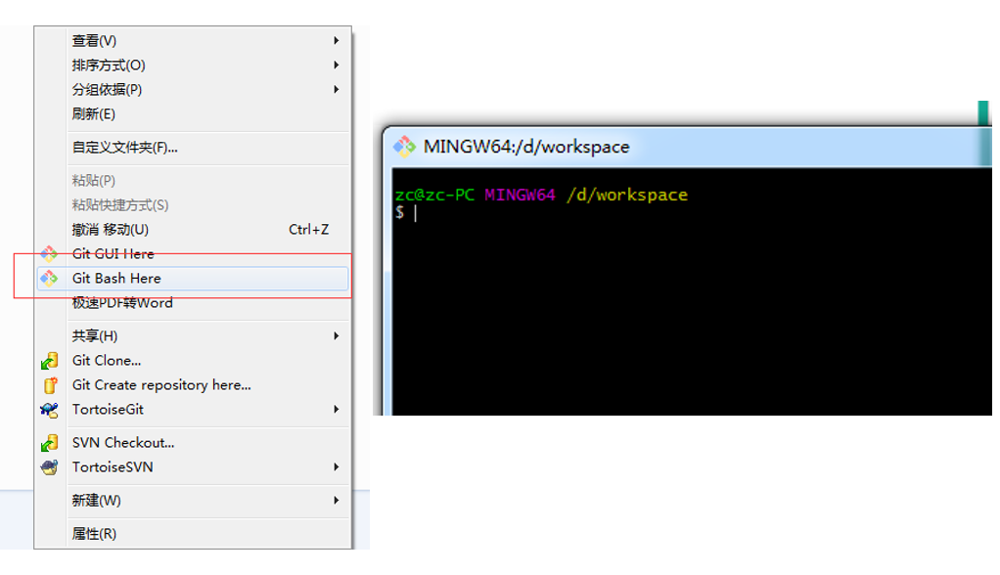

安装完成后，在任意的文件目录下，右键都可以开打Git的命令行窗口。

安装完成后，还需要最后一步设置，在命令行输入如下：

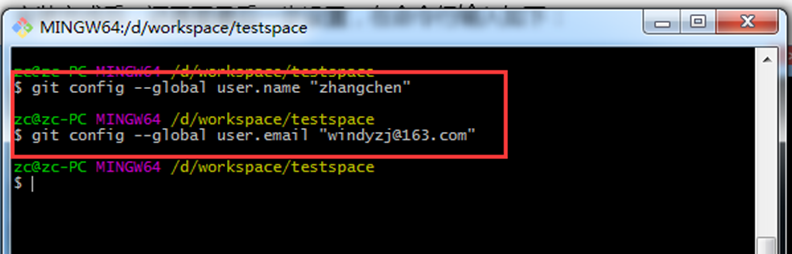

Git是分布式版本控制系统，所以需要填写用户名和邮箱作为一个标识。

C:\Users\admin路径下的.gitconfig文件里面可以看到

--global 表示全局属性，所有的git项目都会共用属性