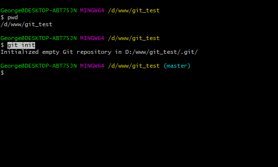
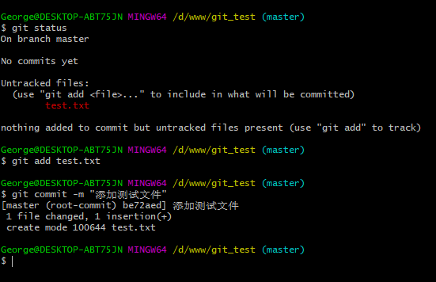
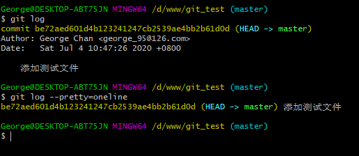
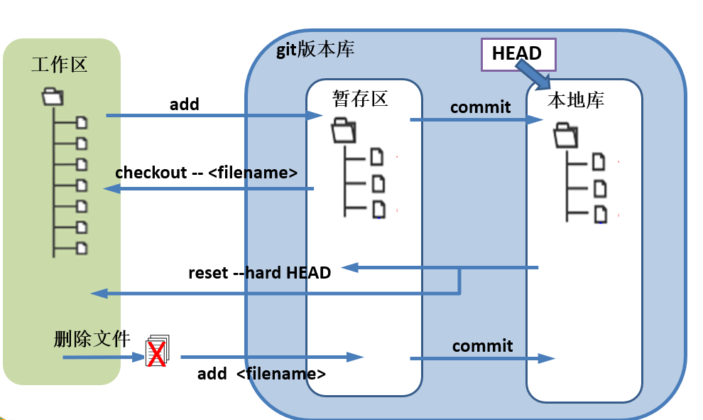
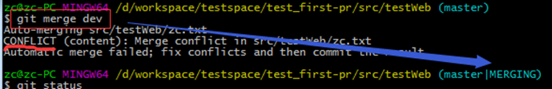
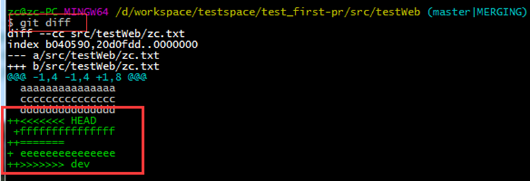
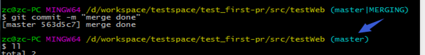

## Git实战操练

### 环境

- Centos 7.6
- xshell 6
- vmvare 15.5
- git 2.25.1


### 创建版本库

在项目文件夹内，执行:  git  init

```shell
git init
```




### 提交文件

- 新建文件后，通过git  status  进行查看文件状态
- 将文件添加到暂存区   git  add  文件名
- 提交文件到本地库  git  commit
- 编写注释 ，完成提交
- 或者也可以git  commit  –m “注释内容”, 直接带注释提交




### 查看文件提交记录

- 执行 git  log  文件名     进行查看历史记录
- git log  --pretty=oneline 文件名      简易信息查看




### 回退历史

- git  reset  --hard HEAD^   回退到上一次提交
- git  reset  --hard HEAD~n  回退n次操作


### 版本穿越

- 进行查看历史记录的版本号，执行 git  reflog  文件名
- 执行 git  reset  --hard  版本号


### 还原文件

- git  checkout -- 文件名  


### 删除某个文件

- 先删除文件
- 再git add 再提交


### 理解工作区+暂存区+本地库

- 工作区(Working Directory):就是你电脑本地硬盘目录
- 本地库(Repository):工作区有个隐藏目录.git，它就是Git的本地版本库
- 暂存区(stage):一般存放在"git目录"下的index文件（.git/index）中，所以我们把暂存区有时也叫作索引（index）。




### 分支


#### 创建分支

- git  branch  <分支名>
- git branch –v  查看分支


#### 切换分支

- git checkout  <分支名>
- git checkout  –b  <分支名>   (创建并切换到该分支)


#### 合并分支

- 先切换到主干   git  checkout  master
- git  merge  <分支名>


#### 冲突

冲突一般指同一个文件同一位置的代码，在两种版本合并时版本管理软件无法判断到底应该保留哪个版本，因此会提示该文件发生冲突，需要程序员来手工判断解决冲突。


#### 合并时冲突

程序合并时发生冲突系统会提示CONFLICT关键字，命令行后缀会进入MERGING状态，表示此时是解决冲突的状态。




#### 解决冲突

- 此时通过git diff 可以找到发生冲突的文件及冲突的内容。



- 然后修改冲突文件的内容，再次git add <file> 和git commit 提交后，后缀MERGING消失，说明冲突解决完成。

