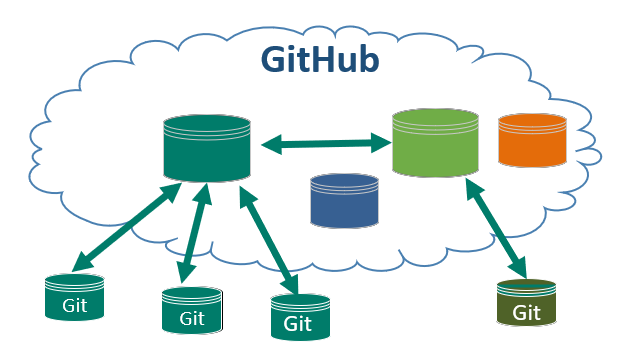
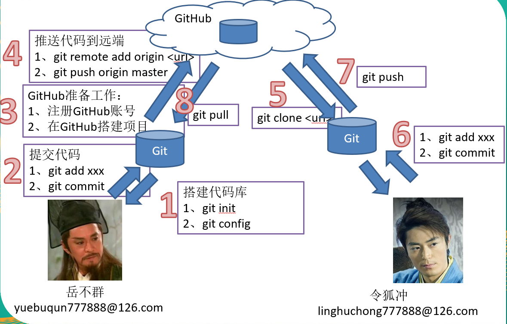
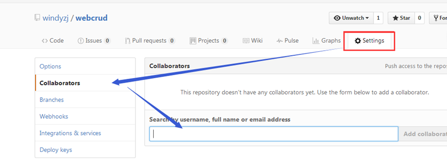
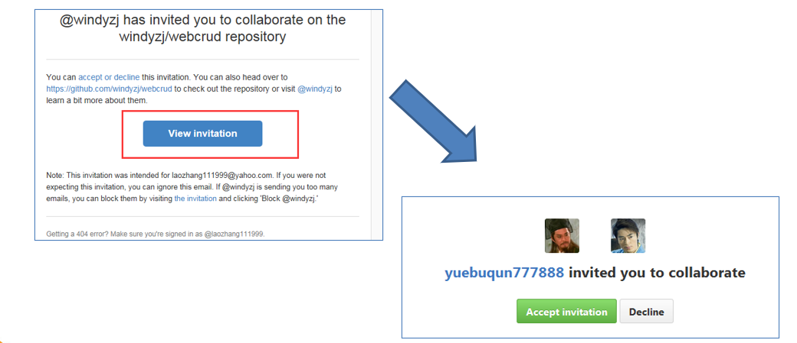
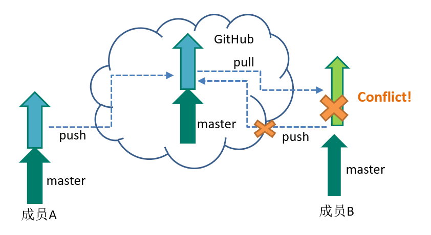
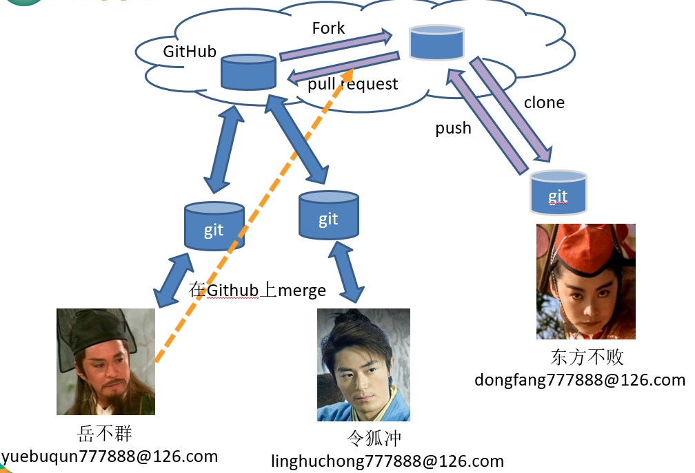

## Git与Github

### 环境

- Centos 7.6
- xshell 6
- vmvare 15.5
- git 2.25.1

### 什么是Github

GitHub是一个Git项目托管网站,主要提供基于Git的版本托管服务

### 开发流程图

### 增加远程地址

- git remote add  <远端代号>   <远端地址> 。
- <远端地址> 默认远程链接的url
- 例： git  remote  add  origin  https://github.com/user111/Helloworld.git

### 推送到远程库

- git  push   <远端代号>    <本地分支名称>。
- <远端代号> 是指远程链接的代号。
- <分支名称>  是指要提交的分支名字，比如master。
- 例： git  push  origin  master

### 从GitHub上克隆一个项目

- git  clone   <远端地址>   <新项目目录名>。
-  <远端地址> 是指远程链接的地址
- <项目目录名>  是指为克隆的项目在本地新建的目录名称，可以不填，默认是GitHub的项目名。
- 命令执行完后，会自动为这个远端地址建一个名为origin的代号。
- 例 git  clone  https://github.com/user111/Helloworld.git   hello_world

### 从GitHub更新项目

- git  pull   <远端代号>   <远端分支名>。
-  <远端代号> 是指远程链接的代号。
- <远端分支名>是指远端的分支名称，如master。 
- 例 git pull origin  master

**以上对项目的操作方式，必须是项目的创建者或者合作伙伴。**

### 添加合作伙伴

- 合作伙伴添加方式如下图: 在项目中点击settings页签，然后点击Collaborators,然后在文本框中搜索合作伙伴的邮箱或者账号。点击添加。
- 添加后GitHub会给合作伙伴对应的邮箱发一封，邀请邮件。

- 合作伙伴会收到邀请邮件。点击View invitation 按钮后会跳转至GitHub页面，让合作伙伴选择，是否接受邀请。
- 点击接受后，则合伙伙伴正式加入项目，获得直接提交代码的权限。 

### 协作冲突

在上传或同步代码时，由于你和他人都改了同一文件的同一位置的代码，版本管理软件无法判断究竟以谁为准，就会报告冲突,需要程序员手工解决。

**解决冲突**

- **修改合并**
- **git add** 
- **git commit**

### Fork与Pull Request

- 非项目团队开发人员想要提交项目代码，需要自己fork一份代码
- 更新提交到自己fork的项目仓库中
- 在github页面点击 `Pull requests`，创建一个pull请求
- 对方可以接受的pull请求或拒绝

