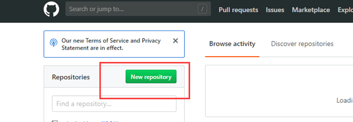
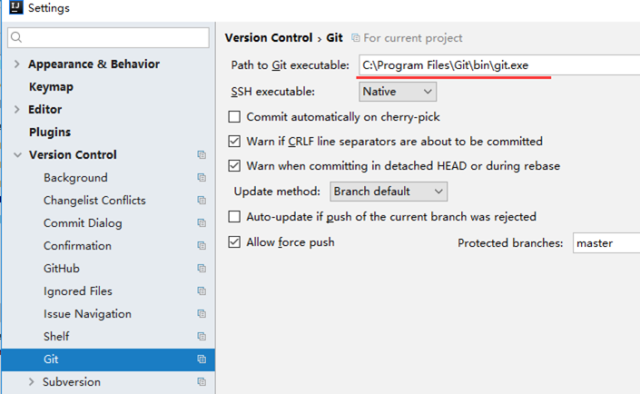

## 在IDEA中操作Git

### 环境

- Centos 7.6
- xshell 6
- vmvare 15.5
- git 2.25.1

###  在GitHub网站上建立仓库

###  在GitHub网站上建立仓库，填写仓库相关信息

### 复制仓库地址的连接

### 在idea中，settings →Version Control →Git选择本地的Git.exe的位置 

### 在idea中，settings →Version Control →GitHub 填写网站登录的用户名密码

### 在idea中，通过版本控制软件创建项目

#### 选择新建项目

#### 有时候会弹出让你提交文件的提示，请选择No ，并勾中不再提示。

#### 增加一个类，然后右键点击add，添加到暂存区

#### 增加一个类，然后右键Commit File.. ,提交到本地库

#### 填写提交信息

#### 然后推送到GitHub

#### 去GitHub上验证是否上传成功

### 另外一个项目成员也下载代码

#### 把clone下来的项目中的文件夹转化为模块

### 解决冲突

 两个开发人员同样一块代码，但是做了不同的修改，其中一个人提交了，另外一个人再提交就会报错。

可以直接选择Merge，idea会帮你把最新代码下载下来，然后跟你本地代码发生冲突

**然后又三个选项:**

- 直接以你本地代码为准覆盖掉别人的
- 直接以别人代码为准覆盖掉你的
- 手工合并(推荐选择)

#### **编辑合并后，再次commit File**   

#### commit File，再次push

