## Git开发流程

### 环境

- Centos 7.6
- xshell 6
- vmvare 15.5
- git 2.25.1

### Git开发流程

简单来说就是，一个项目的成员们在工作中统一使用Git的工作方式。

- 集中式工作流
- GitFlow工作流

### 集中式工作流

- 像SVN一样，集中式工作流以中央仓库作为项目所有修改的单点实体。所有修改都提交到Master这个分支上。
- 这种方式与SVN的主要区别就是开发人员有本地库。Git很多特性并没有用到。 

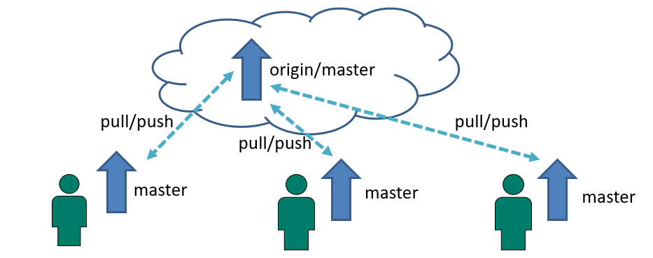

### GitFlow工作流

- Gitflow工作流通过为功能开发、发布准备和维护设立了独立的分支，让发布迭代过程更流畅。严格的分支模型也为大型项目提供了一些非常必要的结构。

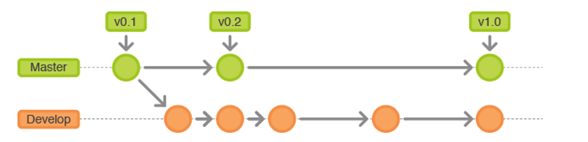

**不同类型的分支应用图例：**

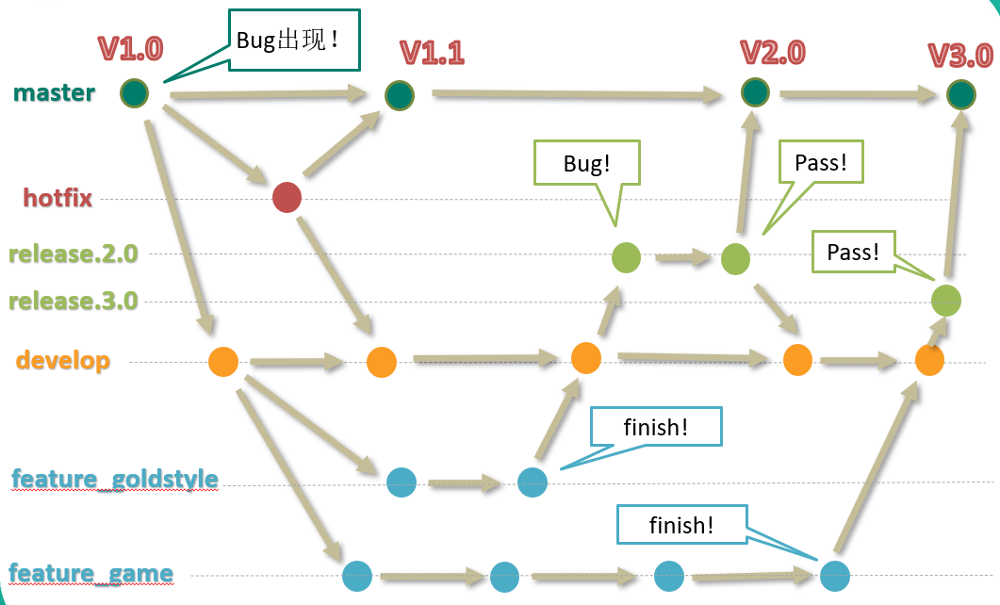

### 分支种类

- 主干分支 `master`

  主要负责管理正在运行的生产环境代码。永远保持与正在运行的生产环境完全一致。

- 开发分支  `develop`

  主要负责管理正在开发过程中的代码。一般情况下应该是最新的代码。 

- bug修理分支  `hotfix`

  主要负责管理生产环境下出现的紧急修复的代码。 从主干分支分出，修理完毕并测试上线后，并回主干分支。并回后，视情况可以删除该分支。

- 发布版本分支  `release`

  较大的版本上线前，会从**开发分支**中分出**发布版本分支**，进行最后阶段的集成测试。该版本上线后，会合并到主干分支。生产环境运行一段阶段较稳定后可以视情况删除。

- 功能分支    `feature`

  为了不影响较短周期的开发工作，一般把中长期开发模块，会从**开发分支**中独立出来。 开发完成后会合并到**开发分支**。

### 分支实战

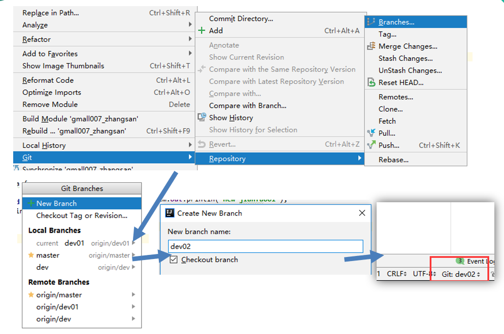

- 在这个分支下增加新代码
- 本地提交，然后push到远端
- 之后可以在github上看到新的分支被上传

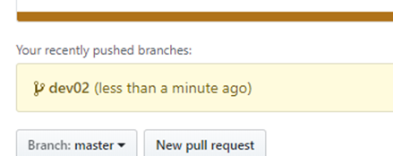

#### 想要查看该分支内容

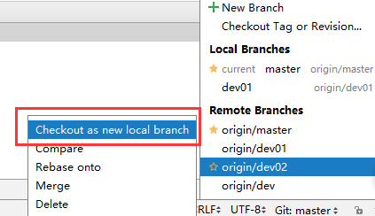

#### 把远程分支下载下来变成本地分支

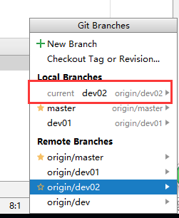

#### 另一个开发人员，想获得分支，把分支fetch下来

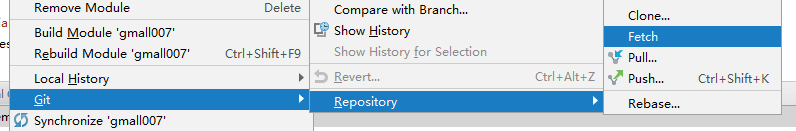

#### 能看到远程分支 

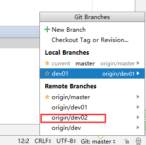

#### 如果该分支内容修改没有问题，可以合并到主干

- **首先切换到主干master**

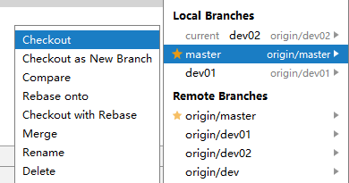

- **在主干master分支上选择要合并的分支进行Merge**

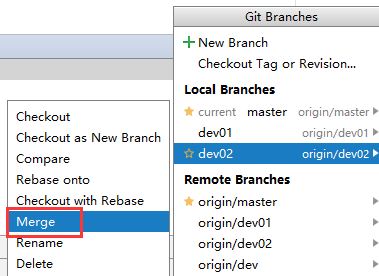

**最后把经过合并的master, push到远端即完成了一个功能在主干上的提交。**