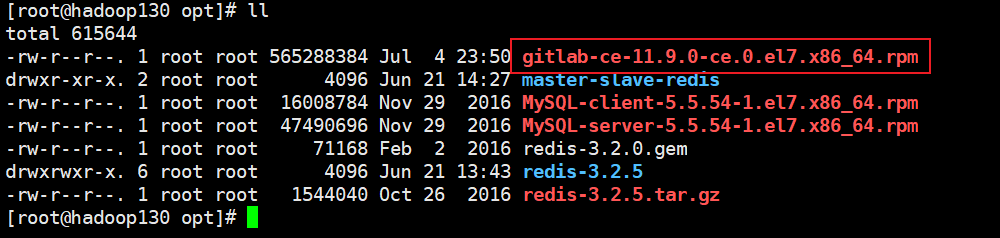
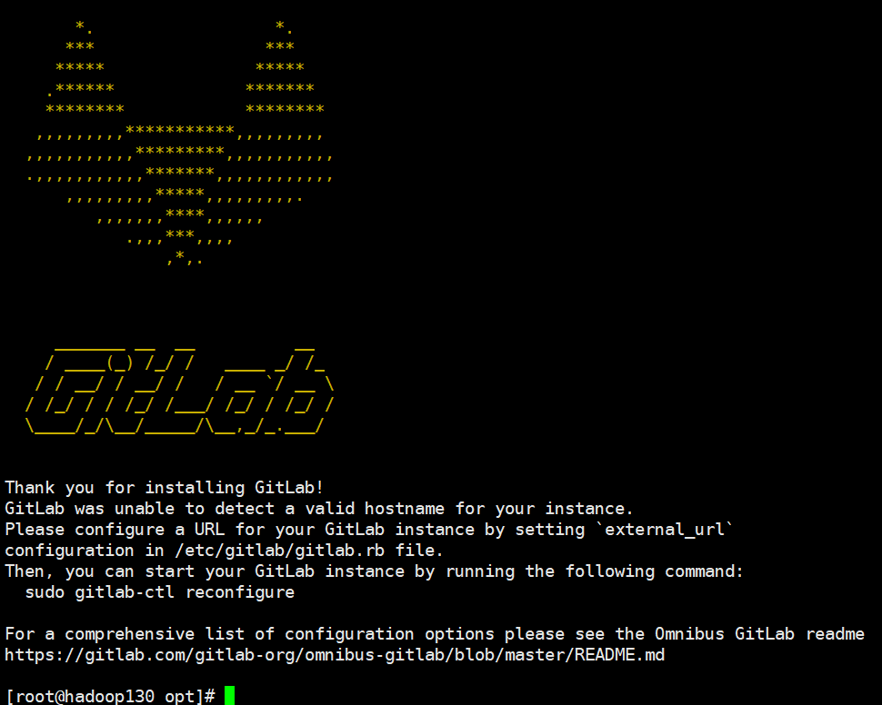
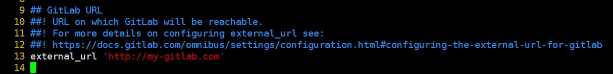
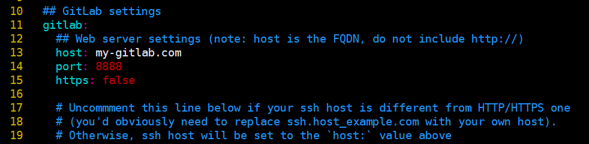
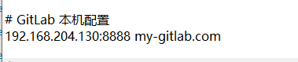
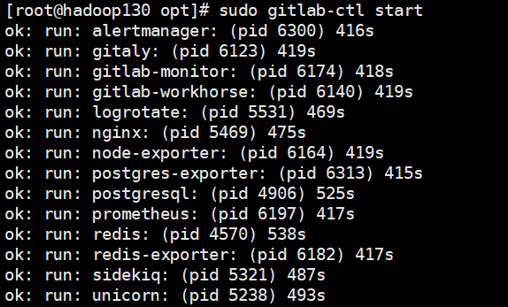
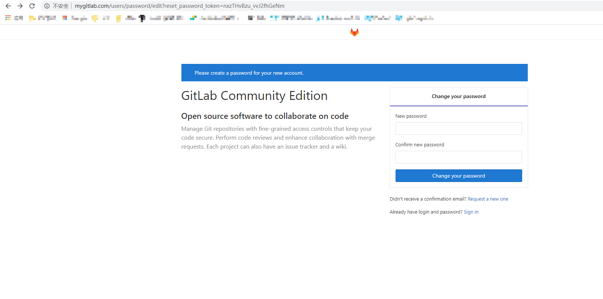
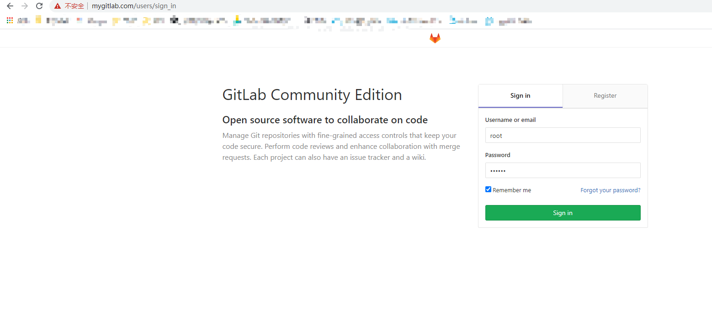
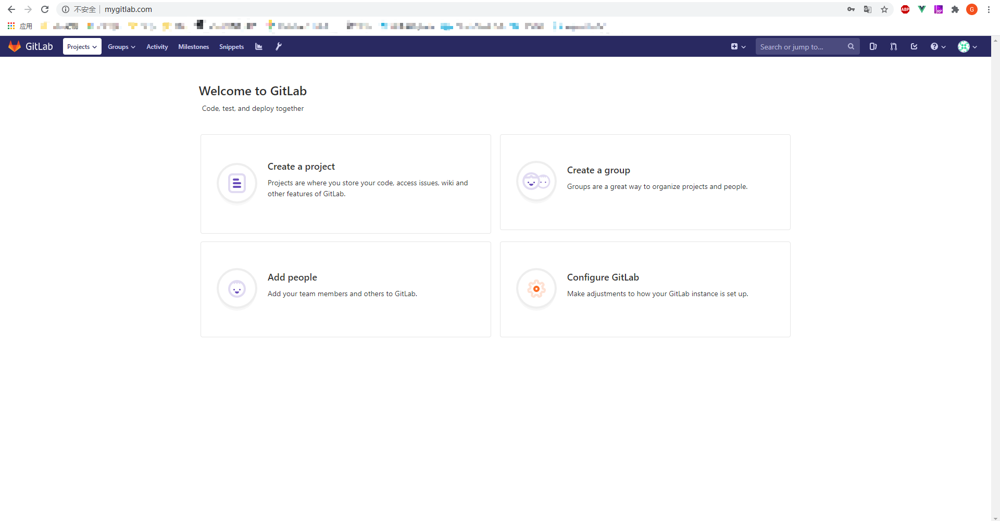
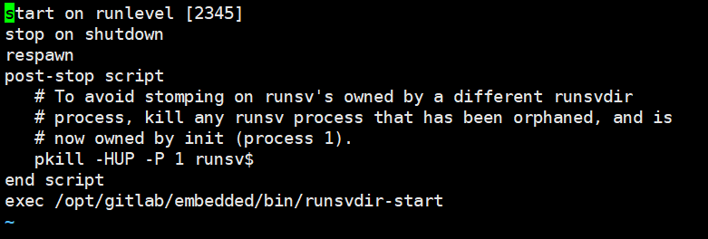

## 搭建GitLab私服

### 环境

- Centos 7.6
- xshell 6
- vmvare 15.5
- git 2.25.1
- gitlab 11.9


- 官网: https://about.gitlab.com/

- 下载网址 : https://about.gitlab.com/install

  建议从国内镜像网站下载：https://mirrors.tuna.tsinghua.edu.cn/gitlab-ce


### 安装 


#### 安装依赖

```shell
sudo yum install -y curl policycoreutils-python openssh-server cronie

# sudo yum -y install lokkit
sudo lokkit -s http -s ssh
```


#### 下载GitLab安装包

```shell
[root@hadoop130 opt]# pwd
/opt

wget https://mirrors.tuna.tsinghua.edu.cn/gitlab-ce/yum/el7/gitlab-ce-11.9.0-ce.0.el7.x86_64.rpm
```




#### 执行安装命令

```shell
sudo rpm -ivh /opt/gitlab-ce-11.9.0-ce.0.el7.x86_64.rpm
```




#### 自动配置

```shell
sudo gitlab-ctl reconfigure
# 这个命令时间比较久
```


### 修改gitlab的url

```shell
# 配置访问url
sudo vim /etc/gitlab/gitlab.rb
```




#### 配置主机与端口

```shell
sudo vim /opt/gitlab/embedded/service/gitlab-rails/config/gitlab.yml
```




#### window中的host映射




### 启动gitlab

- sudo gitlab-ctl start              启动
- sudo gitlab-ctl stop              关闭
- sudo gitlab-ctl  restart         重启
- sudo gitlab-ctl status           查看状态

```shell
sudo gitlab-ctl start
```




### 访问GitLab

#### 设置root密码



#### 登录root用户






### 开机自启动设置

默认为开机启动


```shell
# 关闭开机自启
[root@hadoop130 opt]# systemctl disable gitlab-runsvdir.service

# 启动开机自启
[root@hadoop130 opt]# systemctl enable gitlab-runsvdir.service
```




**Gitlab操作与GitHub基本相同**