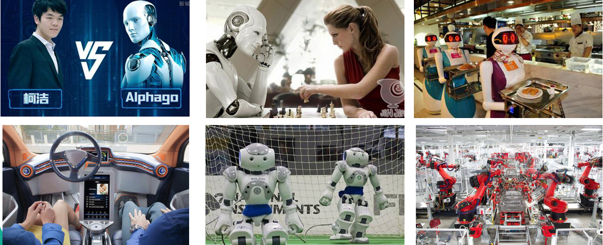
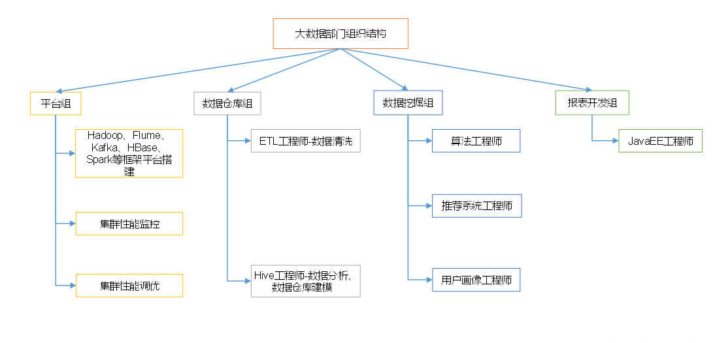

## 大数据概论

### 大数据概念

大数据（big data）：指无法在一定时间范围内用常规软件工具进行捕捉、管理和处理的数据集合，是需要新处理模式才能具有更强的决策力、洞察发现力和流程优化能力的海量、高增长率和多样化的信息资产。

主要解决，海量数据的存储和海量数据的分析计算问题。

### 大数据特点

- **Volume（大量）**

  截至目前，人类生产的所有印刷材料的数据量是200PB，而历史上全人类总共说过的话的数据量大约是5EB。当前，典型个人计算机硬盘的容量为TB量级，而一些大企业的数据量已经接近EB量级。

- **Velocity（高速）**

  这是大数据区分于传统数据挖掘的最显著特征。根据IDC的“数字宇宙”的报告，预计到2020年，全球数据使用量将达到35.2ZB。在如此海量的数据面前，处理数据的效率就是企业的生命。

- **Variety（多样）**

  这种类型的多样性也让数据被分为结构化数据和非结构化数据。相对于以往便于存储的以数据库/文本为主的结构化数据，非结构化数据越来越多，包括网络日志、音频、视频、图片、地理位置信息等，这些多类型的数据对数据的处理能力提出了更高要求。

- **Value（低价值密度）**

  价值密度的高低与数据总量的大小成反比。如何快速对有价值数据“提纯”成为目前大数据背景下待解决的难题。

### 大数据应用场景

- 物流仓储：大数据分析系统助力商家精细化运营、提升销量、节约成本。

- 零售：分析用户消费习惯，为用户购买商品提供方便，从而提升商品销量。

- 旅游：深度结合大数据能力与旅游行业需求，共建旅游产业智慧管理、智慧服务和智慧营销的未来。

- 商品广告推荐：给用户推荐可能喜欢的商品

- 保险：海量数据挖掘及风险预测，助力保险行业精准营销，提升精细化定价能力。

- 金融：多维度体现用户特征，帮助金融机构推荐优质客户，防范欺诈风险。

- 房产：大数据全面助力房地产行业，打造精准投策与营销，选出更合适的地，建造更合适的楼，卖给更合适的人。

- 人工智能

  

### 大数据部门组织结构

大数据部门组织结构，适用于大中型企业

