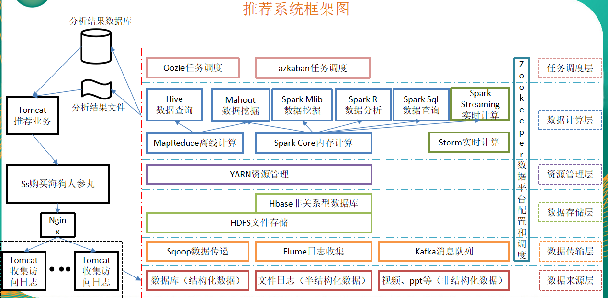

## 从Hadoop框架讨论大数据生态

### 环境

- Centos 7.6
- xshell 6
- vmvare 15.5
- hadoop 2.7.5

### Hadoop是什么

- Hadoop是一个由Apache基金会所开发的分布式系统基础架构
- 主要解决，海量数据的存储和海量数据的分析计算问题。
- 广义上来说，HADOOP通常是指一个更广泛的概念——HADOOP生态圈

### Hadoop发展历史

1）Lucene--Doug Cutting开创的开源软件，用java书写代码，实现与Google类似的全文搜索功能，它提供了全文检索引擎的架构，包括完整的查询引擎和索引引擎 

2）2001年年底成为apache基金会的一个子项目

3）对于大数量的场景，Lucene面对与Google同样的困难

4）学习和模仿Google解决这些问题的办法 ：微型版Nutch

5）可以说Google是hadoop的思想之源(Google在大数据方面的三篇论文)
	GFS --->HDFS
	Map-Reduce --->MR
	BigTable --->Hbase

6）2003-2004年，Google公开了部分GFS和Mapreduce思想的细节，以此为基础Doug Cutting等人用了2年业余时间实现了DFS和Mapreduce机制，使Nutch性能飙升 

7）2005 年Hadoop 作为 Lucene的子项目 Nutch的一部分正式引入Apache基金会。2006 年 3 月份，Map-Reduce和Nutch Distributed File System (NDFS) 分别被纳入称为 Hadoop 的项目中 

8）名字来源于Doug Cutting儿子的玩具大象

9）Hadoop就此诞生并迅速发展，标志这云计算时代来临

### Hadoop三大发行版本：

Apache、Cloudera、Hortonworks

- Apache版本最原始（最基础）的版本，对于入门学习最好。

  - 官网地址：http://hadoop.apache.org/releases.html
  - 下载地址：https://archive.apache.org/dist/hadoop/common/

  

- Cloudera在大型互联网企业中用的较多。

  - 官网地址：https://www.cloudera.com/
  - 下载地址：https://docs.cloudera.com/documentation/enterprise/release-notes/topics/cdh_vd_cdh_download.html

（1）2008年成立的Cloudera是最早将Hadoop商用的公司，为合作伙伴提供Hadoop的商用解决方案，主要是包括支持、咨询服务、培训。

（2）2009年Hadoop的创始人Doug Cutting也加盟Cloudera公司。Cloudera产品主要为CDH，Cloudera Manager，Cloudera Support

（3）CDH是Cloudera的Hadoop发行版，完全开源，比Apache Hadoop在兼容性，安全性，稳定性上有所增强。

（4）Cloudera Manager是集群的软件分发及管理监控平台，可以在几个小时内部署好一个Hadoop集群，并对集群的节点及服务进行实时监控。Cloudera Support即是对Hadoop的技术支持。

（5）Cloudera的标价为每年每个节点4000美元。Cloudera开发并贡献了可实时处理大数据的Impala项目。

- Hortonworks文档较好。
  - 官网地址：https://www.cloudera.com/products.html
  - 下载地址：https://www.cloudera.com/downloads.html

（1）2011年成立的Hortonworks是雅虎与硅谷风投公司Benchmark Capital合资组建。

（2）公司成立之初就吸纳了大约25名至30名专门研究Hadoop的雅虎工程师，上述工程师均在2005年开始协助雅虎开发Hadoop，贡献了Hadoop80%的代码。

（3）雅虎工程副总裁、雅虎Hadoop开发团队负责人Eric Baldeschwieler出任Hortonworks的首席执行官。

（4）Hortonworks的主打产品是Hortonworks Data Platform（HDP），也同样是100%开源的产品，HDP除常见的项目外还包括了Ambari，一款开源的安装和管理系统。

（5）HCatalog，一个元数据管理系统，HCatalog现已集成到Facebook开源的Hive中。Hortonworks的Stinger开创性的极大的优化了Hive项目。Hortonworks为入门提供了一个非常好的，易于使用的沙盒。

（6）Hortonworks开发了很多增强特性并提交至核心主干，这使得Apache Hadoop能够在包括Window Server和Windows Azure在内的microsoft Windows平台上本地运行。定价以集群为基础，每10个节点每年为12500美元。

### Hadoop的优势

- 高可靠性：Hadoop底层维护多个数据副本，所以即使Hadoop某个计算元素或存储出现故障，也不会导致数据的丢失。
- 高扩展性：在集群间分配任务数据，可方便的扩展数以千计的节点。
- 高效性：在MapReduce的思想下，Hadoop是并行工作的，以加快任务处理速度。
- 高容错性：能够自动将失败的任务重新分配。

### Hadoop组成

#### 概述

##### Hadoop1.x组成

- Hadoop HDFS：一个高可靠、高吞吐量的分布式文件系统。

- Hadoop MapReduce：一个分布式的资源调度和离线并行计算框架。

- Hadoop Common：支持其他模块的工具模块（Configuration、RPC、序列化机制、日志操作）。

  

##### Hadoop2.x组成

- Hadoop HDFS：一个高可靠、高吞吐量的分布式文件系统。

- Hadoop MapReduce：一个分布式的离线并行计算框架。

- Hadoop YARN：作业调度与集群资源管理的框架。

- Hadoop Common：支持其他模块的工具模块。

  

#### HDFS架构概述

NameNode（nn）：存储文件的元数据，如文件名，文件目录结构，文件属性（生成时间、副本数、文件权限），以及每个文件的块列表和块所在的DataNode等。

DataNode(dn)：在本地文件系统存储文件块数据，以及块数据的校验和。

Secondary NameNode(2nn)：用来监控HDFS状态的辅助后台程序，每隔一段时间获取HDFS元数据的快照。

#### YARN架构概述

ResourceManager(rm)：处理客户端请求、启动/监控ApplicationMaster、监控NodeManager、资源分配与调度；

NodeManager(nm)：单个节点上的资源管理、处理来自ResourceManager的命令、处理来自ApplicationMaster的命令；

ApplicationMaster：数据切分、为应用程序申请资源，并分配给内部任务、任务监控与容错。

Container：对任务运行环境的抽象，封装了CPU、内存等多维资源以及环境变量、启动命令等任务运行相关的信息。

#### MapReduce架构概述

MapReduce将计算过程分为两个阶段：Map和Reduce。Map阶段并行处理输入数据，Reduce阶段对Map结果进行汇总

### 大数据技术生态体系

- 1）Sqoop：sqoop是一款开源的工具，主要用于在Hadoop(Hive)与传统的数据库(mysql)间进行数据的传递，可以将一个关系型数据库（例如 ： MySQL ,Oracle 等）中的数据导进到Hadoop的HDFS中，也可以将HDFS的数据导进到关系型数据库中。

- 2）Flume：Flume是Cloudera提供的一个高可用的，高可靠的，分布式的海量日志采集、聚合和传输的系统，Flume支持在日志系统中定制各类数据发送方，用于收集数据；同时，Flume提供对数据进行简单处理，并写到各种数据接受方（可定制）的能力。

- 3）Kafka：Kafka是一种高吞吐量的分布式发布订阅消息系统，有如下特性：
  （1）通过O(1)的磁盘数据结构提供消息的持久化，这种结构对于即使数以TB的消息存储也能够保持长时间的稳定性能。
  （2）高吞吐量：即使是非常普通的硬件Kafka也可以支持每秒数百万的消息
  （3）支持通过Kafka服务器和消费机集群来分区消息。
  （4）支持Hadoop并行数据加载。

- 4）Storm：Storm为分布式实时计算提供了一组通用原语，可被用于“流处理”之中，实时处理消息并更新数据库。这是管理队列及工作者集群的另一种方式。 Storm也可被用于“连续计算”（continuous computation），对数据流做连续查询，在计算时就将结果以流的形式输出给用户。

- 5）Spark：Spark是当前最流行的开源大数据内存计算框架。可以基于Hadoop上存储的大数据进行计算。

- 6）Oozie：Oozie是一个管理Hdoop作业（job）的工作流程调度管理系统。Oozie协调作业就是通过时间（频率）和有效数据触发当前的Oozie工作流程。

- 7）Hbase：HBase是一个分布式的、面向列的开源数据库。HBase不同于一般的关系数据库，它是一个适合于非结构化数据存储的数据库。

- 8）Hive：hive是基于Hadoop的一个数据仓库工具，可以将结构化的数据文件映射为一张数据库表，并提供简单的sql查询功能，可以将sql语句转换为MapReduce任务进行运行。 其优点是学习成本低，可以通过类SQL语句快速实现简单的MapReduce统计，不必开发专门的MapReduce应用，十分适合数据仓库的统计分析。

- 9）R语言：R是用于统计分析、绘图的语言和操作环境。R是属于GNU系统的一个自由、免费、源代码开放的软件，它是一个用于统计计算和统计制图的优秀工具。
- 10）Mahout:
  Apache Mahout是个可扩展的机器学习和数据挖掘库，当前Mahout支持主要的4个用例：
  推荐挖掘：搜集用户动作并以此给用户推荐可能喜欢的事物。
  聚集：收集文件并进行相关文件分组。
  分类：从现有的分类文档中学习，寻找文档中的相似特征，并为无标签的文档进行正确的归类。
  频繁项集挖掘：将一组项分组，并识别哪些个别项会经常一起出现。

- 11）ZooKeeper：Zookeeper是Google的Chubby一个开源的实现。它是一个针对大型分布式系统的可靠协调系统，提供的功能包括：配置维护、名字服务、 分布式同步、组服务等。ZooKeeper的目标就是封装好复杂易出错的关键服务，将简单易用的接口和性能高效、功能稳定的系统提供给用户。

### 推荐系统框架图

