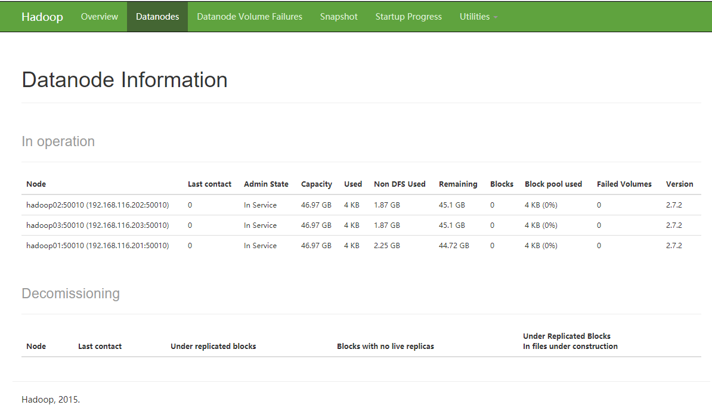
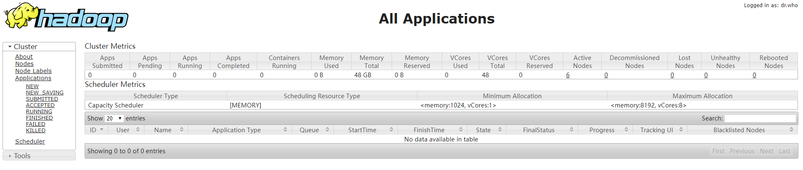
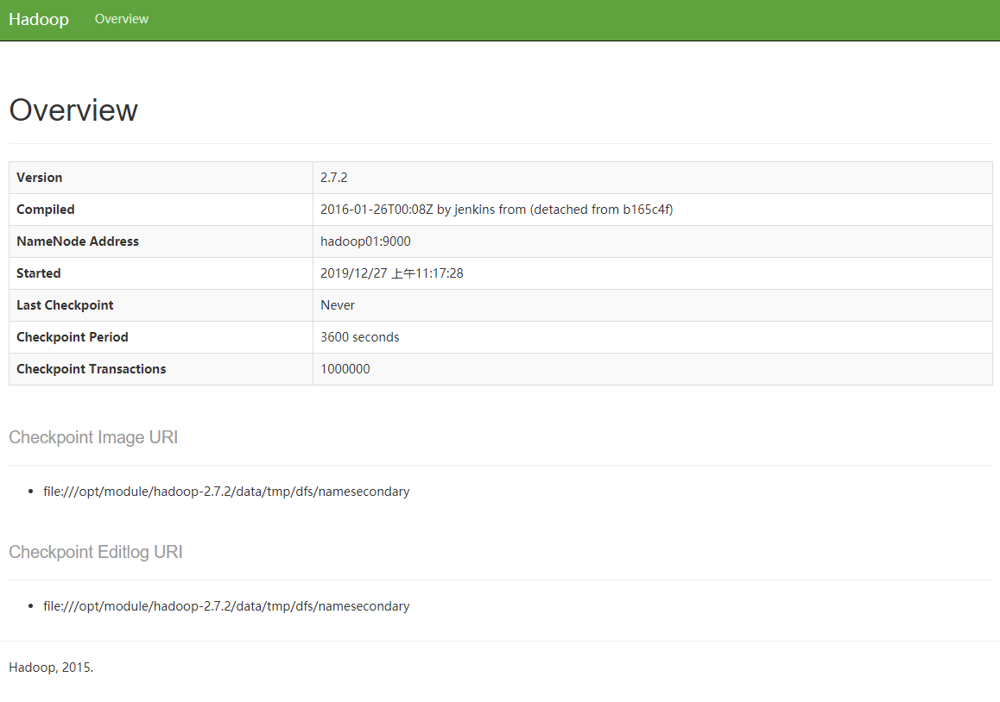
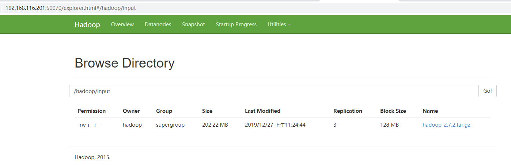
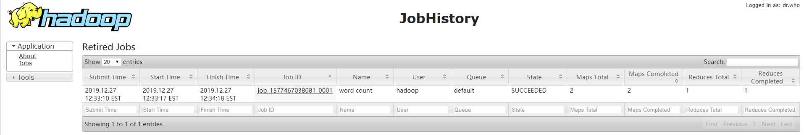
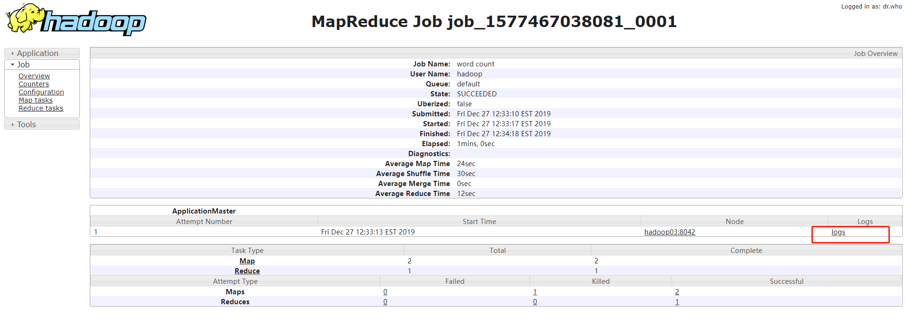

# Hadoop环境搭建之全分布式安装

> 系统：Centos 7.6
>
> JDK版本：1.8.0_231
>
> Hadoop版本：2.7.2

## 环境准备

- 1.准备3台虚拟机并配置静态IP

  |   名称   |       IP        |
  | :------: | :-------------: |
  | hadoop01 | 192.168.116.201 |
  | hadoop02 | 192.168.116.201 |
  | hadoop03 | 192.168.116.203 |

  参考：[Centos7配置静态IP](https://gitee.com/GeorgeChan/BigData-LearningNotes/blob/master/虚拟机/Centos7配置静态IP.md)

- 2.修改 `/etc/hosts`，添加如下内容

  ```shell
  192.168.116.201 hadoop01
  192.168.116.202 hadoop02
192.168.116.203 hadoop03
  ```
  
- 3.设置时间同步

  ```shell
  # 安装ntpdate工具
  sudo yum -y install ntp ntpdate
  # 设置系统时间与网络时间同步
  sudo ntpdate cn.pool.ntp.org
  # 将系统时间写入硬件时间
  sudo hwclock --systohc
  ```

- 4.配置SSH免密登录

  - 1)、生成密钥，并写入到授权文件中 (每个服务器都得执行)

    ```shell
    # 生成密钥（回车三次）
    ssh-keygen -t rsa
    
    # 将公钥写入到授权文件
    cat /home/hadoop/.ssh/id_rsa.pub >> /home/hadoop/.ssh/authorized_keys
    
    # 密钥文件修改权限（*这是linux的安全要求，如果权限不对，自动登录将不会生效）
    sudo chmod 700 /home/hadoop/.ssh/
    sudo chmod 600 /home/hadoop/.ssh/authorized_keys 
    ```

    

  - 2)、使用ssh登录自己一次(每个服务器都得执行)

    ```shell
    # ssh 主机名, 如：
    ssh hadoop01
    ```

  - 3)、hadoop01公钥分发给其它节点，实现hadoop01免密登录其它节点

    **方式一：**
    
    ```shell
    # 将hadoop01的公钥文件，分发到其它两个节点，并写入到授权文件中
    # 文件分发到hadoop02
    scp /home/hadoop/.ssh/id_rsa.pub hadoop02:`pwd`/.ssh/hadoop01.pub
    
    # 文件分发到hadoop03
    scp /home/hadoop/.ssh/id_rsa.pub hadoop03:`pwd`/.ssh/hadoop01.pub
    
    # 写入到授权文件中——hadoop02（连接hadoop02服务器执行）
    cat /home/hadoop/.ssh/hadoop01.pub >> /home/hadoop/.ssh/authorized_keys
    
    # 写入到授权文件中——hadoop03（连接hadoop03服务器执行）
cat /home/hadoop/.ssh/hadoop01.pub >> /home/hadoop/.ssh/authorized_keys
    ```
    
    **方式二：**
    
    ```shell
    # 将hadoop01节点的公钥分发到hadoop02，并写入授权文件
    ssh-copy-id hadoop02
    
    # 将hadoop01节点的公钥分发到hadoop03，并写入授权文件
    ssh-copy-id hadoop03
    ```
    
    *此时使用  hadoop01便可以使用  `ssh 主机名` 免密登录其它两台机器了*
    
    **hadoop02 和 hadoop03 节点也需要将自己的公钥分发到其它节点，实现免密登录**
    
    
    
  - 4)、关闭防火墙
  
    ```shell
    # 关闭防火墙
    sudo systemctl stop firewalld
    # 查看防火墙状态
    sudo firewall-cmd --state
    # 禁止防火墙开机启动
    sudo systemctl disable firewalld
    ```


## 集群规划

由于资源有限，一台宿主机无法同时开启更多的虚拟机，故只能把多个 `hadoop`服务部署在同一个虚拟机中。全分布式需要的服务有：NameNode、SecondaryNameNode、DataNode、NodeManager、ResourceManager。

一个主节点（hadoop01），三个副本节点（hadoop01、hadoop02、hadoop03）

|      |        hadoop01        |             hadoop02             |            hadoop03             |
| :--: | :--------------------: | :------------------------------: | :-----------------------------: |
| hdfs | NameNode<br />DataNode |             DataNode             | SecondaryNameNode<br />DataNode |
| yarn |      NodeManager       | ResourceManager<br />NodeManager |           NodeManager           |


## 开始安装

*这里只需安装`hadoop01`节点，然后通过`xsync`将安装文件和配置分发到其它节点*

- 安装`rsync` 

  ```shell
  sudo yum install rsync
  ```

  *每个节点都得装一次，否则无法执行分发命令*

  **rsync主要用于备份和镜像。具有速度快、避免复制相同内容和支持符号链接的优点**

- 安装JDK

  参考：[Hadoop环境搭建之JDK安装](https://gitee.com/GeorgeChan/BigData-LearningNotes/blob/master/hadoop/02-Hadoop环境搭建-安装JDK.md)

- 安装Hadoop

  进入 `${HADOOP_HOME}/etc/hadoop/ `目录下，修改以下配置：

  - 配置`hadoop-env.sh`

    ```shell
    export JAVA_HOME=/opt/module/jdk1.8.0_231
    ```

  - 配置`mapred-env.sh`

    ```shell
    export JAVA_HOME=/opt/module/jdk1.8.0_231
    ```

  - 配置`yarn-env.sh`

    ```shell
    export JAVA_HOME=/opt/module/jdk1.8.0_231
    ```

  - 配置`core-site.xml`

    ```xml
    <configuration>
        <property>
            <!--指定 namenode 的 hdfs 协议文件系统的通信地址-->
            <name>fs.defaultFS</name>
            <value>hdfs://hadoop01:9000</value>
        </property>
        <property>
            <!--指定 hadoop 存储临时文件的目录-->
            <name>hadoop.tmp.dir</name>
            <value>/opt/module/hadoop-2.7.2/data/tmp</value>
        </property>
    </configuration>
    ```

  - 配置`hdfs-site.xml`

    ```xml
    <configuration>
            <!--由于我们这里搭建是单机版本，所以指定 dfs 的副本系数为 1-->
        <property>
            <name>dfs.replication</name>
            <value>3</value>
        </property>
        <!--secondary namenode 服务器地址和端口-->
        <property>
            <name>dfs.namenode.secondary.http-address</name>
            <value>hadoop03:50090</value>
        </property>
    </configuration>
    ```

  - 配置`yarn-site.xml`

    ```xml
    <configuration>
        <!-- Reducer获取数据的方式 -->
        <property>
             <name>yarn.nodemanager.aux-services</name>
             <value>mapreduce_shuffle</value>
        </property>
        <!-- 指定YARN的ResourceManager的地址 -->
        <property>
             <name>yarn.resourcemanager.hostname</name>
             <value>hadoop02</value>
        </property>
    </configuration>
    ```

  - 配置： (对mapred-site.xml.template重新命名为) `mapred-site.xml`

    ```xml
    <configuration>
        <!-- 指定MR运行在YARN上 -->
        <property>
            <name>mapreduce.framework.name</name>
            <value>yarn</value>
        </property>
    </configuration>
    ```

  - 配置`slaves`

    ```shell
    hadoop01
    hadoop02
    hadoop03
    ```

  - 配置分发( `JDK` 和 `Hadoop` )

    ```shell
    # 分发到hadoop02
    rsync -av /opt/module/ root@hadoop02:/opt/module
    
    # 分发到hadoop03
    rsync -av /opt/module/ root@hadoop03:/opt/module
    ```

  - 分发环境变量

    ```shell
    # 分发到hadoop02
    rsync -av /etc/profile root@hadoop02:/etc/profile
    
    # 分发到hadoop03
    rsync -av /etc/profile root@hadoop03:/etc/profile
    
    # 使环境变量生效，hadoop02和hadoop03都需要执行
    source /etc/profile
    ```

  - 验证分发

    ```shell
    hadoop version
    
    java -version
    ```

## 集群启动

- 格式化集群

  *首次启动需要格式化集群*

  ```shell
  hdfs namenode -format
  ```

- 单节点启动

  ```shell
  # hadoop01启动 NameNode
  [hadoop@hadoop01 ~]$ hadoop-daemon.sh start namenode
  
  # hadoop03启动 SecondaryNameNode
  [hadoop@hadoop03 hadoop-2.7.2]$ hadoop-daemon.sh start secondarynamenode
  
  # hadoop01启动 DataNode
  [hadoop@hadoop01 ~]$ hadoop-daemon.sh start datanode
  
  # hadoop02启动 DataNode
  [hadoop@hadoop02 data]$ hadoop-daemon.sh start datanode
  
  # hadoop03启动 DataNode
  [hadoop@hadoop03 hadoop-2.7.2]$ hadoop-daemon.sh start datanode
  
  # hadoop02启动 ResourceManager
  [hadoop@hadoop02 data]$ yarn-daemon.sh start resourcemanager
  
  # hadoop01启动 NodeManager
  [hadoop@hadoop01 ~]$ yarn-daemon.sh start nodemanager
  
  # hadoop02启动 NodeManager
  [hadoop@hadoop02 data]$ yarn-daemon.sh start nodemanager
  
  # hadoop03启动 NodeManager
  [hadoop@hadoop03 hadoop-2.7.2]$ yarn-daemon.sh start nodemanager
  ```

- 网页访问

  ```shell
  # 查看文件系统(NameNode节点)
  http://192.168.116.201:50070/
  
  # 查看节点集群(ResourceManager)
  http://192.168.116.202:8088/cluster
  
  # 查看SecondaryNameNode
  http://192.168.116.203:50090/status.html
  ```

  





- 批量启动

  ```shell
  # 在ResourceManager所在节点执行（需要配置好免密和分发）
  start-all.sh
  ```

  *相当于在 NameNode节点上执行 `start-dfs.sh` 和在 ResourceManager 节点上执行 `start-yarn.sh`*

- 关闭Hadoop

  ```shell
  # 在ResourceManager所在节点执行
  stop-all.sh
  ```

*相当于在 NameNode节点上执行 `stop-dfs.sh` 和在 ResourceManager 节点上执行 `stop-yarn.sh`*

## 集群测试

- 上传文件到集群中

  ```shell
  # 创建文件夹
    [hadoop@hadoop01 logs]$ hdfs dfs -mkdir -p /hadoop/input
    # 上传文件
    [hadoop@hadoop01 logs]$ hdfs dfs -put /opt/software/hadoop-2.7.2.tar.gz /hadoop/input  
  ```

  

- 查看文件存储位置

  ```shell
  [hadoop@hadoop01 subdir0]$ pwd
  /opt/module/hadoop-2.7.2/data/tmp/dfs/data/current/BP-1072896292-192.168.116.201-1577414761683/current/finalized/subdir0/subdir0
  ```

- 文件下载

  ```shell
  hdfs dfs -get /hadoop/input/hadoop-2.7.2.tar.gz /opt/software/
  ```


## 配置历史服务器

为了便于查看程序的历史运行情况，需要配置一下历史服务器。

- 配置mapred-site.xml，添加如下内容

  ```shell
  [hadoop@hadoop01 hadoop]$ vim mapred-site.xml
  ```

  ```xml
  <!-- 历史服务器端地址 -->
  <property>
  	<name>mapreduce.jobhistory.address</name>
  	<value>hadoop01:10020</value>
  </property>
  <!-- 历史服务器web端地址 -->
  <property>
  	<name>mapreduce.jobhistory.webapp.address</name>
  	<value>hadoop01:19888</value>
  </property>
  ```

- 配置分发

  ```shell
  rsync -av /opt/module/hadoop-2.7.2/etc/hadoop/mapred-site.xml root@hadoop02:/opt/module/hadoop-2.7.2/etc/hadoop/mapred-site.xml
  
  rsync -av /opt/module/hadoop-2.7.2/etc/hadoop/mapred-site.xml root@hadoop03:/opt/module/hadoop-2.7.2/etc/hadoop/mapred-site.xml
  ```

- 启动历史服务器

  ```shell
  mr-jobhistory-daemon.sh start historyserver
  ```

- 查看历史服务器是否启动

  ```shell
  jps
  ```

- 测试执行job

  - 新建 `wc.input`

    ```shell
    # 文件路径
    /opt/module/hadoop-2.7.2/input
    # 内容如下
    hadoop yarn
    hadoop mapreduce
    george
    george
    ```

    保存

  - 上传到分布式文件系统

    ```shell
    # 在hdfs上新建文件夹
    hdfs dfs -mkdir -p /hadoop/input
    # 文件上传，当前命令所在路径   /opt/module/hadoop-2.7.2
    hdfs dfs -put input/wc.input /hadoop/input/wc.input
    # 第一个路径是服务器文件路径（相对路径）
    # 第二个路径是hdfs文件所在路径（绝对路径）
    ```

  - 执行单词统计程序

    ```shell
    hadoop jar share/hadoop/mapreduce/hadoop-mapreduce-examples-2.7.2.jar wordcount /hadoop/input /hadoop/output
    ```

    

- 查看`JobHistory`

  ```
  http://hadoop01:19888/jobhistory
  ```

  

## 配置日志的聚集

日志聚集概念：应用运行完成以后，将程序运行日志信息上传到HDFS系统上。

日志聚集功能好处：可以方便的查看到程序运行详情，方便开发调试。

- 配置yarn-site.xml,添加如下内容

```shell
<!-- 日志聚集功能使能 -->
<property>
	<name>yarn.log-aggregation-enable</name>
	<value>true</value>
</property>
<!-- 日志保留时间设置7天 -->
<property>
	<name>yarn.log-aggregation.retain-seconds</name>
	<value>604800</value>
</property>
```

- 配置分发

```shell
rsync -av /opt/module/hadoop-2.7.2/etc/hadoop/yarn-site.xml root@hadoop02:/opt/module/hadoop-2.7.2/etc/hadoop/yarn-site.xml

rsync -av /opt/module/hadoop-2.7.2/etc/hadoop/yarn-site.xml root@hadoop03:/opt/module/hadoop-2.7.2/etc/hadoop/yarn-site.xml
```

**注意：开启日志聚集功能，需要重新启动`NodeManager` 、`ResourceManager`和`HistoryManager`。**

- 运行单词统计job，同上

- 查看日志

  ```
  http://192.168.116.201:19888/jobhistory
  ```

  

**至此，Hadoop集群搭建完成**

**注意点：**

​	1、`/etc/hosts` 每个节点都得配置

​	2、关闭防火墙

​	3、配置各个节点直接免密登录（重要）

​	4、各节点时间要同步

​	5、不要反复的格式化节点，重新格式化需要把配置的临时文件夹的内容删掉