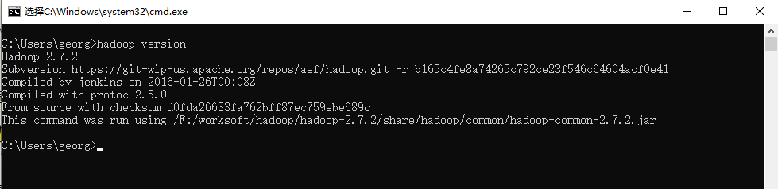

# Windows10搭建Hadoop开发环境

> 系统：Windows10
>
> JDK已安装： 1.8.0_231

### 安装Hadoop并配置环境变量

- **下载并解压**

  在[官网](https://archive.apache.org/)下载与服务器版本一致的Hadoop包，我这里是 [2.7.2版本](https://archive.apache.org/dist/hadoop/common/hadoop-2.7.2/)，并解压到不含有中文的目录中去

- **配置windows环境变量**

  - 配置 `HADOOP_HOME`

    

  - 配置 `Path`

    

    一路点击 `确定` 保存

- **验证**

  打开 `cmd` 输入

  ```shell
  hadoop version
  ```

  


​		*至此，Hadoop环境变量配置完成。*

​		但是仅仅这样依然无法在Windows上进行开发，因为Windows和Linux的文件系统差异较大，要在windows上进行开发调试，还需要一个工具 `winutils.exe`

## 安装winutils.exe

- 下载

  从[github](https://github.com/steveloughran/winutils)上下载相应的  `bin` 包 ，理论上hadoop是什么版本就选择相应的 `bin`, 如果没有完全一致的版本，大版本应该相同,我的hadoop是  2.7.2 版本，选择的 `bin` 是2.7.1的。

- 解压

  将下载的 `bin`文件夹覆盖本地 hadoop 的 `bin`文件夹，主要得包含 `winutils.exe` 和 `hadoop.dll` 这两个文件，然后另外复制一份`hadoop.dll` 放在 `C:\Windows\System32`目录下

- 重启电脑


**Hadoop开发环境搭建完成**