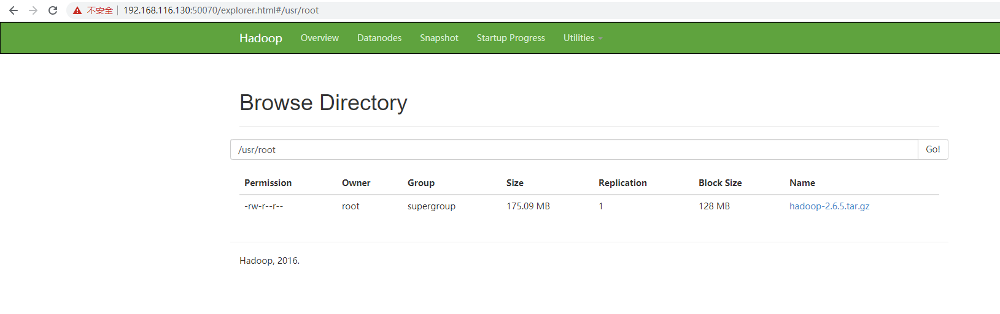

# Hadoop伪分布式环境搭建

> 系统：Centos 7.6
>
> JDK版本：1.8
>
> Hadoop版本：2.6.5

## 前期准备

#### 先决条件

hadoop的运行依赖JDK，需预先安装JDK，安装步骤见

- [ Centos7安装JDK1.8](https://gitee.com/GeorgeChan/BigData-LearningNotes/blob/master/jdk/Centos安装JDK1.8.md)

#### 配置IP映射

- 配置hosts

```shell
# 编辑hosts文件
vi /etc/hosts
# 配置映射IP
192.168.116.130 node01
```

- 配置network

```shell
vi /etc/sysconfig/network
# 添加主机名称
HOSTNAME=node01
```

- 测试

```shell
[root@localhost ~]# ping node01
PING node01 (192.168.116.130) 56(84) bytes of data.
64 bytes from node01 (192.168.116.130): icmp_seq=1 ttl=64 time=0.042 ms
64 bytes from node01 (192.168.116.130): icmp_seq=2 ttl=64 time=0.040 ms
64 bytes from node01 (192.168.116.130): icmp_seq=3 ttl=64 time=0.038 ms
64 bytes from node01 (192.168.116.130): icmp_seq=4 ttl=64 time=0.095 ms
^C
--- node01 ping statistics ---
4 packets transmitted, 4 received, 0% packet loss, time 2999ms
rtt min/avg/max/mdev = 0.038/0.053/0.095/0.025 ms
```


#### 配置免密登录

- 生成密钥

```shell
ssh-keygen -t dsa -P '' -f ~/.ssh/id_dsa
```

​	生成成功

```shell
Generating public/private dsa key pair.
Your identification has been saved in /root/.ssh/id_dsa.
Your public key has been saved in /root/.ssh/id_dsa.pub.
The key fingerprint is:
SHA256:1Mn/jeX+OLgXJ+Liu/Vt2Dk/YAMIq2xhIF7iSECRtLE root@localhost.localdomain
The key's randomart image is:
+---[DSA 1024]----+
|==o              |
| =+o   . o .     |
|=E+ .   + =      |
|.o   o o . o     |
|    o o S   o   .|
|     +      .=o=.|
|    .      .oo=*+|
|          ..o.+Bo|
|         .++.oooX|
+----[SHA256]-----+
```

- 将公钥写入到授权文件

```
cat ~/.ssh/id_dsa.pub >> ~/.ssh/authorized_keys
```


## Hadoop（HDFS）环境搭建

#### 下载解压

​	从[官网](https://archive.apache.org/dist/hadoop/common/)下载响应版本的Hadoop安装包，我这里是[2.6.5](https://archive.apache.org/dist/hadoop/common/hadoop-2.6.5/hadoop-2.6.5.tar.gz)，建议下载[CDH](http://archive.cloudera.com/cdh5/cdh/5/)版本的安装包，稳定且兼容性好。

```shell
# 下载安装包
wget https://archive.apache.org/dist/hadoop/common/hadoop-2.6.5/hadoop-2.6.5.tar.gz

# 解压到指定文件夹
tar -zxvf hadoop-2.6.5.tar.gz -C /usr/hadoop/
```

#### 配置环境变量

```shell
vi /etc/profile
# 修改
export PATH=${JAVA_HOME}/bin:$PATH:${HADOOP_HOME}/bin:$PATH:${HADOOP_HOME}/sbin:$PATH
# 追加
export HADOOP_HOME=/usr/hadoop/hadoop-2.6.5
```

​	**保存**

- 执行 `source` 命令，使得配置的环境变量立即生效：

```shell
source /etc/profile
```

- 验证是否配置成功

```shell
[root@localhost ~]# hdfs
Usage: hdfs [--config confdir] COMMAND
       where COMMAND is one of:
  dfs                  run a filesystem command on the file systems supported in Hadoop.
  namenode -format     format the DFS filesystem
  secondarynamenode    run the DFS secondary namenode
  namenode             run the DFS namenode
  journalnode          run the DFS journalnode
  zkfc                 run the ZK Failover Controller daemon
  datanode             run a DFS datanode
  dfsadmin             run a DFS admin client
  haadmin              run a DFS HA admin client
  fsck                 run a DFS filesystem checking utility
  balancer             run a cluster balancing utility
  jmxget               get JMX exported values from NameNode or DataNode.
  mover                run a utility to move block replicas across
                       storage types
  oiv                  apply the offline fsimage viewer to an fsimage
  oiv_legacy           apply the offline fsimage viewer to an legacy fsimage
  oev                  apply the offline edits viewer to an edits file
  fetchdt              fetch a delegation token from the NameNode
  getconf              get config values from configuration
  groups               get the groups which users belong to
  snapshotDiff         diff two snapshots of a directory or diff the
                       current directory contents with a snapshot
  lsSnapshottableDir   list all snapshottable dirs owned by the current user
						Use -help to see options
  portmap              run a portmap service
  nfs3                 run an NFS version 3 gateway
  cacheadmin           configure the HDFS cache
  crypto               configure HDFS encryption zones
  storagepolicies      get all the existing block storage policies
  version              print the version

Most commands print help when invoked w/o parameters.
```

成功

#### 修改Hadoop配置

进入 `${HADOOP_HOME}/etc/hadoop/ `目录下，修改以下配置：

- 修改hadoop-env.sh

```shell
export JAVA_HOME=/usr/java/jdk1.8.0_231
```

- 修改mapred-env.sh

```shell
export JAVA_HOME=/usr/java/jdk1.8.0_231
```

- 修改yarn-env.sh

```shell
export JAVA_HOME=/usr/java/jdk1.8.0_231
```

- 修改core-site.xml

```shell
<configuration>
    <property>
    	<!--指定 namenode 的 hdfs 协议文件系统的通信地址-->
        <name>fs.defaultFS</name>
        <value>hdfs://node01:9000</value>
    </property>
    <property>
    	<!--指定 hadoop 存储临时文件的目录-->
        <name>hadoop.tmp.dir</name>
        <value>/usr/hadoop/local</value>
    </property> 
</configuration>
```

- 修改hdfs-site.xml

  指定副本系数和secondary namenode：

```shell
<configuration>
	<!--由于我们这里搭建是单机版本，所以指定 dfs 的副本系数为 1-->
    <property>
        <name>dfs.replication</name>
        <value>1</value>
    </property>
    <!--secondary namenode 服务器地址和端口-->
    <property>
        <name>dfs.namenode.secondary.http-address</name>
        <value>node01:50090</value>
    </property>
</configuration>
```

- 修改slaves

  配置所有从属节点的主机名或 IP 地址，由于是单机版本，所以指定本机即可

```shell
node01
```

#### 格式化

*由于已经配置了环境变量，可在任意目录下执行格式化命令*

```
hdfs namenode -format
```

部分格式化信息

```shell
19/12/21 11:31:47 INFO namenode.FSImage: Allocated new BlockPoolId: BP-739976895-127.0.0.1-1576945907893
19/12/21 11:31:47 INFO common.Storage: Storage directory /usr/hadoop/local/dfs/name has been successfully formatted.
19/12/21 11:31:47 INFO namenode.FSImageFormatProtobuf: Saving image file /usr/hadoop/local/dfs/name/current/fsimage.ckpt_0000000000000000000 using no compression
19/12/21 11:31:47 INFO namenode.FSImageFormatProtobuf: Image file /usr/hadoop/local/dfs/name/current/fsimage.ckpt_0000000000000000000 of size 321 bytes saved in 0 seconds.
```

#### 启动hadoop

```shell
start-dfs.sh
```

#### 关闭hadoop

```shell
stop-dfs.sh
```


#### 防火墙开启端口

```shell
# 开启50070端口
firewall-cmd --zone=public --add-port=50070/tcp --permanent

# 重启防火墙
firewall-cmd --reload

# 查看端口是否开启
firewall-cmd --query-port=50070/tcp
```

### 访问Hadoop的web UI

浏览器访问 `http://192.168.116.130:50070/`

启动成功！


#### 验证文件上传

- 创建上传文件夹

```shell
hadoop fs -mkdir -p /usr/root/
```

- 查看目录

```shell
hdfs dfs -ls /usr/root/
```

- 上传文件

```shell
hdfs dfs -put /usr/local/src/jdk-8u231-linux-x64.tar.gz /usr/root/
```

​	查看网页，文件上传成功



#### 重新格式化

若需要重新格式化hadoop集群，则首先应该先删除 hadoop的临时目录。

临时目录位置配置在`core-site.xml`中，`/usr/hadoop/local`

```
rm -rf /usr/hadoop/local
```

然后执行格式化命令

```
hdfs namenode -format
```

