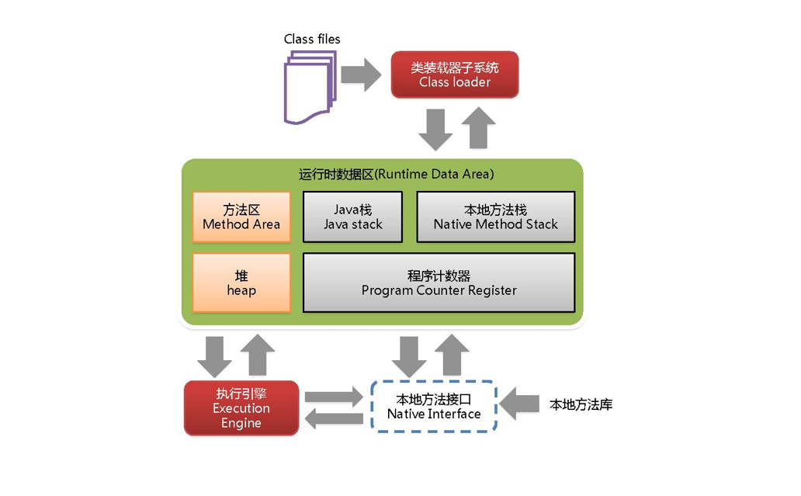
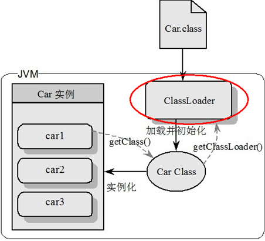
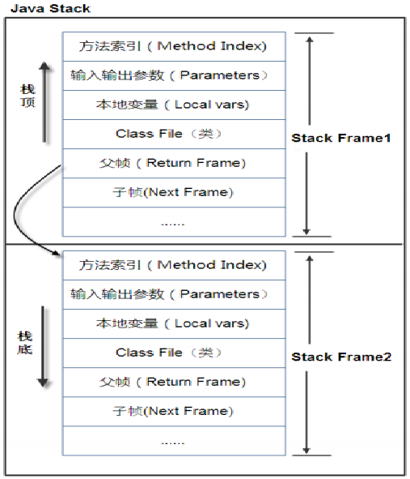
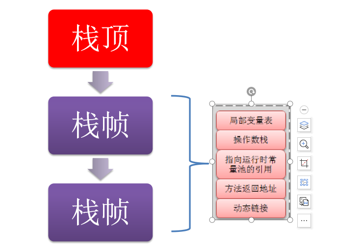
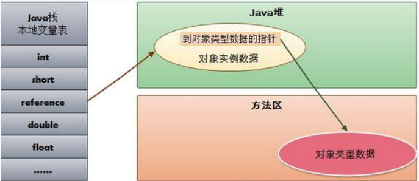

## JVM体系结构概述

### 环境

- Centos 7.6
- xshell 6
- vmvare 15.5
- jdk 1.8

### JVM位置

**JVM是运行在操作系统之上的，它与硬件没有直接的交互**

### JVM体系结构概览

### 类装载器ClassLoader

负责加载class文件，class文件在**文件开头有特定的文件标示**，将class文件字节码内容加载到内存中，并将这些内容转换成方法区中的运行时数据结构并且ClassLoader只负责class文件的加载，至于它是否可以运行，则由Execution Engine决定 

- 虚拟机自带的加载器

- 启动类加载器（Bootstrap）C++

  这个类加载器负责将\lib目录下的类库加载到虚拟机内存中,用来加载java的核心库,此类加载器并不继承于java.lang.ClassLoader,不能被java程序直接调用,代码是使用C++编写的.是虚拟机自身的一部分

- 扩展类加载器（Extension）Java

  这个类加载器负责加载\lib\ext目录下的类库,用来加载java的扩展库,开发者可以直接使用这个类加载器

- 应用程序类加载器（AppClassLoader）

  这个类加载器负责加载用户类路径(CLASSPATH)下的类库,一般我们编写的java类都是由这个类加载器加载,这个类加载器是CLassLoader中的getSystemClassLoader()方法的返回值,所以也称为系统类加载器.一般情况下这就是系统默认的类加载器

- 用户自定义加载器

  Java.lang.ClassLoader的子类，用户可以定制类的加载方式

  

**sun.misc.Launcher 它是一个java虚拟机的入口应用**

### 双亲委派 

当一个类收到了类加载请求，他首先不会尝试自己去加载这个类，而是把这个请求委派给父类去完成，每一个层次类加载器都是如此，因此所有的加载请求都应该传送到启动类加载其中，只有当父类加载器反馈自己无法完成这个请求的时候（在它的加载路径下没有找到所需加载的Class），子类加载器才会尝试自己去加载。 

采用双亲委派的一个好处是比如加载位于 rt.jar 包中的类 java.lang.Object，不管是哪个加载器加载这个类，最终都是委托给顶层的启动类加载器进行加载，这样就保证了使用不同的类加载器最终得到的都是同样一个 Object对象。 

### Execution Engine执行引擎负责解释命令，提交操作系统执行

### Native Interface本地接口

本地接口的作用是融合不同的编程语言为 Java 所用，它的初衷是融合 C/C++程序，Java 诞生的时候是 C/C++横行的时候，要想立足，必须有调用 C/C++程序，于是就在内存中专门开辟了一块区域处理标记为native的代码，它的具体做法是 Native Method Stack中登记 native方法，在Execution Engine 执行时加载native libraies。

目前该方法使用的越来越少了，除非是与硬件有关的应用，比如通过Java程序驱动打印机或者Java系统管理生产设备，在企业级应用中已经比较少见。因为现在的异构领域间的通信很发达，比如可以使用 Socket通信，也可以使用Web Service等等，不多做介绍。

### Native Method Stack

它的具体做法是Native Method Stack中登记native方法，在Execution Engine 执行时加载本地方法库。

### PC寄存器

每个线程都有一个程序计数器，是线程私有的,就是一个指针，指向方法区中的方法字节码**（用来存储指向下一条指令的地址,也就是即将要执行的指令代码）**，由执行引擎读取下一条指令，是一个非常小的内存空间，几乎可以忽略不记。

这块内存区域很小，**它是当前线程所执行的字节码的行号指示器**，字节码解释器通过改变这个计数器的值来选取下一条需要执行的字节码指令。

如果执行的是一个Native方法，那这个计数器是空的。

用以完成分支、循环、跳转、异常处理、线程恢复等基础功能。不会发生内存溢出(OutOfMemory=OOM)错误

### Method Area 方法区

供各线程共享的运行时内存区域。它存储了每一个类的结构信息，例如运行时常量池（Runtime Constant Pool）、字段和方法数据、构造函数和普通方法的字节码内容。上面讲的是规范，在不同虚拟机里头实现是不一样的，最典型的就是永久代(PermGen space)和元空间(Metaspace)。

**注意：实例变量存在堆内存中,和方法区无关**

### Stack栈

栈也叫栈内存，主管Java程序的运行，是在线程创建时创建，它的生命期是跟随线程的生命期，线程结束栈内存也就释放，对于栈来说不存在垃圾回收问题，只要线程一结束该栈就Over，生命周期和线程一致，是线程私有的。**8种基本类型的变量+对象的引用变量+实例方法都是在函数的栈内存中分配。**

#### 栈存储什么?

栈帧中主要保存3 类数据：

- 本地变量（Local Variables）:输入参数和输出参数以及方法内的变量；
- 栈操作（Operand Stack）:记录出栈、入栈的操作；
- 栈帧数据（Frame Data）:包括类文件、方法等等。

#### 栈运行原理

栈中的数据都是以栈帧（Stack Frame）的格式存在，栈帧是一个内存区块，是一个数据集，是一个有关方法(Method)和运行期数据的数据集，当一个方法A被调用时就产生了一个栈帧 F1，并被压入到栈中，
A方法又调用了 B方法，于是产生栈帧 F2 也被压入栈，
B方法又调用了 C方法，于是产生栈帧 F3 也被压入栈，
……
执行完毕后，先弹出F3栈帧，再弹出F2栈帧，再弹出F1栈帧……

遵循“先进后出”/“后进先出”原则。

每个方法执行的同时都会创建一个栈帧，用于存储局部变量表、操作数栈、动态链接、方法出口等信息，每一个方法从调用直至执行完毕的过程，就对应着一个栈帧在虚拟机中入栈到出栈的过程。栈的大小和具体JVM的实现有关，通常在256K~756K之间,与等于1Mb左右。

#### 图示：

图示在一个栈中有两个栈帧：

图示在一个栈中有两个栈帧：

1、栈帧 2是最先被调用的方法，先入栈，

2、然后方法 2 又调用了方法1，栈帧 1处于栈顶的位置，

3、栈帧 2 处于栈底，执行完毕后，依次弹出栈帧 1和栈帧 2，

4、线程结束，栈释放。

每执行一个方法都会产生一个栈帧，保存到栈(后进先出)的**顶部，顶部栈就是当前的方法，该方法执行完毕后会自动将此栈帧出栈。**

### Exception in thread "main" java.lang.StackOverflowError

**栈溢出是Error不是Exception**

#### 栈+堆+方法区的交互关系

HotSpot是使用指针的方式来访问对象：

Java堆中会存放访问类元数据的地址，

reference存储的就直接是对象的地址