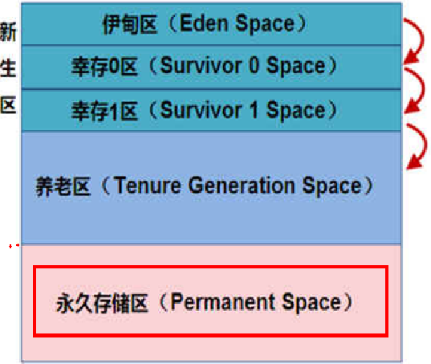
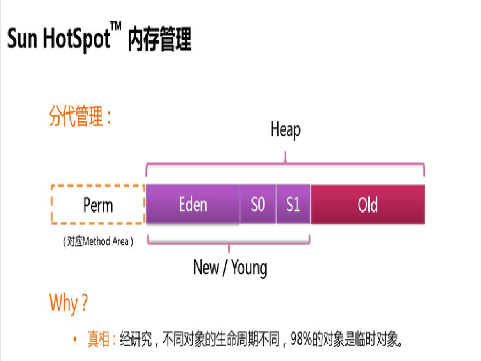
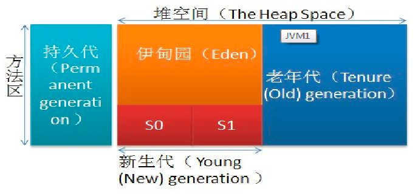

## JVM堆体系结构概述

### 环境

- Centos 7.6
- xshell 6
- vmvare 15.5
- jdk 1.8

### Heap 堆

一个JVM实例只存在一个堆内存，堆内存的大小是可以调节的。类加载器读取了类文件后，需要把类、方法、常变量放到堆内存中，保存所有引用类型的真实信息，以方便执行器执行，堆内存分为三部分：

- Young Generation Space  新生区                    Young/New
- Tenure generation space  养老区                     Old/ Tenure
- Permanent Space              永久区                         Perm

****

### 新生区

新生区是类的诞生、成长、消亡的区域，一个类在这里产生，应用，最后被垃圾回收器收集，结束生命。新生区又分为两部分： 伊甸区（Eden space）和幸存者区（Survivor pace） ，所有的类都是在伊甸区被new出来的。幸存区有两个： 0区（Survivor 0 space）和1区（Survivor 1 space）。当伊甸园的空间用完时，程序又需要创建对象，JVM的垃圾回收器将对伊甸园区进行垃圾回收(Minor GC)，将伊甸园区中的不再被其他对象所引用的对象进行销毁。然后将伊甸园中的剩余对象移动到幸存 0区。若幸存 0区也满了，再对该区进行垃圾回收，然后移动到 1 区。那如果1 区也满了呢？再移动到养老区。若养老区也满了，那么这个时候将产生MajorGC（FullGC），进行养老区的内存清理。若养老区执行了Full GC之后发现依然无法进行对象的保存，就会产生OOM异常“OutOfMemoryError”。

**如果出现java.lang.OutOfMemoryError: Java heap space异常，说明Java虚拟机的堆内存不够。原因有二：**

- **Java虚拟机的堆内存设置不够，可以通过参数-Xms、-Xmx来调整。**
- **代码中创建了大量大对象，并且长时间不能被垃圾收集器收集（存在被引用）。**

### heap内复制详解

**eden、SurvivorFrom 复制到 SurvivorTo，年龄+1** 

首先，当Eden区满的时候会触发第一次GC,把还活着的对象拷贝到SurvivorFrom区，当Eden区再次触发GC的时候会扫描Eden区和From区域,对这两个区域进行垃圾回收，经过这次回收后还存活的对象,则直接复制到To区域（如果有对象的年龄已经达到了老年的标准，则赋值到老年代区），同时把这些对象的年龄+1、

**清空 eden、SurvivorFrom **

然后，清空Eden和SurvivorFrom中的对象，也即复制之后有交换，谁空谁是to

（from区和to区不是固定的，每次GC后会交换，谁空了谁是to）

**SurvivorTo和 SurvivorFrom 互换 **

最后，SurvivorTo和SurvivorFrom互换，原SurvivorTo成为下一次GC时的SurvivorFrom区。部分对象会在From和To区域中复制来复制去,如此交换15次(由JVM参数MaxTenuringThreshold决定,这个参数默认是15),最终如果还是存活,就存入到老年代

### 方法区

实际而言，方法区（Method Area）和堆一样，是各个线程共享的内存区域，它用于存储虚拟机加载的：类信息+普通常量+静态常量+编译器编译后的代码等等，**虽然JVM规范将方法区描述为堆的一个逻辑部分，但它却还有一个别名叫做Non-Heap(非堆)，目的就是要和堆分开。**

对于HotSpot虚拟机，很多开发者习惯将方法区称之为“永久代(Parmanent Gen)” ，但严格本质上说两者不同，或者说使用永久代来实现方法区而已，永久代是方法区(相当于是一个接口interface)的一个实现，jdk1.7的版本中，已经将原本放在永久代的字符串常量池移走。

### 永久区(java7之前有)

永久存储区是一个常驻内存区域，用于存放JDK自身所携带的 Class,Interface 的元数据，也就是说它存储的是运行环境必须的类信息，被装载进此区域的数据是不会被垃圾回收器回收掉的，关闭 JVM 才会释放此区域所占用的内存。

