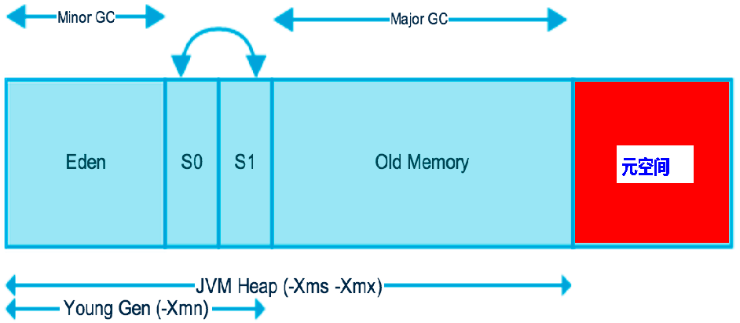

## JVM堆参数调优入门

### 环境

- Centos 7.6
- xshell 6
- vmvare 15.5
- jdk 1.8


### JVM垃圾收集(Java Garbage Collection )

**均以JDK1.8+HotSpot为例**


#### Java7的jvm构成


#### Java8的jvm构成

JDK 1.8之后将最初的永久代取消了，由元空间取代。



在Java8中，永久代已经被移除，被一个称为元空间的区域所取代。元空间的本质和永久代类似。

元空间与永久代之间最大的区别在于：
永久带使用的JVM的堆内存，但是java8以后的元空间并不在虚拟机中而是使用本机物理内存。

因此，默认情况下，元空间的大小仅受本地内存限制。类的元数据放入 native memory, 字符串池和类的静态变量放入 java 堆中，这样可以加载多少类的元数据就不再由MaxPermSize 控制, 而由系统的实际可用空间来控制。 


### 堆内存调优简介01

| 配置                | 作用                                    |
| ------------------- | --------------------------------------- |
| -Xms                | 设置初始分配大小，默认为物理内存的 1/64 |
| -Xmx                | 最大分配内存，默认为物理内存的 1/4      |
| -XX:+PrintGCDetails | 输出详细的GC处理日志                    |

**代码示例**

`codes` --> `jvm-juc` --> `jvm-case\HeapTest01.java`

```java
public class HeapTest01 {
    public static void main(String[] args) {
        // 返回java虚拟机试图使用的最大内存
        long maxMemory = Runtime.getRuntime().maxMemory();
        // 返回java虚拟机中的内存总量
        long totalMemory = Runtime.getRuntime().totalMemory();
        System.out.println("MAX_MEMORY=" + maxMemory + "字节、" + maxMemory / (double) 1024 / 1024 + "MB");
        System.out.println("TOTAL_MEMORY=" + totalMemory + "字节、" + totalMemory / (double) 1024 / 1024 + "MB");

    }
}
```


**发现默认的情况下分配的内存是总内存的“1 / 4”、而初始化的内存为“1 / 64”**

MAX_MEMORY=1029177344字节、981.5MB
TOTAL_MEMORY=1029177344字节、981.5MB

VM参数：	-Xms1024m -Xmx1024m -XX:+PrintGCDetails

**生产环境中，应该将jvm的初始内存和最大内存设置的一样大，可以避免因GC线程和主线程互相抢占内存资源时造成的程序暂停现象**


### 堆内存调优简介02 


**年轻代与老年代所占的区域大小的和，正好等于堆内存的区域大小**


### 堆内存调优简介03

演示堆内存溢出，VM参数：-Xms8m -Xmx8m -XX:+PrintGCDetails

**代码示例：**

`codes` --> `jvm-juc` --> `jvm-case\HeapOomTest02.java`

```java
public class HeapOomTest02 {
    public static void main(String[] args) {
        String str = "hello, I am Heap!";
        while (true) {
            str += str + new Random().nextInt(8888888) + new Random().nextInt(9999999);
        }
    }
}
```


**Exception in thread "main" java.lang.OutOfMemoryError: Java heap space**

