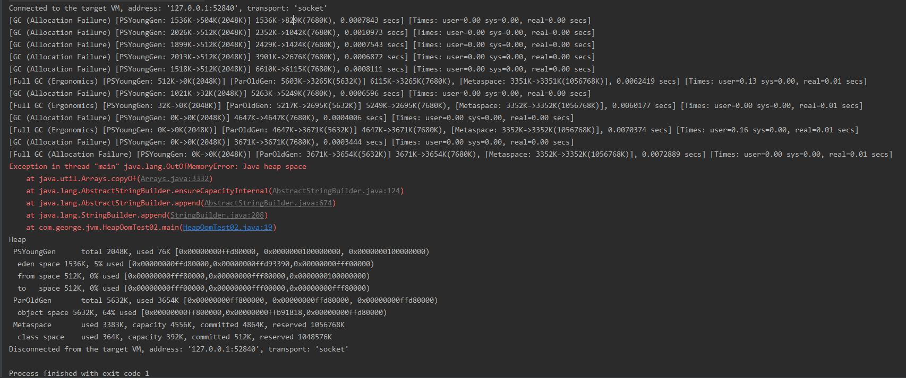
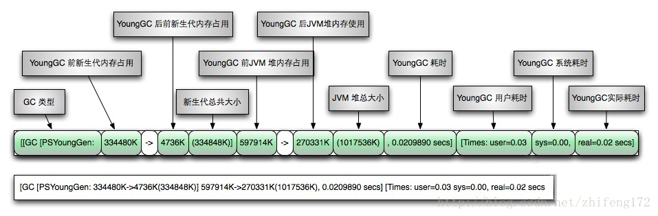
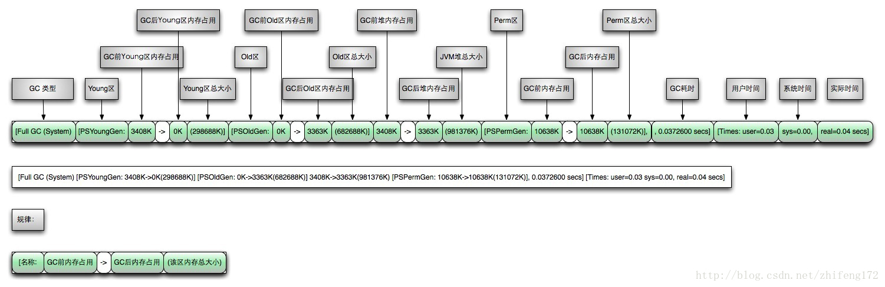

## GC收集日志信息的解读

### 环境

- Centos 7.6
- xshell 6
- vmvare 15.5
- jdk 1.8


### GC日志




### GC日志1

```
[GC (Allocation Failure) [PSYoungGen: 1536K->504K(2048K)] 1536K->829K(7680K), 0.0007843 secs] [Times: user=0.00 sys=0.00, real=0.00 secs]
```

#### 解析：

`GC (Allocation Failure)`对象分配失败，`GC`表示新生代Young区的GC，`Full GC`则包含老年代。`[PSYoungGen: 1536K->504K(2048K)]`表示Young区回收前大小是1536K，回收后是504K，总大小是2048K。紧接着中括号外，`1536K->829K(7680K)`表示回收前整个堆大小是7680K，回收后堆大小829K，堆总大小7680K。`0.0039021 secs`是垃圾回收用的时间。可以看出，新生代由1.5M变为了约0.5M，而整个堆由1.5M变为了约0.8M，也就是这次GC后，老年代约为0.3M

#### 图示：

从网上down的，数值对不上




### GC日志2

```
[Full GC (Ergonomics) [PSYoungGen: 0K->0K(2048K)] [ParOldGen: 4647K->3671K(5632K)] 4647K->3671K(7680K), [Metaspace: 3352K->3352K(1056768K)], 0.0070374 secs] [Times: user=0.16 sys=0.00, real=0.01 secs]
```

#### 解析：

`[Full GC (Ergonomics)`由于代码 Ergonomics 发起了Full GC。`[PSYoungGen: 0K->0K(2048K)]`表示回收前新生代是0K，回收后0K，新生代总大小是2048K。`[ParOldGen: 4647K->3671K(5632K)]`表示回收前老年代是4647K，回收后3671K，老年代总大小5632K。紧接着中括号外，`4647K->3671K(7680K)`回收前堆大小4647K，回收后3671K，堆总大小7680K。`[Metaspace: 3352K->3352K(1056768K)]`回收前元空间大小3352K，回收后3352K，总大小1056768K。这次GC用时0.0102082 secs。

#### 图示：

这是从网上down的图，此图是jdk7的 jvm 图，这里的 `Perm`对应的JDK8中的 `Metaspace`




### GC日志3

```java
Heap
 PSYoungGen      total 2048K, used 76K [0x00000000ffd80000, 0x0000000100000000, 0x0000000100000000)
  eden space 1536K, 5% used [0x00000000ffd80000,0x00000000ffd93390,0x00000000fff00000)
  from space 512K, 0% used [0x00000000fff80000,0x00000000fff80000,0x0000000100000000)
  to   space 512K, 0% used [0x00000000fff00000,0x00000000fff00000,0x00000000fff80000)
 ParOldGen       total 5632K, used 3654K [0x00000000ff800000, 0x00000000ffd80000, 0x00000000ffd80000)
  object space 5632K, 64% used [0x00000000ff800000,0x00000000ffb91818,0x00000000ffd80000)
 Metaspace       used 3383K, capacity 4556K, committed 4864K, reserved 1056768K
  class space    used 364K, capacity 392K, committed 512K, reserved 1048576K
```

#### 解析：

日志的最后打印出了堆的信息，新生代总大小2048K，已使用76K，新生代中的eden区大小1536K，已用5%，两个survivor区都是512K。老年代总大小5632K，已使用3654K。元空间已使用3383K。
