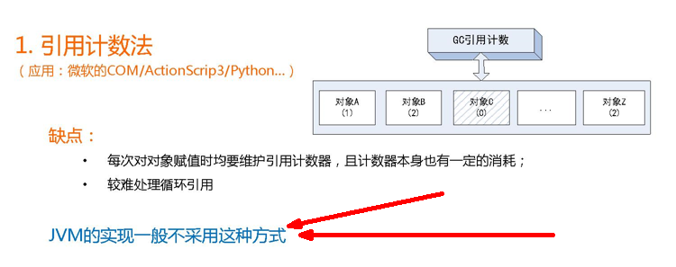
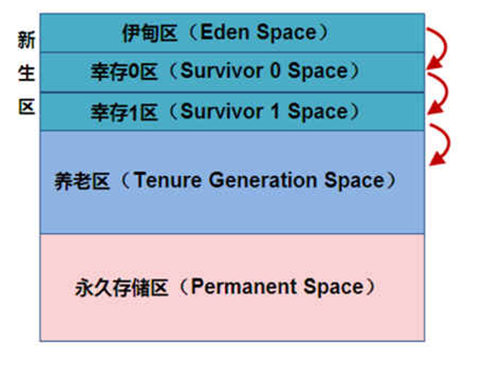
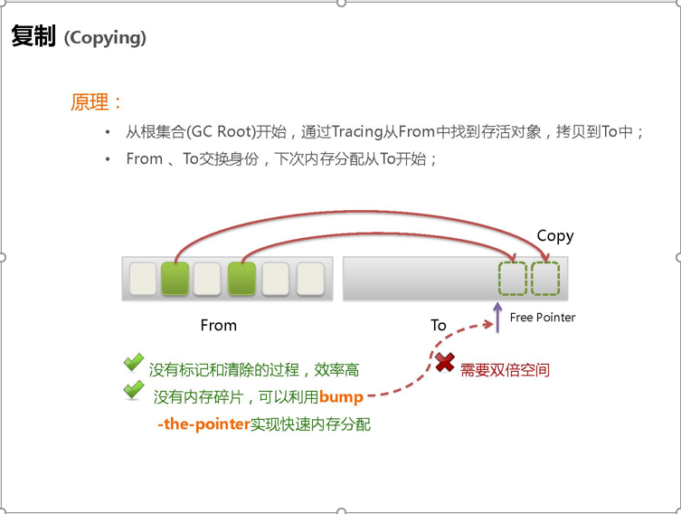
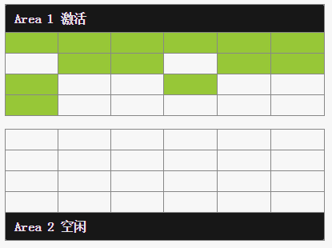
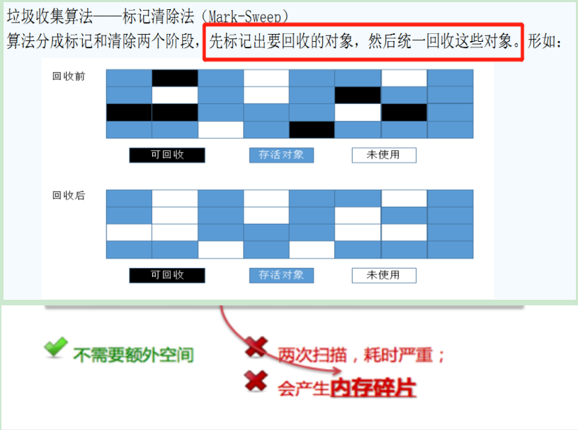
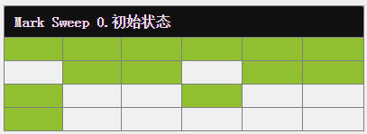

## GC四大算法

### 环境

- Centos 7.6
- xshell 6
- vmvare 15.5
- jdk 1.8


### GC算法总体概述


JVM在进行GC时，并非每次都对上面三个内存区域一起回收的，大部分时候回收的都是指新生代。
因此GC按照回收的区域又分了两种类型，一种是普通GC（minor GC），一种是全局GC（major GC or Full GC）


#### Minor GC和Full GC的区别

- **普通GC（minor GC）**

  只针对新生代区域的GC,指发生在新生代的垃圾收集动作，因为大多数Java对象存活率都不高，所以Minor GC非常频繁，一般回收速度也比较快

- **全局GC（major GC or Full GC）**

  指发生在老年代的垃圾收集动作，出现了Major GC，经常会伴随至少一次的Minor GC（但并不是绝对的）。Major GC的速度一般要比Minor GC慢上10倍以上


### 引用计数法



**代码示例**

`codes` --> `jvm-juc` --> `jvm-case\RefCountGC03.java`

```java
public class RefCountGC03 {
    //这个成员属性唯一的作用就是占用一点内存
    private byte[] bigSize = new byte[2 * 1024 * 1024];
    Object instance = null;

    public static void main(String[] args) {
        RefCountGC03 objectA = new RefCountGC03();
        RefCountGC03 objectB = new RefCountGC03();
        // 循环引用
        objectA.instance = objectB;
        objectB.instance = objectA;
        objectA = null;
        objectB = null;

        System.gc();
    }

}
```


### 复制算法(Copying)

**年轻代**中使用的是Minor GC，这种GC算法采用的是复制算法(Copying)



#### 原理

​		Minor GC会把Eden中的所有活的对象都移到Survivor区域中，如果Survivor区中放不下，那么剩下的活的对象就被移到Old  generation中，也即一旦收集后，Eden是就变成空的了。

​		当对象在 Eden ( 包括一个 Survivor 区域，这里假设是 from 区域 ) 出生后，在经过一次 Minor GC 后，如果对象还存活，并且能够被另外一块 Survivor 区域所容纳( 上面已经假设为 from 区域，这里应为 to 区域，即 to 区域有足够的内存空间来存储 Eden 和 from 区域中存活的对象 )，则使用复制算法将这些仍然还存活的对象复制到另外一块 Survivor 区域 ( 即 to 区域 ) 中，然后清理所使用过的 Eden 以及 Survivor 区域 ( 即 from 区域 )，并且将这些对象的年龄设置为1，以后对象在 Survivor 区每熬过一次 Minor GC，就将对象的年龄 + 1，当对象的年龄达到某个值时 ( 默认是 15 岁，通过-XX:MaxTenuringThreshold 来设定参数)，这些对象就会成为老年代。

**-XX:MaxTenuringThreshold** — 设置对象在新生代中存活的次数


#### 解释

**年轻代中的GC,主要是复制算法（Copying）**

HotSpot JVM把年轻代分为了三部分：1个Eden区和2个Survivor区（分别叫from和to）。默认比例为8:1:1,一般情况下，新创建的对象都会被分配到Eden区(一些大对象特殊处理),这些对象经过第一次Minor GC后，如果仍然存活，将会被移到Survivor区。对象在Survivor区中每熬过一次Minor GC，年龄就会增加1岁，当它的年龄增加到一定程度时，就会被移动到年老代中。因为年轻代中的对象基本都是朝生夕死的(90%以上)，所以在**年轻代的垃圾回收算法使用的是复制算法**，复制算法的基本思想就是将内存分为两块，每次只用其中一块，当这一块内存用完，就将还活着的对象复制到另外一块上面。**复制算法不会产生内存碎片**。



在GC开始的时候，对象只会存在于Eden区和名为“From”的Survivor区，Survivor区“To”是空的。紧接着进行GC，Eden区中所有存活的对象都会被复制到“To”，而在“From”区中，仍存活的对象会根据他们的年龄值来决定去向。年龄达到一定值(年龄阈值，可以通过-XX:MaxTenuringThreshold来设置)的对象会被移动到年老代中，没有达到阈值的对象会被复制到“To”区域。**经过这次GC后，Eden区和From区已经被清空。这个时候，“From”和“To”会交换他们的角色，也就是新的“To”就是上次GC前的“From”，新的“From”就是上次GC前的“To”。**不管怎样，都会保证名为To的Survivor区域是空的。Minor GC会一直重复这样的过程，直到“To”区被填满，“To”区被填满之后，会将所有对象移动到年老代中。


因为Eden区对象一般存活率较低，一般的，使用两块10%的内存作为空闲和活动区间，而另外80%的内存，则是用来给新建对象分配内存的。一旦发生GC，将10%的from活动区间与另外80%中存活的eden对象转移到10%的to空闲区间，接下来，将之前90%的内存全部释放，以此类推。 


#### 动态演示




#### 劣势

复制算法它的缺点也是相当明显的。

- 它浪费了一半的内存
- 如果对象的存活率很高，我们可以极端一点，假设是100%存活，那么我们需要将所有对象都复制一遍，并将所有引用地址重置一遍。复制这一工作所花费的时间，在对象存活率达到一定程度时，将会变的不可忽视。 所以从以上描述不难看出，复制算法要想使用，**最起码对象的存活率要非常低才行**，而且最重要的是，我们必须要克服50%内存的浪费。


### 标记清除(Mark-Sweep)

**老年代**一般是由标记清除或者是标记清除与标记整理的混合实现


#### 原理



用通俗的话解释一下标记清除算法，就是当程序运行期间，若可以使用的内存被耗尽的时候，GC线程就会被触发并将程序暂停，随后将要回收的对象标记一遍，最终统一回收这些对象，完成标记清理工作接下来便让应用程序恢复运行。

主要进行两项工作，第一项则是标记，第二项则是清除。 

- 标记：从引用根节点开始标记遍历所有的GC Roots， 先标记出要回收的对象。
- 清除：遍历整个堆，把标记的对象清除。 

**缺点：此算法需要暂停整个应用，会产生内存碎片 **


#### 动态演示


#### 劣势

- 首先，它的缺点就是效率比较低（递归与全堆对象遍历），而且在进行GC的时候，需要停止应用程序，这会导致用户体验非常差劲
- 其次，主要的缺点则是这种方式清理出来的空闲内存是不连续的，这点不难理解，我们的死亡对象都是随机的出现在内存的各个角落的，现在把它们清除之后，内存的布局自然会乱七八糟。而为了应付这一点，JVM就不得不维持一个内存的空闲列表，这又是一种开销。而且在分配数组对象的时候，寻找连续的内存空间会不太好找。 


### 标记压缩(Mark-Compact)

**老年代一般是由标记清除或者是标记清除与标记整理的混合实现**


#### 原理


在整理压缩阶段，不再对标记的对像做回收，而是通过所有存活对像都向一端移动，然后直接清除边界以外的内存。
可以看到，标记的存活对象将会被整理，按照内存地址依次排列，而未被标记的内存会被清理掉。如此一来，当我们需要给新对象分配内存时，JVM只需要持有一个内存的起始地址即可，这比维护一个空闲列表显然少了许多开销。

标记/整理算法不仅可以弥补标记/清除算法当中，内存区域分散的缺点，也消除了复制算法当中，内存减半的高额代价


#### 劣势

标记/整理算法唯一的缺点就是效率也不高，不仅要标记所有存活对象，还要整理所有存活对象的引用地址。
从效率上来说，标记/整理算法要低于复制算法。


#### 动态演示




### 总结

**内存效率**：复制算法>标记清除算法>标记整理算法（此处的效率只是简单的对比时间复杂度，实际情况不一定如此）。 

**内存整齐度**：复制算法=标记整理算法>标记清除算法。 

**内存利用率**：标记整理算法=标记清除算法>复制算法。 

可以看出，效率上来说，复制算法是当之无愧的老大，但是却浪费了太多内存，而为了尽量兼顾上面所提到的三个指标，标记/整理算法相对来说更平滑一些，但效率上依然不尽如人意，它比复制算法多了一个标记的阶段，又比标记/清除多了一个整理内存的过程


##### 分代收集算法

**年轻代(Young Gen)**  

**年轻代特点是区域相对老年代较小，对像存活率低。**

这种情况复制算法的回收整理，速度是最快的。复制算法的效率只和当前存活对像大小有关，因而很适用于年轻代的回收。而复制算法内存利用率不高的问题，通过hotspot中的两个survivor的设计得到缓解。

**老年代(Tenure Gen)**

**老年代的特点是区域较大，对像存活率高。**

这种情况，	存在大量存活率高的对像，复制算法明显变得不合适。一般是由标记清除或者是标记清除与标记整理的混合实现。

**Mark阶段的开销与存活对像的数量成正比**，这点上说来，对于老年代，标记清除或者标记整理有一些不符，但可以通过多核/线程利用，对并发、并行的形式提标记效率。

**Sweep阶段的开销与所管理区域的大小形正相关**，但Sweep“就地处决”的特点，回收的过程没有对像的移动。使其相对其它有对像移动步骤的回收算法，仍然是效率最好的。但是需要解决内存碎片问题。

**Compact阶段的开销与存活对像的数据成开比**，如上一条所描述，对于大量对像的移动是很大开销的，做为老年代的第一选择并不合适。

基于上面的考虑，**老年代一般是由标记清除或者是标记清除与标记整理的混合实现**。以hotspot中的CMS回收器为例，CMS是基于Mark-Sweep实现的，对于对像的回收效率很高，而对于碎片问题，CMS采用基于Mark-Compact算法的Serial Old回收器做为补偿措施：当内存回收不佳（碎片导致的Concurrent Mode Failure时），将采用Serial Old执行Full GC以达到对老年代内存的整理。


### 面试题

- JVM内存模型以及分区，需要详细到每个区放什么
- 堆里面的分区：Eden，survival from to，老年代，各自的特点。
- GC的三种收集方法：标记清除、标记整理、复制算法的原理与特点，分别用在什么地方
- Minor GC与Full GC分别在什么时候发生