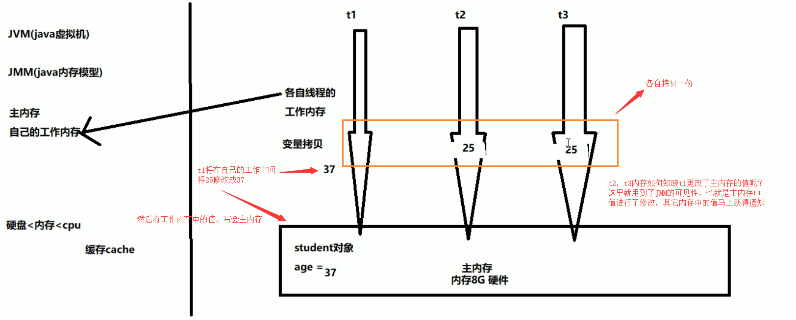
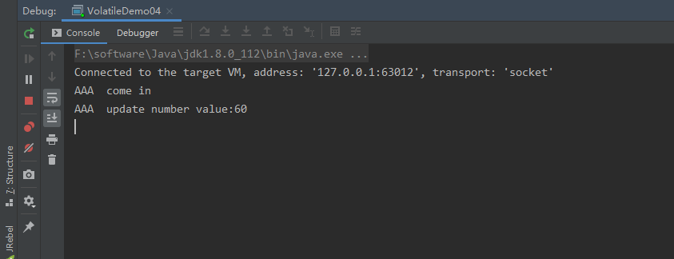
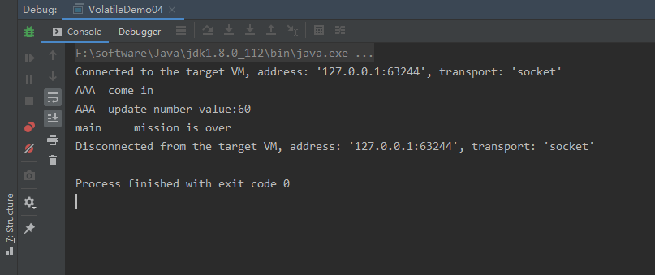

## Volatile和JMM内存模型的可见性

### 环境

- Centos 7.6
- xshell 6
- vmvare 15.5
- jdk 1.8


### 谈谈对Volatile的理解

Volatile在日常的单线程环境是应用不到的
Volatile是Java虚拟机提供的轻量级的同步机制

**三大特性**

- 保证可见性
- 保证可见性
- 禁止指令重排


### JMM是什么

JMM是Java内存模型，也就是Java Memory Model，简称JMM，本身是一种抽象的概念，实际上并不存在，它描述的是一组规则或规范，通过这组规范定义了程序中各个变量（包括实例字段，静态字段和构成数组对象的元素）的访问方式

JMM关于同步的规定：

- 线程解锁前，必须把共享变量的值刷新回主内存
- 线程解锁前，必须读取主内存的最新值，到自己的工作内存
- 加锁和解锁是同一把锁


由于JVM运行程序的实体是线程，而每个线程创建时JVM都会为其创建一个工作内存（有些地方称为栈空间），工作内存是每个线程的私有数据区域，而Java内存模型中规定所有变量都存储在主内存，主内存是共享内存区域，所有线程都可以访问**，但线程对变量的操作（读取赋值等）必须在工作内存中进行，首先要将变量从主内存拷贝到自己的工作内存空间，然后对变量进行操作，操作完成后再将变量写会主内存，**不能直接操作主内存中的变量，各个线程中的工作内存中存储着主内存中的变量副本拷贝，因此不同的线程间无法访问对方的工作内存，线程间的通信（传值）必须通过主内存来完成，其简要访问过程：


**数据传输速率：硬盘 < 内存 < < cache < CPU**

上面提到了两个概念：主内存 和 工作内存

- 主内存：就是计算机的内存，也就是经常提到的8G内存，16G内存
- 工作内存：但我们实例化 new student，那么 age = 25 也是存储在主内存中
- 当同时有三个线程同时访问 student中的age变量时，那么每个线程都会拷贝一份，到各自的工作内存，从而实现了变量的拷贝




即：JMM内存模型的可见性，指的是当主内存区域中的值被某个线程写入更改后，其它线程会马上知晓更改后的值，并重新得到更改后的值。


### JMM的特性

JMM的三大特性，volatile只保证了两个，即可见性和有序性，不满足原子性

- 可见性
- 原子性
- 有序性


### 可见性代码验证

`codes` --> `jvm-juc` --> `jvm-case\VolatileDemo04.java`

当我们对于成员变量没有添加任何修饰时，是无法感知其它线程修改后的值

```java
/**
 * 假设是主物理内存
 */
class MyData {

    int number = 0;

    public void addTo60() {
        this.number = 60;
    }
}

/**
 * <p>
 * 测试JMM的可见性
 * 1. 假设int number = 0， number变量之前没有添加volatile关键字修饰
 * </p>
 *
 * @author George Chan
 * @version 1.0
 * @date 2020/7/13 23:21
 * @since JDK 1.8
 */
public class VolatileDemo04 {
    public static void main(String args[]) {

        // 资源类
        MyData myData = new MyData();

        // AAA线程 实现了Runnable接口的，lambda表达式
        new Thread(() -> {
            System.out.println(Thread.currentThread().getName() + "\t come in");
            // 线程睡眠3秒，假设在进行运算
            try {
                TimeUnit.SECONDS.sleep(3);
            } catch (InterruptedException e) {
                e.printStackTrace();
            }
            // 修改number的值
            myData.addTo60();

            // 输出修改后的值
            System.out.println(Thread.currentThread().getName() + "\t update number value:" + myData.number);
        }, "AAA").start();

        while (myData.number == 0) {
            // main线程就一直在这里等待循环，直到number的值不等于零
        }

        // 按道理这个值是不可能打印出来的，因为主线程运行的时候，number的值为0，所以一直在循环
        // 如果能输出这句话，说明AAA线程在睡眠3秒后，更新的number的值，重新写入到主内存，并被main线程感知到了
        System.out.println(Thread.currentThread().getName() + "\t mission is over");

        /**
         * 最后输出结果：
         * AAA	 come in
         * AAA	 update number value:60
         * 最后线程没有停止，并行没有输出  mission is over 这句话，说明没有用volatile修饰的变量，是没有可见性
         */
    }
}
```

最后输出为：



最后线程没有停止，并行没有输出 mission is over 这句话，说明没有用volatile修饰的变量，是没有可见性
当我们修改MyData类中的成员变量时，并且添加volatile关键字修饰


```java
/**
 * 假设是主物理内存
 */
class MyData {
    /**
     * volatile 修饰的关键字，是为了增加 主线程和线程之间的可见性，只要有一个线程修改了内存中的值，其它线程也能马上感知
     */
    volatile int number = 0;

    public void addTo60() {
        this.number = 60;
    }
}
```

最后输出为：



主线程也执行完毕了，说明volatile修饰的变量，是具备JVM轻量级同步机制的，能够感知其它线程的修改后的值。