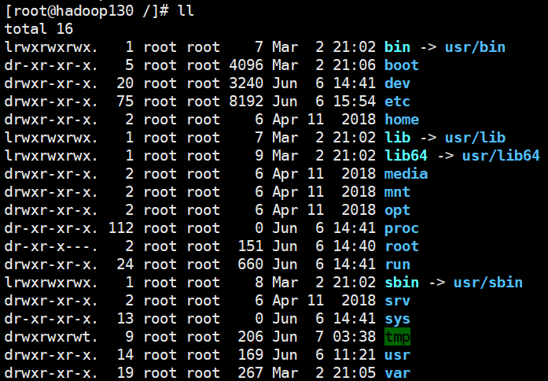

## 文件目录命令

### 环境

- Centos 7.6
- xshell 6
- vmvare 15.5


### pwd


#### 基本语法

pwd			（功能描述：显示当前工作目录的绝对路径）


#### 案例实操

```shell
# 显示当前工作目录的绝对路径
[root@hadoop130 ~]# pwd
/root
```


### ls


#### 基本语法

ls:list 列出目录内容


#### 选项说明

| 选项 | 功能                                                      |
| ---- | --------------------------------------------------------- |
| -a   | 全部的文件，连同隐藏档( 开头为 . 的文件) 一起列出来(常用) |
| -l   | 长数据串列出，包含文件的属性与权限等等数据；(常用)        |
|      |                                                           |
|      |                                                           |
|      |                                                           |


#### 显示说明

每行列出的信息依次是： 

文件类型与权限  链接数  文件属主  文件属组  文件大小用byte来表示  建立或最近修改的时间  名字 




#### 案例实操

```shell
# 查看当前目录的所有内容信息
ls -al
```


### cd

cd:Change Directory切换路径


#### 基本语法

cd [参数]


#### 参数说明

| 参数           | 功能                                 |
| -------------- | ------------------------------------ |
| cd 绝对路径    | 切换路径                             |
| cd**相对路径** | 切换路径                             |
| cd ~或者cd     | 回到自己的家目录                     |
| cd -           | 回到上一次所在目录                   |
| cd ..          | 回到当前目录的上一级目录             |
| cd -P          | 跳转到实际物理路径，而非快捷方式路径 |


#### 案例实操

```shell
# 使用绝对路径切换到root目录
cd /root/

# cd- 回到上一次所在目录
cd -
```


### mkdir

mkdir:Make directory 建立目录


#### 基本语法

mkdir [选项] 要创建的目录


#### 显示说明

| 选项 | 功能         |
| ---- | ------------ |
| -p   | 创建多层目录 |
|      |              |
|      |              |
|      |              |
|      |              |


#### 案例实操

```shell
# 创建一个目录
mkdir xiyou
# 创建一个多级目录
mkdir -p xiyou/dssz/meihouwang
```


### rmdir

*rmdir*:Remove directory 移动目录


#### 基本语法

rmdir 要删除的**空目录**


#### 案例实操

```shell
# 删除一个空的文件夹
rmdir xiyou/dssz/meihouwang
```


### touch

创建空文件


#### 基本语法

touch 文件名称


#### 案例实操

```shell
# 创建一个空的文件
touch xiyou/dssz/sunwukong.txt
```


### cp

复制文件或目录


#### 基本语法

cp [选项] source dest             （功能描述：复制source文件到dest）


#### 选项说明

| 选项 | 功能               |
| ---- | ------------------ |
| -r   | 递归复制整个文件夹 |


#### 参数说明

| 参数   | 功能     |
| ------ | -------- |
| source | 源文件   |
| dest   | 目标文件 |


#### 案例实操

```shell
# 复制文件
cp xiyou/dssz/suwukong.txt xiyou/mingjie/
# 递归复制整个文件夹
cp -r xiyou/dssz/ ./
```


#### 经验技巧

强制覆盖不提示的方法：\cp


### rm

移除文件或目录


#### 基本语法

rm [选项] deleteFile          （功能描述：递归删除目录中所有内容）


#### 选项说明

| 选项 | 功能                                     |
| ---- | ---------------------------------------- |
| -r   | 递归删除目录中所有内容                   |
| -f   | 强制执行删除操作，而不提示用于进行确认。 |
| -v   | 显示指令的详细执行过程                   |


#### 案例实操

```shell
# 删除目录中的内容
rm xiyou/mingjie/sunwukong.txt
# 递归删除目录中所有内容
rm -rf dssz/
```


### mv

移动文件与目录或重命名


#### 基本语法

- mv oldNameFile newNameFile   （功能描述：重命名）
- mv /temp/movefile /targetFolder  （功能描述：移动文件）


#### 显示说明

| 选项 | 功能 |
| ---- | ---- |
|      |      |
|      |      |
|      |      |
|      |      |
|      |      |


#### 案例实操

```shell
# 重命名
mv xiyou/dssz/suwukong.txt xiyou/dssz/houge.txt
# 移动文件
mv xiyou/dssz/houge.txt ./
```


### cat

查看文件内容，从第一行开始显示


#### 基本语法

cat [选项] 要查看的文件


#### 选项说明

| 选项 | 功能                         |
| ---- | ---------------------------- |
| -n   | 显示所有行的行号，包括空行。 |
|      |                              |
|      |                              |
|      |                              |
|      |                              |


#### 经验技巧

一般查看比较小的文件，**一屏幕能显示全的**。


#### 案例实操

```shell
# 查看文件内容并显示行号
cat -n houge.txt 
```


### more

more指令是一个基于VI编辑器的文本过滤器，它以全屏幕的方式按页显示文本文件的内容。more指令中内置了若干快捷键，详见操作说明。


#### 基本语法

more 要查看的文件


#### 操作说明

| 操作           | 功能                                     |
| -------------- | ---------------------------------------- |
| 空白键 (space) | 代表向下翻一页                           |
| Enter          | 代表向下翻『一行』                       |
| q              | 代表立刻离开 more ，不再显示该文件内容。 |
| Ctrl+F         | 向下滚动一屏                             |
| Ctrl+B         | 返回上一屏                               |
| =              | 输出当前行的行号                         |
| :f             | 输出文件名和当前行的行号                 |


#### 案例实操

```shell
# 采用more查看文件
more smartd.conf
```


### less

less指令用来分屏查看文件内容，它的功能与more指令类似，但是比more指令更加强大，支持各种显示终端。less指令在显示文件内容时，并不是一次将整个文件加载之后才显示，而是根据显示需要加载内容，对于显示**大型文件具有较高的效率**。


#### 基本语法

less 要查看的文件


#### 操作说明

| 操作       | 功能                                             |
| ---------- | ------------------------------------------------ |
| 空白键     | 向下翻动一页                                     |
| [pagedown] | 向下翻动一页                                     |
| [pageup]   | 向上翻动一页                                     |
| /字串      | 向下搜寻『字串』的功能；n：向下查找；N：向上查找 |
| ?字串      | 向上搜寻『字串』的功能；n：向上查找；N：向下查找 |
| q          | 离开 less 这个程序；                             |


#### 案例实操

```shell
# 采用less查看文件
less smartd.conf
```


### echo

echo输出内容到控制台


#### 基本语法

echo [选项] [输出内容]


#### 控制说明

| 控制字符 | 功能                |
| -------- | ------------------- |
| \\       | 输出\本身           |
| \n       | 换行符              |
| \t       | 制表符，也就是Tab键 |
|          |                     |
|          |                     |


#### 选项说明

| 控制字符 | 功能                     |
| -------- | ------------------------ |
| -e       | 支持反斜线控制的字符转换 |
|          |                          |
|          |                          |


#### 案例实操

```shell
[root@hadoop130 /]# echo "hello\\world"
hello\world

[root@hadoop130 /]# echo -e "hello\tworld"
hello	world
```


### head

用于显示文件的开头部分内容，默认情况下head指令显示文件的前10行内容。


#### 基本语法

head 文件      （功能描述：查看文件头10行内容）

head -n 5 文件   （功能描述：查看文件头5行内容，5可以是任意行数）


#### 案例实操

```shell
# 查看文件的头2行
head -n 2 smartd.conf
```


### tail

用于输出文件中尾部的内容，默认情况下tail指令显示文件的后10行内容。


#### 基本语法

tail 文件           （功能描述：查看文件后10行内容）

tail -n 5 文件       （功能描述：查看文件后5行内容，5可以是任意行数）

tail -f 文件    （功能描述：实时追踪该文档的所有更新）


#### 选项说明

| 选项     | 功能                                 |
| -------- | ------------------------------------ |
| -n<行数> | 输出文件尾部n行内容                  |
| -f       | 显示文件最新追加的内容，监视文件变化 |
|          |                                      |
|          |                                      |
|          |                                      |


#### 案例实操

```shell
# 查看文件头1行内容
tail -n 1 smartd.conf 

# 实时追踪该档的所有更新
tail -f houge.txt
```


### > 覆盖 和 >> 追加


#### 基本语法

- ll >文件     （功能描述：列表的内容写入文件a.txt中（**覆盖写**））

- ll >>文件    （功能描述：列表的内容**追加**到文件aa.txt的末尾）
- cat 文件1 > 文件2   （功能描述：将文件1的内容覆盖到文件2）
- echo “内容” >> 文件 


#### 案例实操

```shell
# 将ls查看信息写入到文件中
ls -l>houge.txt
# 将ls查看信息追加到文件中
ls -l>>houge.txt
# 采用echo将hello单词追加到文件中
echo hello>>houge.txt
```


### ln

软链接也成为符号链接，类似于windows里的快捷方式，有自己的数据块，主要存放了链接其他文件的路径。


#### 基本语法

ln -s [原文件或目录] [软链接名]    （功能描述：给原文件创建一个软链接）


#### 经验技巧

删除软链接： rm -rf 软链接名，而不是rm -rf 软链接名/

查询：通过ll就可以查看，列表属性第1位是l，尾部会有位置指向。


#### 案例实操

```shell
# 创建软连接
[root@hadoop130 /]# ln -s /root/anaconda-ks.cfg ln.txt
[root@hadoop130 /]# ll
total 16
lrwxrwxrwx.   1 root root    7 Mar  2 21:02 bin -> usr/bin
dr-xr-xr-x.   5 root root 4096 Mar  2 21:06 boot
drwxr-xr-x.  20 root root 3240 Jun  6 14:41 dev
drwxr-xr-x.  75 root root 8192 Jun  6 15:54 etc
drwxr-xr-x.   2 root root    6 Apr 11  2018 home
lrwxrwxrwx.   1 root root    7 Mar  2 21:02 lib -> usr/lib
lrwxrwxrwx.   1 root root    9 Mar  2 21:02 lib64 -> usr/lib64
lrwxrwxrwx.   1 root root   21 Jun  7 10:57 ln.txt -> /root/anaconda-ks.cfg
drwxr-xr-x.   2 root root    6 Apr 11  2018 media
drwxr-xr-x.   2 root root    6 Apr 11  2018 mnt
drwxr-xr-x.   2 root root    6 Apr 11  2018 opt
dr-xr-xr-x. 114 root root    0 Jun  6 14:41 proc
dr-xr-x---.   2 root root  151 Jun  7 10:56 root
drwxr-xr-x.  24 root root  660 Jun  6 14:41 run
lrwxrwxrwx.   1 root root    8 Mar  2 21:02 sbin -> usr/sbin
drwxr-xr-x.   2 root root    6 Apr 11  2018 srv
dr-xr-xr-x.  13 root root    0 Jun  6 14:41 sys
drwxrwxrwt.   9 root root  206 Jun  7 03:38 tmp
drwxr-xr-x.  14 root root  169 Jun  6 11:21 usr
drwxr-xr-x.  19 root root  267 Mar  2 21:05 var


# 删除软连接
[root@hadoop130 /]# rm -rf ln.txt 

# 进入软连接实际物理路径
[root@hadoop130 /]# ln -s /root/ ln.txt
[root@hadoop130 /]# cd -P ln.txt/
```


### history

查看已经执行过历史命令


#### 基本语法

history                    （功能描述：查看已经执行过历史命令）


#### 案例实操

```shell
# 查看已经执行过的历史命令
[root@hadoop130 ~]# history
```

