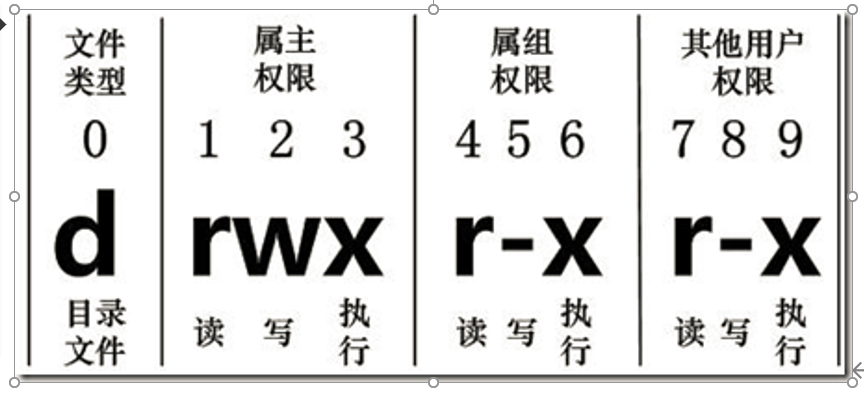
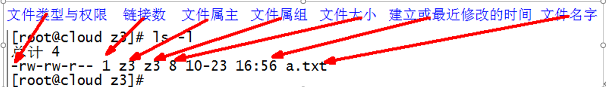
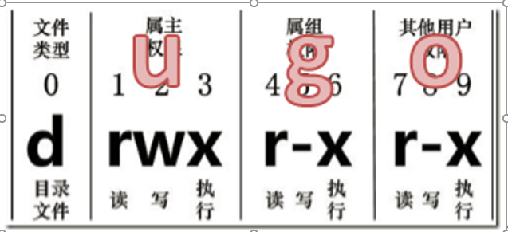

## 文件权限类命令

### 环境

- Centos 7.6
- xshell 6
- vmvare 15.5


### 文件属性

Linux系统是一种典型的多用户系统，不同的用户处于不同的地位，拥有不同的权限。为了保护系统的安全性，Linux系统对不同的用户访问同一文件（包括目录文件）的权限做了不同的规定。在Linux中我们可以使用 `ll` 或者 `ls -l` 命令来显示一个文件的属性以及文件所属的用户和组。


- 从左到右的10个字符表示



如果没有权限，就会出现减号[ - ]而已。从左至右用0-9这些数字来表示:

- 0首位表示类型

  在Linux中第一个字符代表这个文件是目录、文件或链接文件等等

  \- 代表文件

  d 代表目录

   l 链接文档(link file)；

- 第1-3位确定属主（该文件的所有者）拥有该文件的权限。---User

- 第4-6位确定属组（所有者的同组用户）拥有该文件的权限，---Group

- 第7-9位确定其他用户拥有该文件的权限 ---Other


#### rxw作用文件和目录的不同解释

- 作用到文件：

  [ r ]代表可读(read): 可以读取，查看

  [ w ]代表可写(write): 可以修改，但是不代表可以删除该文件，删除一个文件的前提条件是对该文件所在的目录有写权限，才能删除该文件.

  [ x ]代表可执行(execute):可以被系统执行

- 作用到目录：

  [ r ]代表可读(read): 可以读取，ls查看目录内容

  [ w ]代表可写(write): 可以修改，目录内创建+删除+重命名目录

  [ x ]代表可执行(execute):可以进入该目录


#### 案例实操

```shell
[root@hadoop130 opt]# ll
total 0
drwxr-xr-x. 2 kk   kk   6 Jun  7 22:02 t_dir
drwxr-xr-x. 2 root root 6 Jun  7 22:01 test_dir
```





- 如果查看到是文件：链接数指的是硬链接个数。创建硬链接方

  ln [原文件] [目标文件]  

  ```shell
  ln xiyou/dssz/houge.txt ./hg.txt
  ```

- 如果查看的是文件夹：链接数指的是子文件夹个数。

  ```shell
  [root@hadoop130 /]# ls -al opt/
  total 0
  drwxr-xr-x.  4 root root  35 Jun  7 22:02 .
  dr-xr-xr-x. 17 root root 238 Jun  7 11:01 ..
  drwxr-xr-x.  2 kk   kk     6 Jun  7 22:02 t_dir
  drwxr-xr-x.  2 root root   6 Jun  7 22:01 test_dir
  ```

  


### chmod 改变权限


#### 基本语法



- 第一种方式变更权限

  chmod [{ugoa}{+-=}{rwx}] 文件或目录

- 第二种方式变更权限

  chmod [mode=421 ] [文件或目录]


#### 经验技巧

u:所有者 g:所有组 o:其他人 a:所有人(u、g、o的总和)

r=4 w=2 x=1    rwx=4+2+1=7


#### 案例实操

```shell
# 修改文件使其所属主用户具有执行权限
cp xiyou/dssz/houge.txt ./
chmod u+x houge.txt

# 修改文件使其所属组用户具有执行权限
chmod g+x houge.txt

# 修改文件所属主用户执行权限,并使其他用户具有执行权限
chmod u-x,o+x houge.txt

# 采用数字的方式，设置文件所有者、所属组、其他用户都具有可读可写可执行权限。
chmod 777 houge.txt

# 修改整个文件夹里面的所有文件的所有者、所属组、其他用户都具有可读可写可执行权限。
 chmod -R 777 xiyou/
```


###  chown 改变所有者


#### 基本语法

chown [选项] [最终用户] [文件或目录]      （功能描述：改变文件或者目录的所有者）


#### 选项说明

| 选项 | 功能     |
| ---- | -------- |
| -R   | 递归操作 |
|      |          |
|      |          |


#### 案例实操

```shell
# 修改文件所有者
 chown atguigu houge.txt 
 
 # 递归改变文件所有者和所有组
 chown -R atguigu:atguigu xiyou/
```


###  chgrp 改变所属组


#### 基本语法

chgrp [最终用户组] [文件或目录]    （功能描述：改变文件或者目录的所属组）


#### 案例实操

```shell
# 修改文件的所属组
chgrp root houge.txt
```


### 命令


#### 基本语法


#### 经验技巧


#### 选项说明

| 选项 | 功能 |
| ---- | ---- |
|      |      |
|      |      |
|      |      |
|      |      |
|      |      |


#### 案例实操

```shell
# 

```


### 命令


#### 基本语法


#### 经验技巧


#### 选项说明

| 选项 | 功能 |
| ---- | ---- |
|      |      |
|      |      |
|      |      |
|      |      |
|      |      |


#### 案例实操

```shell
# 

```


### 命令


#### 基本语法


#### 经验技巧


#### 选项说明

| 选项 | 功能 |
| ---- | ---- |
|      |      |
|      |      |
|      |      |
|      |      |
|      |      |


#### 案例实操

```shell
# 

```


### 命令


#### 基本语法


#### 经验技巧


#### 选项说明

| 选项 | 功能 |
| ---- | ---- |
|      |      |
|      |      |
|      |      |
|      |      |
|      |      |


#### 案例实操

```shell
# 

```


### 命令


#### 基本语法


#### 经验技巧


#### 选项说明

| 选项 | 功能 |
| ---- | ---- |
|      |      |
|      |      |
|      |      |
|      |      |
|      |      |


#### 案例实操

```shell
# 

```


### 命令


#### 基本语法


#### 经验技巧


#### 选项说明

| 选项 | 功能 |
| ---- | ---- |
|      |      |
|      |      |
|      |      |
|      |      |
|      |      |


#### 案例实操

```shell
# 

```


### 命令


#### 基本语法


#### 经验技巧


#### 选项说明

| 选项 | 功能 |
| ---- | ---- |
|      |      |
|      |      |
|      |      |
|      |      |
|      |      |


#### 案例实操

```shell
# 

```


### 命令


#### 基本语法


#### 经验技巧


#### 选项说明

| 选项 | 功能 |
| ---- | ---- |
|      |      |
|      |      |
|      |      |
|      |      |
|      |      |


#### 案例实操

```shell
# 

```


### 命令


#### 基本语法


#### 经验技巧


#### 选项说明

| 选项 | 功能 |
| ---- | ---- |
|      |      |
|      |      |
|      |      |
|      |      |
|      |      |


#### 案例实操

```shell
# 

```


### 命令


#### 基本语法


#### 经验技巧


#### 选项说明

| 选项 | 功能 |
| ---- | ---- |
|      |      |
|      |      |
|      |      |
|      |      |
|      |      |


#### 案例实操

```shell
# 

```


### 命令


#### 基本语法


#### 经验技巧


#### 选项说明

| 选项 | 功能 |
| ---- | ---- |
|      |      |
|      |      |
|      |      |
|      |      |
|      |      |


#### 案例实操

```shell
# 

```


### 命令


#### 基本语法


#### 经验技巧


#### 选项说明

| 选项 | 功能 |
| ---- | ---- |
|      |      |
|      |      |
|      |      |
|      |      |
|      |      |


#### 案例实操

```shell
# 

```


### 命令


#### 基本语法


#### 经验技巧


#### 选项说明

| 选项 | 功能 |
| ---- | ---- |
|      |      |
|      |      |
|      |      |
|      |      |
|      |      |


#### 案例实操

```shell
# 

```


### 命令


#### 基本语法


#### 经验技巧


#### 选项说明

| 选项 | 功能 |
| ---- | ---- |
|      |      |
|      |      |
|      |      |
|      |      |
|      |      |


#### 案例实操

```shell
# 

```


### 命令


#### 基本语法


#### 经验技巧


#### 选项说明

| 选项 | 功能 |
| ---- | ---- |
|      |      |
|      |      |
|      |      |
|      |      |
|      |      |


#### 案例实操

```shell
# 

```


### 命令


#### 基本语法


#### 经验技巧


#### 选项说明

| 选项 | 功能 |
| ---- | ---- |
|      |      |
|      |      |
|      |      |
|      |      |
|      |      |


#### 案例实操

```shell
# 

```


### 命令


#### 基本语法


#### 经验技巧


#### 选项说明

| 选项 | 功能 |
| ---- | ---- |
|      |      |
|      |      |
|      |      |
|      |      |
|      |      |


#### 案例实操

```shell
# 

```


### 命令


#### 基本语法


#### 经验技巧


#### 选项说明

| 选项 | 功能 |
| ---- | ---- |
|      |      |
|      |      |
|      |      |
|      |      |
|      |      |


#### 案例实操

```shell
# 

```


### 命令


#### 基本语法


#### 经验技巧


#### 选项说明

| 选项 | 功能 |
| ---- | ---- |
|      |      |
|      |      |
|      |      |
|      |      |
|      |      |


#### 案例实操

```shell
# 

```


### 命令


#### 基本语法


#### 经验技巧


#### 选项说明

| 选项 | 功能 |
| ---- | ---- |
|      |      |
|      |      |
|      |      |
|      |      |
|      |      |


#### 案例实操

```shell
# 

```


### 命令


#### 基本语法


#### 经验技巧


#### 选项说明

| 选项 | 功能 |
| ---- | ---- |
|      |      |
|      |      |
|      |      |
|      |      |
|      |      |


#### 案例实操

```shell
# 

```


### 命令


#### 基本语法


#### 经验技巧


#### 选项说明

| 选项 | 功能 |
| ---- | ---- |
|      |      |
|      |      |
|      |      |
|      |      |
|      |      |


#### 案例实操

```shell
# 

```


### 命令


#### 基本语法


#### 经验技巧


#### 选项说明

| 选项 | 功能 |
| ---- | ---- |
|      |      |
|      |      |
|      |      |
|      |      |
|      |      |


#### 案例实操

```shell
# 

```


