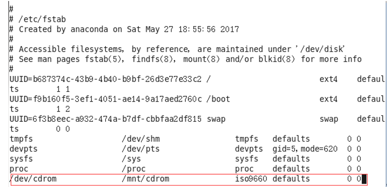

## 磁盘分区类命令

### 环境

- Centos 7.6
- xshell 6
- vmvare 15.5


### df

查看磁盘空间使用情况 

df: disk free 空余硬盘


#### 基本语法

df 选项 						（功能描述：列出文件系统的整体磁盘使用量，检查文件系统的磁盘空间占用情况）


#### 选项说明

| 选项 | 功能                                                     |
| ---- | -------------------------------------------------------- |
| -h   | 以人们较易阅读的 GBytes, MBytes, KBytes 等格式自行显示； |
|      |                                                          |


#### 案例实操

```shell
# 查看磁盘使用情况
[root@hadoop130 usr]# df -h
Filesystem               Size  Used Avail Use% Mounted on
devtmpfs                 898M     0  898M   0% /dev
tmpfs                    910M     0  910M   0% /dev/shm
tmpfs                    910M  9.5M  901M   2% /run
tmpfs                    910M     0  910M   0% /sys/fs/cgroup
/dev/mapper/centos-root   44G  1.4G   43G   4% /
/dev/sda1               1014M  150M  865M  15% /boot
tmpfs                    182M     0  182M   0% /run/user/0
```


### fdisk

fdisk 查看分区


#### 基本语法

fdisk -l         （功能描述：查看磁盘分区详情）


#### 经验技巧

该命令必须在root用户下才能使用


#### 功能说明

- Linux分区
  - Device：分区序列
  - Boot：引导
  - Start：从X磁柱开始
  - End：到Y磁柱结束
  - Blocks：容量
  - Id：分区类型ID
  - System：分区类型


#### 选项说明

| 选项 | 功能                   |
| ---- | ---------------------- |
| -l   | 显示所有硬盘的分区列表 |
|      |                        |


#### 案例实操

```shell
# 查看磁盘得分区情况
[root@hadoop130 usr]# fdisk -l

Disk /dev/sda: 53.7 GB, 53687091200 bytes, 104857600 sectors
Units = sectors of 1 * 512 = 512 bytes
Sector size (logical/physical): 512 bytes / 512 bytes
I/O size (minimum/optimal): 512 bytes / 512 bytes
Disk label type: dos
Disk identifier: 0x000c1145

   Device Boot      Start         End      Blocks   Id  System
/dev/sda1   *        2048     2099199     1048576   83  Linux
/dev/sda2         2099200   104857599    51379200   8e  Linux LVM

Disk /dev/mapper/centos-root: 47.2 GB, 47240445952 bytes, 92266496 sectors
Units = sectors of 1 * 512 = 512 bytes
Sector size (logical/physical): 512 bytes / 512 bytes
I/O size (minimum/optimal): 512 bytes / 512 bytes


Disk /dev/mapper/centos-swap: 5368 MB, 5368709120 bytes, 10485760 sectors
Units = sectors of 1 * 512 = 512 bytes
Sector size (logical/physical): 512 bytes / 512 bytes
I/O size (minimum/optimal): 512 bytes / 512 bytes
```


### mount/umount

 挂载/卸载

对于Linux用户来讲，不论有几个分区，分别分给哪一个目录使用，它总归就是一个根目录、一个独立且唯一的文件结构。

Linux中每个分区都是用来组成整个文件系统的一部分，它在用一种叫做“挂载”的处理方法，它整个文件系统中包含了一整套的文件和目录，并将一个分区和一个目录联系起来，要载入的那个分区将使它的存储空间在这个目录下获得。

**挂载前准备（必须要有光盘或者已经连接镜像文件）**


#### 基本语法

mount [-t vfstype] [-o options] device dir   （功能描述：挂载设备）

umount 设备文件名或挂载点			（功能描述：卸载设备）


#### 经验技巧


#### 参数说明

| 参数       | 功能                                                         |
| ---------- | ------------------------------------------------------------ |
| -t vfstype | 指定文件系统的类型，通常不必指定。mount 会自动选择正确的类型。<br />常用类型有：  <br />光盘或光盘镜像：iso9660  <br />DOS fat16文件系统：msdos  <br />[Windows](http://blog.csdn.net/hancunai0017/article/details/6995284) 9x fat32文件系统：vfat  <br />Windows NT ntfs文件系统：ntfs  <br />Mount Windows文件[网络](http://blog.csdn.net/hancunai0017/article/details/6995284)共享：smbfs  <br />[UNIX](http://blog.csdn.net/hancunai0017/article/details/6995284)(LINUX) 文件网络共享：nfs |
| -o options | 主要用来描述设备或档案的挂接方式。常用的参数有： <br /> loop：用来把一个文件当成硬盘分区挂接上系统  <br />ro：采用只读方式挂接设备  rw：采用读写方式挂接设备  　 <br />iocharset：指定访问文件系统所用字符集 |
| device     | 要挂接(mount)的设备                                          |
| dir        | 设备在系统上的挂接点(mount point)                            |
|            |                                                              |


#### 案例实操

```shell
# 挂载光盘镜像文件
mkdir /mnt/cdrom/
# 设备/dev/cdrom挂载到 挂载点 ：  /mnt/cdrom中
mount -t iso9660 /dev/cdrom /mnt/cdrom/
# 卸载光盘镜像文件
umount /mnt/cdrom
```


#### 设置开机自动挂载

```shell
vi /etc/fstab
```

添加红框中内容，保存退出



