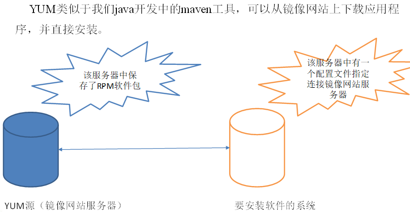
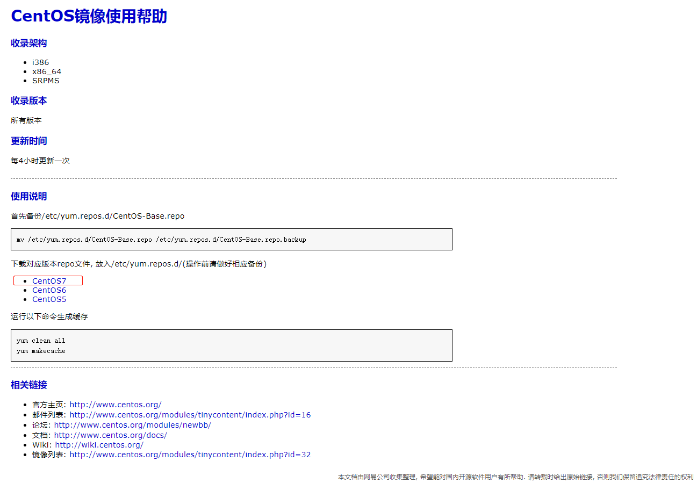

## YUM命令

### 环境

- Centos 7.6
- xshell 6
- vmvare 15.5


### YUM概述

YUM（全称为 Yellow dog Updater, Modified）是一个在Fedora和RedHat以及CentOS中的Shell前端软件包管理器。基于RPM包管理，能够从指定的服务器自动下载RPM包并且安装，可以自动处理依赖性关系，并且一次安装所有依赖的软件包，无须繁琐地一次次下载、安装




### YUM的常用命令


#### 基本语法

yum [选项] [参数]


#### 选项说明

| 选项 | 功能                  |
| ---- | --------------------- |
| -y   | 对所有提问都回答“yes” |


#### 参数说明

| 参数         | 功能                          |
| ------------ | ----------------------------- |
| install      | 安装rpm软件包                 |
| update       | 更新rpm软件包                 |
| check-update | 检查是否有可用的更新rpm软件包 |
| remove       | 删除指定的rpm软件包           |
| list         | 显示软件包信息                |
| clean        | 清理yum过期的缓存             |
| deplist      | 显示yum软件包的所有依赖关系   |


#### 案例实操

```shell
# 采用yum方式安装vim
[root@hadoop130 media]# yum -y install vim
```


### 修改网络YUM源

默认的系统YUM源，需要连接国外apache网站，网速比较慢，可以修改关联的网络YUM源为国内镜像的网站，比如网易163。


#### 前期文件准备

- 前提条件linux系统必须可以联网
- 在Linux环境中访问该网络地址：http://mirrors.163.com/.help/centos.html，在使用说明中点击CentOS7->再点击保存




#### 备份原文件

```shell
[root@hadoop130 yum.repos.d]# mv /etc/yum.repos.d/CentOS-Base.repo /etc/yum.repos.d/CentOS-Base.repo.backup
```


#### 替换本地yum文件

```shell
# 将下载的镜像文件移动到原镜像文件位置
[root@hadoop130 yum.repos.d]# mv /usr/src/CentOS7-Base-163.repo /etc/yum.repos.d/
```


#### 安装命令

```shell
yum clean all
yum makecache
```


#### 测试

```shell
[root@hadoop130 yum.repos.d]# yum list | grep firefox
firefox.i686                                68.9.0-1.el7.centos        updates  
firefox.x86_64                              68.9.0-1.el7.centos        updates
```

