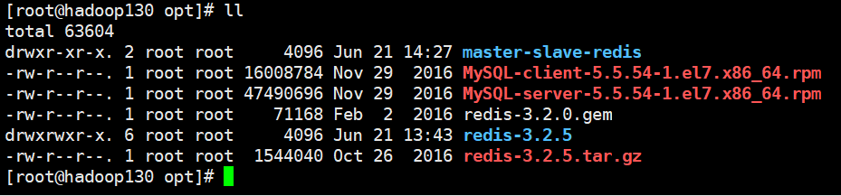
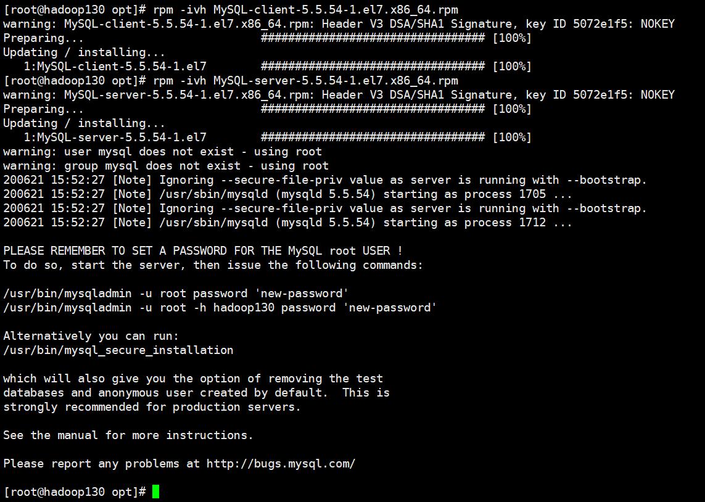
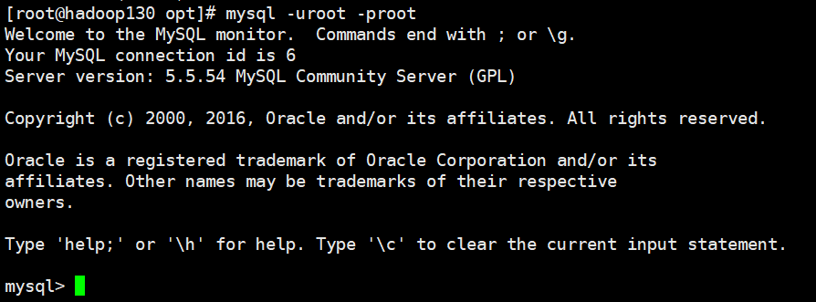
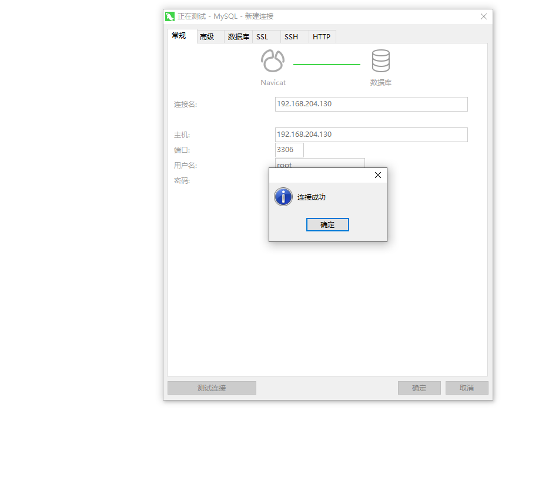

## Mysql的简介和安装

### 环境

- Centos 7.6
- xshell 6
- vmvare 15.5
- mysql 5.5
- navicat 15.9


### Mysql简介

MySQL是一个关系型数据库管理系统，由瑞典MySQL AB公司开发，目前属于Oracle公司。 
MySQL是一种关联数据库管理系统，将数据保存在不同的表中，而不是将所有数据放在一个大仓库内，这样就增加了速度并提高了灵活性。

Mysql是开源的，所以你不需要支付额外的费用。
Mysql是可以定制的，采用了GPL协议，你可以修改源码来开发自己的Mysql系统。 

Mysql支持大型的数据库。可以处理拥有上千万条记录的大型数据库。
MySQL使用标准的SQL数据语言形式。
Mysql可以允许于多个系统上，并且支持多种语言。这些编程语言包括C、C++、Python、Java、Perl、PHP、Eiffel、Ruby和Tcl等。
MySQL支持大型数据库，支持5000万条记录的数据仓库，32位系统表文件最大可支持4GB，64位系统支持最大的表文件为8TB。


### Mysql5.5开始安装


#### 下载mysql安装包

[mysql官网](http://dev.mysql.com/downloads/mysql/) : http://dev.mysql.com/downloads/mysql/

```shell
# 进入 /opt 目录
[root@hadoop130 ~]# cd /opt/

# 下载 mysql 服务端
[root@hadoop130 opt]# wget https://downloads.mysql.com/archives/get/p/23/file/MySQL-server-5.5.54-1.el7.x86_64.rpm

# 下载mysql客户端
[root@hadoop130 opt]# wget https://downloads.mysql.com/archives/get/p/23/file/MySQL-client-5.5.54-1.el7.x86_64.rpm
```




#### 检查当前系统是否安装过mysql

##### Centos6

```shell
rpm -qa|grep mysql

#如果存在mysql-libs的旧版本包，执行卸载命令
rpm -e --nodeps  mysql-libs
```


##### Centos7

```shell
# 查看是否安装了mysql
yum list installed | grep mariadb
# 卸载命令
yum -y remove mariadb*
```


#### 安装mysql

```shell
[root@hadoop130 opt]# ll
total 63604
drwxr-xr-x. 2 root root     4096 Jun 21 14:27 master-slave-redis
-rw-r--r--. 1 root root 16008784 Nov 29  2016 MySQL-client-5.5.54-1.el7.x86_64.rpm
-rw-r--r--. 1 root root 47490696 Nov 29  2016 MySQL-server-5.5.54-1.el7.x86_64.rpm
-rw-r--r--. 1 root root    71168 Feb  2  2016 redis-3.2.0.gem
drwxrwxr-x. 6 root root     4096 Jun 21 13:43 redis-3.2.5
-rw-r--r--. 1 root root  1544040 Oct 26  2016 redis-3.2.5.tar.gz

# 安装 mysql 客户端
[root@hadoop130 opt]# rpm -ivh MySQL-client-5.5.54-1.el7.x86_64.rpm

# 安装 mysql 服务端
[root@hadoop130 opt]# rpm -ivh MySQL-server-5.5.54-1.el7.x86_64.rpm
```



**此时root用户还没有设置密码**


#### 查看mysql版本

```shell
[root@hadoop130 opt]# mysqladmin --version
mysqladmin  Ver 8.42 Distrib 5.5.54, for Linux on x86_64
```


#### mysql服务的启动和停止

```shell
# mysql启动命令
[root@hadoop130 opt]# service mysql start

# mysql停止命令
[root@hadoop130 opt]# service mysql stop
```


#### 设置root用户密码

**需要先启动mysql服务**

```shell
[root@hadoop130 opt]# mysqladmin -u root password 'root'
/usr/bin/mysqladmin -u root -h hadoop130 password 'root'
```


#### 登录mysql

```shell
[root@hadoop130 opt]# mysql -uroot -proot
```




#### MySQL的安装位置

- 在linux下查看安装目录

```shell
[root@hadoop130 opt]# ps -ef|grep mysql
root       1889      1  0 15:59 ?        00:00:00 /bin/sh /usr/bin/mysqld_safe --datadir=/var/lib/mysql --pid-file=/var/lib/mysql/hadoop130.pid
mysql      1976   1889  0 15:59 ?        00:00:00 /usr/sbin/mysqld --basedir=/usr --datadir=/var/lib/mysql --plugin-dir=/usr/lib64/mysql/plugin --user=mysql --log-error=/var/lib/mysql/hadoop130.err --pid-file=/var/lib/mysql/hadoop130.pid
root       2026   1525  0 16:04 pts/0    00:00:00 grep --color=auto mysql
```

**参数路径解释备注：**

-  --basedir /usr/bin     相关命令目录mysqladmin mysqldump等命令

- --datadir/var/lib/mysql/    mysql数据库文件的存放路径

- --pid-file=/var/lib/mysql/hadoop130.pid	进程pid文件
- --plugin-dir=/usr/lib64/mysql/plugin    mysql插件存放路径
- --log-error=/var/lib/mysql/hadoop130.err    mysql错误日志路径
- --socket/var/lib/mysql/mysql.sock    本地连接时用的unix套接字文件
- /etc/init.d/mysql    服务启停相关脚本
- /usr/share/mysql    配置文件目录mysql脚本及配置文件


#### mysql开启远程连接

```shell
# 命令行登录mysql
[root@hadoop130 mysql]# mysql -uroot -proot
# 切换到mysql数据库
mysql> use mysql;
# 创建一个所有ip都可以登录的root账号
mysql> CREATE USER 'root'@'%' IDENTIFIED BY 'root';
# 为该账号授权
mysql> GRANT ALL ON *.* TO 'root'@'%';
# 刷新权限
mysql> FLUSH PRIVILEGES;
```

**测试使用navicat登录mysql**




