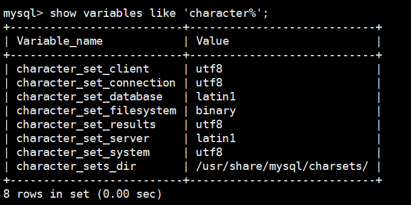

## Mysql插入中文乱码的问题

### 环境

- Centos 7.6
- xshell 6
- vmvare 15.5
- mysql 5.5
- navicat 15.9


### 查看字符集


```shell
[root@hadoop130 ~]# mysql -uroot -proot

mysql> show variables like 'character%';
+--------------------------+----------------------------+
| Variable_name            | Value                      |
+--------------------------+----------------------------+
| character_set_client     | utf8                       |
| character_set_connection | utf8                       |
| character_set_database   | latin1                     |
| character_set_filesystem | binary                     |
| character_set_results    | utf8                       |
| character_set_server     | latin1                     |
| character_set_system     | utf8                       |
| character_sets_dir       | /usr/share/mysql/charsets/ |
+--------------------------+----------------------------+
8 rows in set (0.00 sec)

mysql> show variables like '%char%';
+--------------------------+----------------------------+
| Variable_name            | Value                      |
+--------------------------+----------------------------+
| character_set_client     | utf8                       |
| character_set_connection | utf8                       |
| character_set_database   | latin1                     |
| character_set_filesystem | binary                     |
| character_set_results    | utf8                       |
| character_set_server     | latin1                     |
| character_set_system     | utf8                       |
| character_sets_dir       | /usr/share/mysql/charsets/ |
+--------------------------+----------------------------+
8 rows in set (0.00 sec)

```



**默认的服务器用了latin1，所以会乱码。**


### 修改my-huge.cnf

在/usr/share/mysql/ 中找到my-huge.cnf的配置文件， 拷贝其中的my-huge.cnf 到 /etc/ 并命名为my.cnf 

然后修改my.cnf:

```shell
[root@hadoop130 ~]# cp /usr/share/mysql/my-huge.cnf /etc/my.cnf
[root@hadoop130 ~]# vim /etc/my.cnf

#################### 更新以下内容 ###################
[client]
default-character-set=utf8
[mysqld]
character_set_server=utf8
character_set_client=utf8
collation-server=utf8_general_ci
[mysql]
default-character-set=utf8
############# 在文件的相应位置插入以上内容 ##############
```


### 重新启动mysql

```shell
[root@hadoop130 ~]# service mysql restart
```


### 查看原库的字符集

```shell
mysql> show create database mydb;
```

原库的设定不会发生变化，参数修改之对新建的数据库生效


### 已生成的库表字符集如何变更

**修改数据库的字符集**

```shell
mysql> alter database mydb character set 'utf8';
```

**修改数据表的字符集**

```shell
mysql> alter table mytbl convert to character set 'utf8';
```

但是原有的数据如果是用非'utf8'编码的话，数据本身不会发生改变。

