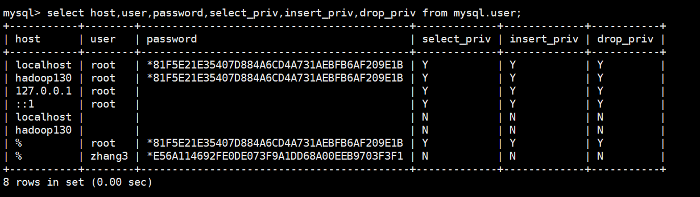

## Mysql的用户管理

### 环境

- Centos 7.6
- xshell 6
- vmvare 15.5
- mysql 5.5
- navicat 15.9


### 创建用户

```shell
[root@hadoop130 ~]# mysql -uroot -proot
mysql> use mysql;
Database changed

mysql> create user zhang3 identified by '123123';
Query OK, 0 rows affected (0.00 sec)
# 表示创建名称为zhang3的用户，密码设为123123；
```


### 查看用户

```shell
mysql> select host,user,password,select_priv,insert_priv,drop_priv from mysql.user;
```




- host ：  表示连接类型

  ​    % 表示所有远程通过 TCP方式的连接

  ​    IP 地址 如 (192.168.1.2,127.0.0.1) 通过制定ip地址进行的TCP方式的连接

  ​    机器名  通过制定i网络中的机器名进行的TCP方式的连接

  ​    ::1  IPv6的本地ip地址 等同于IPv4的 127.0.0.1

  ​    localhost 本地方式通过命令行方式的连接 ，比如mysql -u xxx -p 123xxx 方式的连接。

-  User:表示用户名

  同一用户通过不同方式链接的权限是不一样的。

- password ： 密码

  所有密码串通过 password(明文字符串) 生成的密文字符串。加密算法为MYSQLSHA1 ，不可逆 。

  mysql 5.7 的密码保存到 authentication_string 字段中不再使用password 字段。

-  select_priv , insert_priv等

   为该用户所拥有的权限。


### 设置密码


#### 修改当前用户的密码:

```shell
mysql> set password =password('123456');
Query OK, 0 rows affected (0.00 sec)
```


#### 修改某个用户的密码：

```shell
mysql> update mysql.user set password=password('123456') where user='zhang3';
Query OK, 1 row affected (0.00 sec)
Rows matched: 1  Changed: 1  Warnings: 0
```


#### flush privileges;

*#所有通过user表的修改，必须用该命令才能生效。*

```shell
mysql> flush privileges;
Query OK, 0 rows affected (0.00 sec)
```


### 修改用户名

```shell
mysql> update mysql.user set user='li4' where user='wang5';
mysql> flush privileges;
# 所有通过user表的修改，必须用该命令才能生效
```


### 删除用户

```shell
mysql> drop user 'zhang3';
# 不要通过delete from  user u where user='zhang3' 进行删除，系统会有残留信息保留。
```


