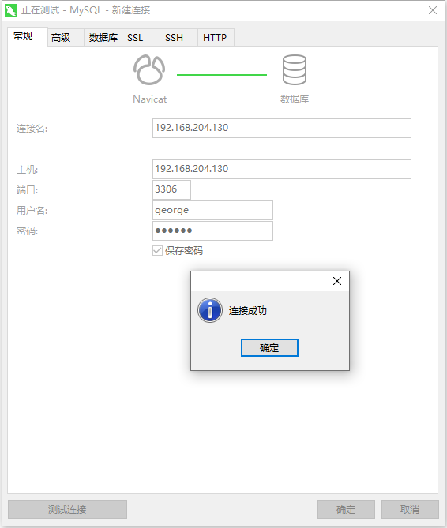

## Mysql的权限管理

### 环境

- Centos 7.6
- xshell 6
- vmvare 15.5
- mysql 5.5
- navicat 15.9


### 授予权限


#### 授权命令

**grant 权限1,权限2,…权限n on 数据库名称.表名称 to 用户名@用户地址 identified by ‘连接口令’;**

**该权限如果发现没有该用户，则会直接新建一个用户。**

比如：

```shell
# 给li4用户用本地命令行方式下，授予test这个库下的所有表的插删改查的权限。
mysql> grant select,insert,delete,drop on test.* to li4@localhost;

# 授予通过网络方式登录的的george用户 ，对所有库所有表的全部权限，密码设为123456
mysql> grant all privileges on *.* to george@'%' identified by '123456';
# 不能忘了这一句
mysql> flush privileges;
```




### 收回权限


#### 查看当前用户权限

```shell
mysql> show grants;
+----------------------------------------------------------------------------------------------------------------------------------------+
| Grants for root@localhost                                                                                                              |
+----------------------------------------------------------------------------------------------------------------------------------------+
| GRANT ALL PRIVILEGES ON *.* TO 'root'@'localhost' IDENTIFIED BY PASSWORD '*81F5E21E35407D884A6CD4A731AEBFB6AF209E1B' WITH GRANT OPTION |
| GRANT PROXY ON ''@'' TO 'root'@'localhost' WITH GRANT OPTION                                                                           |
+----------------------------------------------------------------------------------------------------------------------------------------+
2 rows in set (0.00 sec)
```


#### 收回权限命令

revoke  权限1,权限2,…权限n on 数据库名称.表名称  from  用户名@用户地址；

```shell
# 收回全库全表的所有权限
mysql> revoke all on *.* from 'george'@'%';
Query OK, 0 rows affected (0.00 sec)

mysql> flush privileges;
Query OK, 0 rows affected (0.00 sec)

# 收回mysql库下的所有表的插删改查权限
mysql> REVOKE select,insert,update,delete ON *.* FROM 'george'@'%';
Query OK, 0 rows affected (0.00 sec)

mysql> flush privileges;
Query OK, 0 rows affected (0.00 sec)
```

**必须用户重新登录后才能生效**


### 查看权限


#### 查看当前用户权限

```shell
mysql> show grants;
```


#### 查看某用户的全局权限

```shell
mysql> show grants for li4@'localhost';
+---------------------------------------------------------------------+
| Grants for li4@localhost                                            |
+---------------------------------------------------------------------+
| GRANT USAGE ON *.* TO 'li4'@'localhost'                             |
| GRANT SELECT, INSERT, DELETE, DROP ON `test`.* TO 'li4'@'localhost' |
+---------------------------------------------------------------------+
2 rows in set (0.00 sec)
```


#### 查看某用户的某个表的权限

```shell
mysql> grant all on mysql.user to test@'%' identified by '123456';
Query OK, 0 rows affected (0.00 sec)

mysql> select * from mysql.tables_priv;
```


