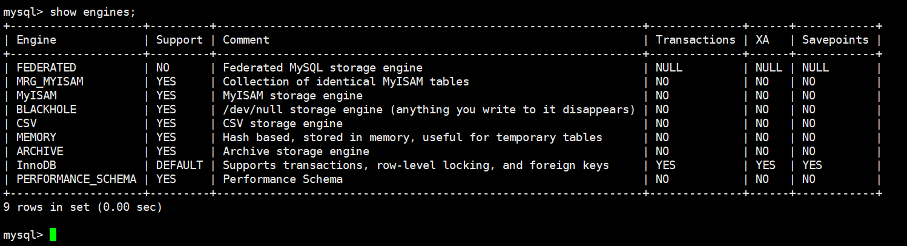
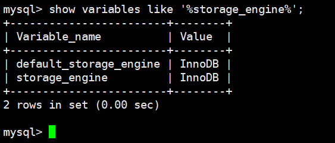
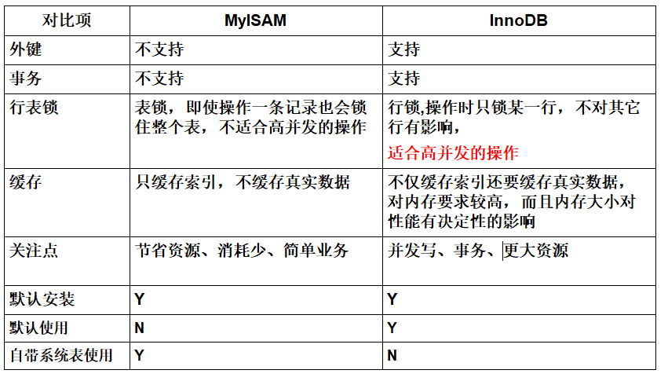

## Mysql存储引擎

### 环境

- Centos 7.6
- xshell 6
- vmvare 15.5
- mysql 5.5
- navicat 15.9


### 查看命令


```shell
# 查看mysql现在已提供什么存储引擎:
mysql> show engines;
```




#### 查看mysql当前默认的存储引擎:

```shell
mysql> show variables like '%storage_engine%';
```




### 各个引擎简介


#### 1、InnoDB存储引擎

InnoDB是MySQL的默认事务型引擎，它被设计用来处理大量的短期(short-lived)事务。除非有非常特别的原因需要使用其他的存储引擎，否则应该优先考虑InnoDB引擎。

#### 2、MyISAM存储引擎

MyISAM提供了大量的特性，包括全文索引、压缩、空间函数(GIS)等，但MyISAM不支持事务和行级锁，有一个毫无疑问的缺陷就是崩溃后无法安全恢复。

#### 3、Archive引擎

Archive档案存储引擎只支持INSERT和SELECT操作，在MySQL5.1之前不支持索引。
Archive表适合日志和数据采集类应用。
根据英文的测试结论来看，Archive表比MyISAM表要小大约75%，比支持事务处理的InnoDB表小大约83%。

#### 4、Blackhole引擎

Blackhole引擎没有实现任何存储机制，它会丢弃所有插入的数据，不做任何保存。但服务器会记录Blackhole表的日志，所以可以用于复制数据到备库，或者简单地记录到日志。但这种应用方式会碰到很多问题，因此并不推荐。 

#### 5、CSV引擎 

CSV引擎可以将普通的CSV文件作为MySQL的表来处理，但不支持索引。
CSV引擎可以作为一种数据交换的机制，非常有用。
CSV存储的数据直接可以在操作系统里，用文本编辑器，或者excel读取。

#### 6、Memory引擎

如果需要快速地访问数据，并且这些数据不会被修改，重启以后丢失也没有关系，那么使用Memory表是非常有用。Memory表至少比MyISAM表要快一个数量级。

#### 7、Federated引擎

Federated引擎是访问其他MySQL服务器的一个代理，尽管该引擎看起来提供了一种很好的跨服务器的灵活性，但也经常带来问题，因此默认是禁用的。


### MyISAM和InnoDB


