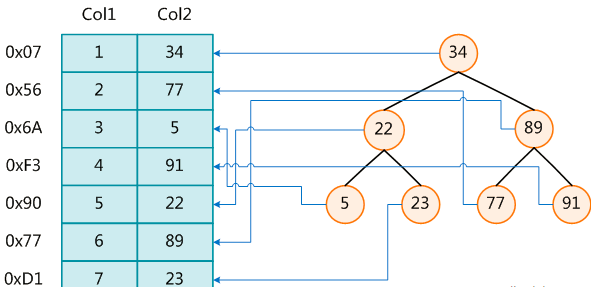

## mysql索引简介

### 环境

- Centos 7.6
- xshell 6
- vmvare 15.5
- mysql 5.5
- navicat 15.9

### 什么是索引

MySQL官方对索引的定义为：索引（Index）是帮助MySQL高效获取数据的数据结构。
可以得到索引的本质：索引是数据结构。

#### 详解(重要)

在数据之外，数据库系统还维护着满足特定查找算法的数据结构，这些数据结构以某种方式引用（指向）数据，
这样就可以在这些数据结构上实现高级查找算法。这种数据结构，就是索引。下图就是一种可能的索引方式示例：

左边是数据表，一共有两列七条记录，最左边的是数据记录的物理地址
 为了加快Col2的查找，可以维护一个右边所示的二叉查找树，每个节点分别包含索引键值和一个指向对应数据记录物理地址的指针，这样就可以运用二叉查找在一定的复杂度内获取到相应数据，从而快速的检索出符合条件的记录。

#### 结论

数据本身之外，数据库还维护着一个满足特定查找算法的数据结构，这些数据结构以某种方式指向数据，这样就可以在这些数据结构的基础上实现高级查找算法，这种数据结构就是索引。

#### 注意：

一般来说索引本身也很大，不可能全部存储在内存中，因此索引往往以索引文件的形式存储的磁盘上

### 索引的优势

类似大学图书馆建书目索引，提高数据检索的效率，降低数据库的IO成本。

通过索引列对数据进行排序，降低数据排序的成本，降低了CPU的消耗。

### 索引的劣势

虽然索引大大提高了查询速度，同时却会降低更新表的速度，如对表进行INSERT、UPDATE和DELETE。
因为更新表时，MySQL不仅要保存数据，还要保存一下索引文件每次更新添加了索引列的字段，
都会调整因为更新所带来的键值变化后的索引信息。

实际上索引也是一张表，该表保存了主键与索引字段，并指向实体表的记录，所以索引列也是要占用空间的