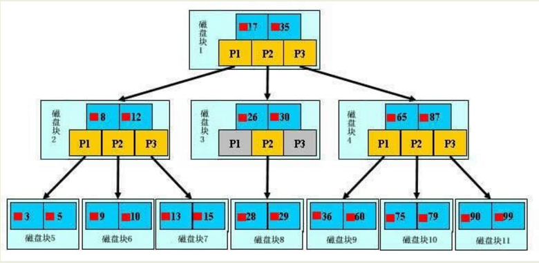
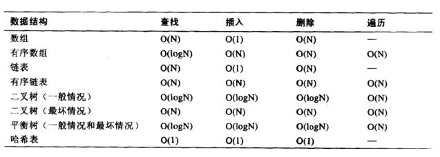
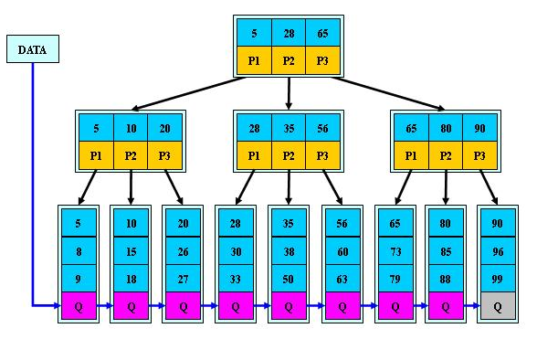
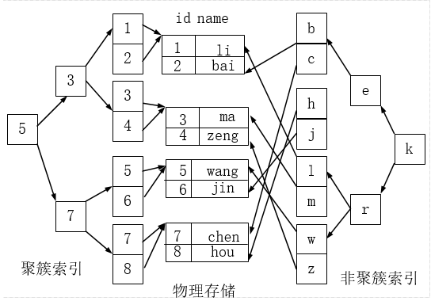

## 标题

### 环境

- Centos 7.6
- xshell 6
- vmvare 15.5
- mysql 5.5
- navicat 15.9

### BTree索引

#### 原理图

【初始化介绍】 
一颗b树，浅蓝色的块我们称之为一个磁盘块，可以看到每个磁盘块包含几个数据项（深蓝色所示）和指针（黄色所示），
如磁盘块1包含数据项17和35，包含指针P1、P2、P3，
P1表示小于17的磁盘块，P2表示在17和35之间的磁盘块，P3表示大于35的磁盘块。
真实的数据存在于叶子节点即3、5、9、10、13、15、28、29、36、60、75、79、90、99。
非叶子节点只不存储真实的数据，只存储指引搜索方向的数据项，如17、35并不真实存在于数据表中。

【查找过程】
如果要查找数据项29，那么首先会把磁盘块1由磁盘加载到内存，此时发生一次IO，在内存中用二分查找确定29在17和35之间，锁定磁盘块1的P2指针，内存时间因为非常短（相比磁盘的IO）可以忽略不计，通过磁盘块1的P2指针的磁盘地址把磁盘块3由磁盘加载到内存，发生第二次IO，29在26和30之间，锁定磁盘块3的P2指针，通过指针加载磁盘块8到内存，发生第三次IO，同时内存中做二分查找找到29，结束查询，总计三次IO。

真实的情况是，3层的b+树可以表示上百万的数据，如果上百万的数据查找只需要三次IO，性能提高将是巨大的，如果没有索引，每个数据项都要发生一次IO，那么总共需要百万次的IO，显然成本非常非常高。

#### 时间复杂度

同一问题可用不同算法解决，而一个算法的质量优劣将影响到算法乃至程序的效率。算法分析的目的在于选择合适算法和改进算法。

### B+Tree索引

#### 原理图

#### B+Tree与B-Tree 的区别

1）B-树的关键字和记录是放在一起的，叶子节点可以看作外部节点，不包含任何信息；B+树的非叶子节点中只有关键字和指向下一个节点的索引，记录只放在叶子节点中。
　 2）在B-树中，越靠近根节点的记录查找时间越快，只要找到关键字即可确定记录的存在；而B+树中每个记录的查找时间基本是一样的，都需要从根节点走到叶子节点，而且在叶子节点中还要再比较关键字。从这个角度看B-树的性能好像要比B+树好，而在实际应用中却是B+树的性能要好些。因为B+树的非叶子节点不存放实际的数据，这样每个节点可容纳的元素个数比B-树多，树高比B-树小，这样带来的好处是减少磁盘访问次数。尽管B+树找到一个记录所需的比较次数要比B-树多，但是一次磁盘访问的时间相当于成百上千次内存比较的时间，因此实际中B+树的性能可能还会好些，而且B+树的叶子节点使用指针连接在一起，方便顺序遍历（例如查看一个目录下的所有文件，一个表中的所有记录等），这也是很多数据库和文件系统使用B+树的缘故。 
　
思考：为什么说B+树比B-树更适合实际应用中操作系统的文件索引和数据库索引？ 
1) B+树的磁盘读写代价更低 
　　B+树的内部结点并没有指向关键字具体信息的指针。因此其内部结点相对B 树更小。如果把所有同一内部结点的关键字存放在同一盘块中，那么盘块所能容纳的关键字数量也越多。一次性读入内存中的需要查找的关键字也就越多。相对来说IO读写次数也就降低了。 
2) B+树的查询效率更加稳定 
　　由于非终结点并不是最终指向文件内容的结点，而只是叶子结点中关键字的索引。所以任何关键字的查找必须走一条从根结点到叶子结点的路。所有关键字查询的路径长度相同，导致每一个数据的查询效率相当。

### 聚簇索引与非聚簇索引

聚簇索引并不是一种单独的索引类型，而是一种数据存储方式。
术语‘聚簇’表示数据行和相邻的键值聚簇的存储在一起。
 如下图，左侧的索引就是聚簇索引，因为数据行在磁盘的排列和索引排序保持一致。

#### 聚簇索引的好处

- 按照聚簇索引排列顺序，查询显示一定范围数据的时候，由于数据都是紧密相连，数据库不不用从多个数据块中提取数据，所以节省了大量的io操作。

#### 聚簇索引的限制

- 对于mysql数据库目前只有innodb数据引擎支持聚簇索引，而Myisam并不支持聚簇索引。

- 由于数据物理存储排序方式只能有一种，所以每个Mysql的表只能有一个聚簇索引。一般情况下就是该表的主键。

- 为了充分利用聚簇索引的聚簇的特性，所以innodb表的主键列尽量选用有序的顺序id，而不建议用无序的id，比如uuid这种。

