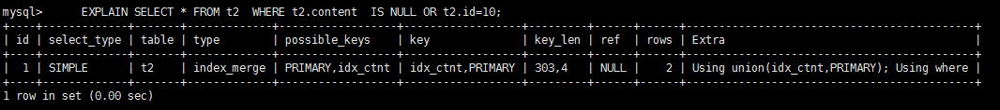
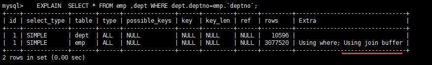

## Explain简介

### 环境

- Centos 7.6
- xshell 6
- vmvare 15.5
- mysql 5.5
- navicat 15.9


### Explain是什么

使用EXPLAIN关键字可以模拟优化器执行SQL查询语句，从而知道MySQL是
如何处理你的SQL语句的。分析你的查询语句或是表结构的性能瓶颈


### Explain能做什么

- 表的读取顺序
- 哪些索引可以使用
- 数据读取操作的操作类型
- 哪些索引被实际使用
- 表之间的引用
- 每张表有多少行被物理查询


### Explain如何使用

Explain + SQL语句

```shell
mysql> explain SELECT e.id, e.empno, e.`name` from t_emp e INNER JOIN t_dept d ON e.deptId = d.id;
```


#### 执行计划包含信息


#### 建表脚本

```shell
CREATE TABLE t1(id INT(10) AUTO_INCREMENT,content  VARCHAR(100) NULL ,  PRIMARY KEY (id));
CREATE TABLE t2(id INT(10) AUTO_INCREMENT,content  VARCHAR(100) NULL ,  PRIMARY KEY (id));
CREATE TABLE t3(id INT(10) AUTO_INCREMENT,content  VARCHAR(100) NULL ,  PRIMARY KEY (id));
CREATE TABLE t4(id INT(10) AUTO_INCREMENT,content  VARCHAR(100) NULL ,  PRIMARY KEY (id));

INSERT INTO t1(content) VALUES(CONCAT('t1_',FLOOR(1+RAND()*1000)));
INSERT INTO t2(content) VALUES(CONCAT('t2_',FLOOR(1+RAND()*1000)));
INSERT INTO t3(content) VALUES(CONCAT('t3_',FLOOR(1+RAND()*1000)));
INSERT INTO t4(content) VALUES(CONCAT('t4_',FLOOR(1+RAND()*1000)));
```


### 名词字段解释


#### id

select查询的序列号,包含一组数字，表示查询中执行select子句或操作表的顺序.

三种情况:

- id相同，执行顺序由上至下

  

- id不同，如果是子查询，id的序号会递增，id值越大优先级越高，越先被执行

  

  id不同，如果是子查询，id的序号会递增，id值越大优先级越高，越先被执行

- id相同不同，同时存在

  

  id如果相同，可以认为是一组，从上往下顺序执行；
  在所有组中，id值越大，优先级越高，越先执行

  衍生 = DERIVED

**id号每个号码，表示一趟独立的查询。一个sql 的查询趟数越少越好。**


#### select_type

##### 有哪些


**查询的类型，主要是用于区别。普通查询、联合查询、子查询等的复杂查询**


##### SIMPLE

简单的 select 查询,查询中不包含子查询或者UNION


##### PRIMARY

查询中若包含任何复杂的子部分，最外层查询则被标记为Primary


##### DERIVED

在FROM列表中包含的子查询被标记为DERIVED(衍生)
MySQL会递归执行这些子查询, 把结果放在临时表里。


##### SUBQUERY

在SELECT或WHERE列表中包含了子查询


##### DEPENDENT SUBQUERY

在SELECT或WHERE列表中包含了子查询,子查询基于外层


##### UNCACHEABLE SUBQUREY


SHOW VARIABLES LIKE '%lower_case_table_names%';

SELECT @@lower_case_table_names FROM DUAL;


##### UNION

若第二个SELECT出现在UNION之后，则被标记为UNION；
若UNION包含在FROM子句的子查询中,外层SELECT将被标记为：DERIVED


##### UNION RESULT

从UNION表获取结果的SELECT


#### table

显示这一行的数据是关于哪张表的


#### type


##### 访问类型排列

type显示的是访问类型，是较为重要的一个指标，结果值从最好到最坏依次是： 

system > const > eq_ref > ref > fulltext > ref_or_null > index_merge > unique_subquery > index_subquery > range > index > ALL 

 

system>const>eq_ref>ref>range>index>ALL


一般来说，得保证查询至少达到range级别，最好能达到ref。


##### system

表只有一行记录（等于系统表），这是const类型的特列，平时不会出现，这个也可以忽略不计


##### const

表示通过索引一次就找到了,const用于比较primary key或者unique索引。因为只匹配一行数据，所以很快
如将主键置于where列表中，MySQL就能将该查询转换为一个常量


##### eq_ref

唯一性索引扫描，对于每个索引键，表中只有一条记录与之匹配。常见于主键或唯一索引扫描


##### ref

非唯一性索引扫描，返回匹配某个单独值的所有行.
本质上也是一种索引访问，它返回所有匹配某个单独值的行，然而，
它可能会找到多个符合条件的行，所以他应该属于查找和扫描的混合体


##### range

只检索给定范围的行,使用一个索引来选择行。key 列显示使用了哪个索引
一般就是在你的where语句中出现了between、<、>、in等的查询
这种范围扫描索引扫描比全表扫描要好，因为它只需要开始于索引的某一点，而结束语另一点，不用扫描全部索引。


##### index

出现index是sql使用了索引但是没用通过索引进行过滤，一般是使用了覆盖索引或者是利用索引进行了排序分组


#### all

Full Table Scan，将遍历全表以找到匹配的行。


##### index_merge

在查询过程中需要多个索引组合使用，通常出现在有 or 的关键字的sql中。




##### ref_or_null

对于某个字段既需要关联条件，也需要null值得情况下。查询优化器会选择用ref_or_null连接查询。


##### index_subquery

利用索引来关联子查询，不再全表扫描。


##### unique_subquery 

该联接类型类似于index_subquery。 子查询中的唯一索引


**备注：一般来说，得保证查询至少达到range级别，最好能达到ref。**


#### possible_keys

显示可能应用在这张表中的索引，一个或多个。
查询涉及到的字段上若存在索引，则该索引将被列出，但不一定被查询实际使用


#### key

实际使用的索引。如果为NULL，则没有使用索引。

查询中若使用了覆盖索引，则该索引和查询的select字段重叠


##### key_len

表示索引中使用的字节数，可通过该列计算查询中使用的索引的长度。 

key_len字段能够帮你检查是否充分的利用上了索引。


如何计算
1 、先看索引上字段的类型+长度比如 int=4 ;  varchar(20) =20 ; char(20) =20  
2  、如果是varchar或者char这种字符串字段，视字符集要乘不同的值，比如utf-8  要乘 3,GBK要乘2，
3 、varchar这种动态字符串要加2个字节
4、 允许为空的字段要加1个字节 


 第一组
key_len=age的字节长度+name的字节长度=4+1  + ( 20*3+2)=5+62=67
 第二组
 key_len=age的字节长度=4+1=5


#### ref

显示索引的哪一列被使用了，如果可能的话，是一个常数。哪些列或常量被用于查找索引列上的值。


#### rows

rows列显示MySQL认为它执行查询时必须检查的行数。


#### Extra

包含不适合在其他列中显示但十分重要的额外信息

##### Using filesort 

说明mysql会对数据使用一个外部的索引排序，而不是按照表内的索引顺序进行读取。
MySQL中无法利用索引完成的排序操作称为“文件排序”


 出现filesort的情况：


优化后，不再出现filesort的情况：


**查询中排序的字段，排序字段若通过索引去访问将大大提高排序速度**


##### Using temporary 

使了用临时表保存中间结果,MySQL在对查询结果排序时使用临时表。常见于排序 order by 和分组查询 group by。

优化前存在 using  temporary 和 using  filesort：


优化前存在 using  temporary 和 using  filesort 不在，性能发生明显变化：


##### USING index

表示相应的select操作中使用了覆盖索引(Covering Index)，避免访问了表的数据行，效率不错！
如果同时出现using where，表明索引被用来执行索引键值的查找;
如果没有同时出现using where，表明索引只是用来读取数据而非利用索引执行查找。

利用索引进行了排序或分组


##### Using where

表明使用了where过滤


##### using join buffer

使用了连接缓存：




##### impossible where

where子句的值总是false，不能用来获取任何元组


##### select tables optimized away

在没有GROUPBY子句的情况下，基于索引优化MIN/MAX操作或者
对于MyISAM存储引擎优化COUNT(*)操作，不必等到执行阶段再进行计算，
查询执行计划生成的阶段即完成优化。

**在innodb中：**


**在Myisam中：**


