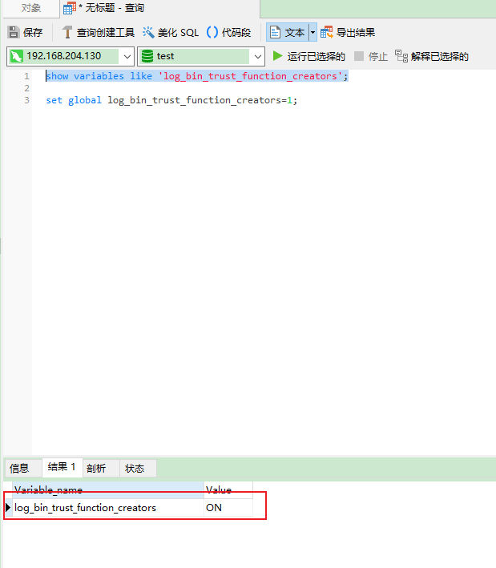
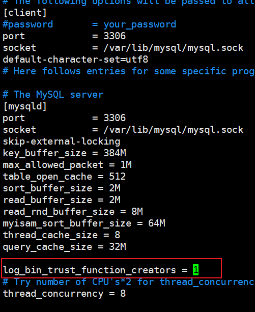
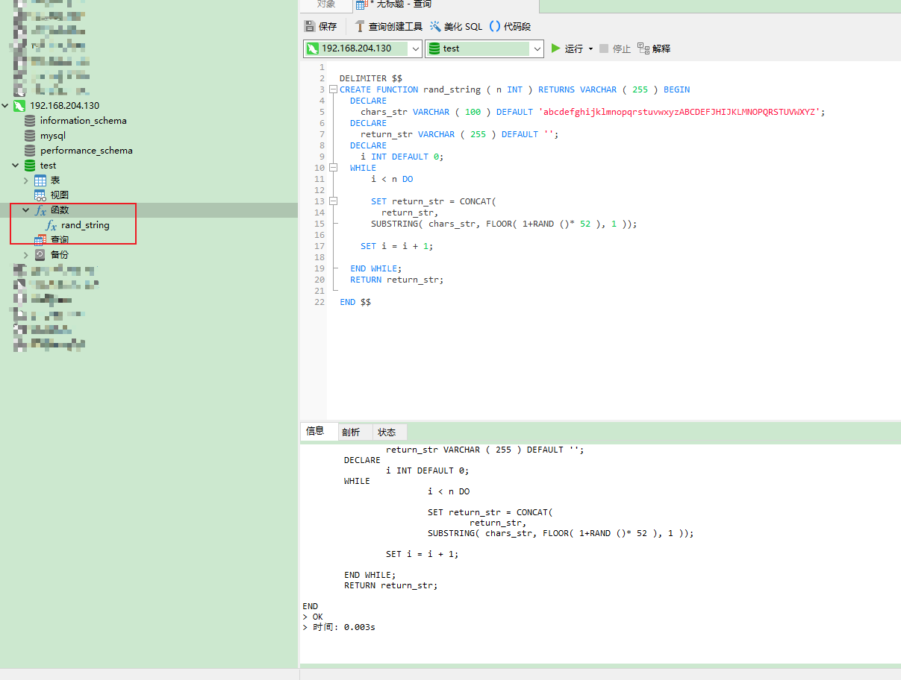
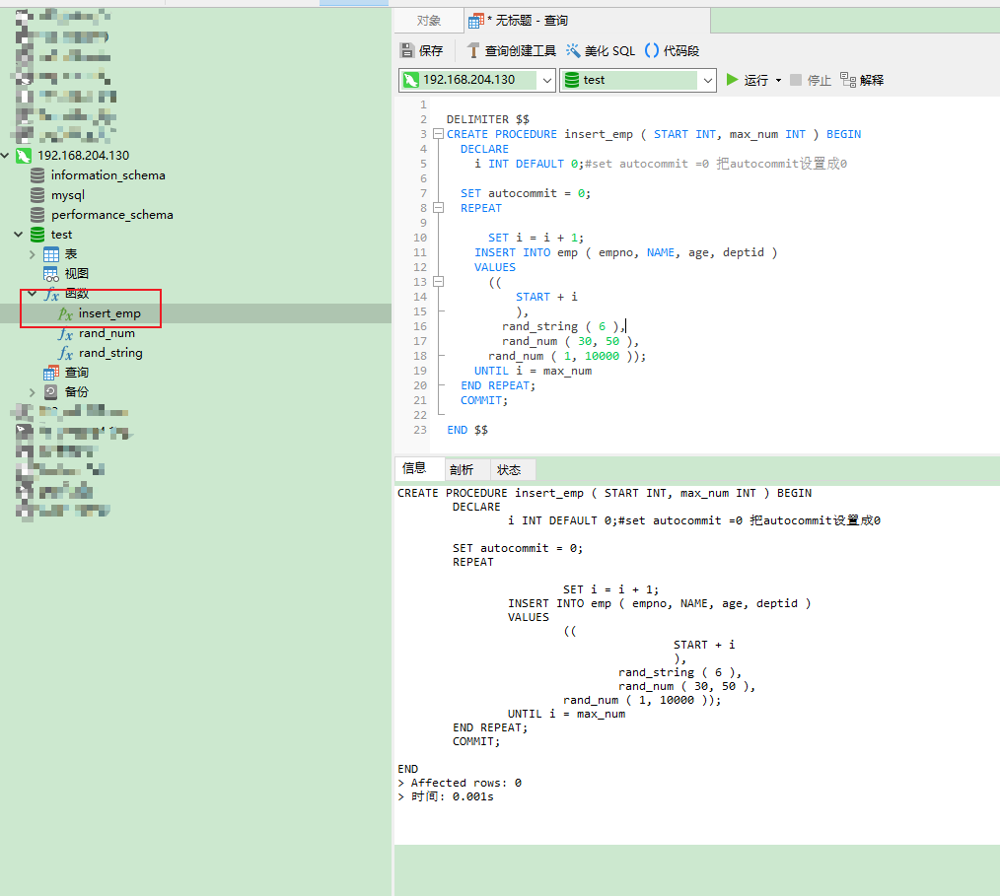

## 批量插入50W条数据

### 环境

- Centos 7.6
- xshell 6
- vmvare 15.5
- mysql 5.5
- navicat 15.9


### 建表

```shell
CREATE TABLE `dept` (
	`id` INT ( 11 ) NOT NULL AUTO_INCREMENT,
	`deptName` VARCHAR ( 30 ) DEFAULT NULL,
	`address` VARCHAR ( 40 ) DEFAULT NULL,
	ceo INT NULL,
	PRIMARY KEY ( `id` ) 
) ENGINE = INNODB AUTO_INCREMENT = 1 DEFAULT CHARSET = utf8;

CREATE TABLE `emp` (
	`id` INT ( 11 ) NOT NULL AUTO_INCREMENT,
	`empno` INT NOT NULL,
	`name` VARCHAR ( 20 ) DEFAULT NULL,
	`age` INT ( 3 ) DEFAULT NULL,
	`deptId` INT ( 11 ) DEFAULT NULL,
	PRIMARY KEY ( `id` ) #CONSTRAINT `fk_dept_id` FOREIGN KEY (`deptId`) REFERENCES `t_dept` (`id`)

) ENGINE = INNODB AUTO_INCREMENT = 1 DEFAULT CHARSET = utf8;
```


### 设置参数log_bin_trust_function_creators

创建函数，假如报错：This function has none of DETERMINISTIC......

由于开启过慢查询日志，因为我们开启了 bin-log, 我们就必须为我们的function指定一个参数。

```shell
show variables like 'log_bin_trust_function_creators';
set global log_bin_trust_function_creators=1;
```



这样添加了参数以后，如果mysqld重启，上述参数又会消失，永久方法：

windows下my.ini[mysqld]加上log_bin_trust_function_creators=1 

linux下    /etc/my.cnf下my.cnf[mysqld]加上log_bin_trust_function_creators=1




### 创建函数,保证每条数据都不同


#### 随机产生字符串

```shell
# 创建
DELIMITER $$
CREATE FUNCTION rand_string ( n INT ) RETURNS VARCHAR ( 255 ) BEGIN
	DECLARE
		chars_str VARCHAR ( 100 ) DEFAULT 'abcdefghijklmnopqrstuvwxyzABCDEFJHIJKLMNOPQRSTUVWXYZ';
	DECLARE
		return_str VARCHAR ( 255 ) DEFAULT '';
	DECLARE
		i INT DEFAULT 0;
	WHILE
			i < n DO
			
			SET return_str = CONCAT(
				return_str,
			SUBSTRING( chars_str, FLOOR( 1+RAND ()* 52 ), 1 ));
		
		SET i = i + 1;
		
	END WHILE;
	RETURN return_str;

END $$

# 删除
drop function rand_string;
```




#### 随机产生部门编号

```shell
# 用于随机产生多少到多少的编号
DELIMITER $$
CREATE FUNCTION rand_num ( from_num INT, to_num INT ) RETURNS INT ( 11 ) BEGIN
	DECLARE
		i INT DEFAULT 0;
	
	SET i = FLOOR(
		from_num + RAND()*(
			to_num - from_num + 1 
		));
	RETURN i;

END $$

# 删除
drop function rand_num;
```


### 创建存储过程


#### 创建往emp表中插入数据的存储过程

```shell
# 执行存储过程，往emp表插入数据
DELIMITER $$
CREATE PROCEDURE insert_emp ( START INT, max_num INT ) BEGIN
	DECLARE
		i INT DEFAULT 0;#set autocommit =0 把autocommit设置成0
	
	SET autocommit = 0;
	REPEAT
			
			SET i = i + 1;
		INSERT INTO emp ( empno, NAME, age, deptid )
		VALUES
			((
					START + i 
					),
				rand_string ( 6 ),
				rand_num ( 30, 50 ),
			rand_num ( 1, 10000 ));
		UNTIL i = max_num 
	END REPEAT;
	COMMIT;

END $$

# 删除
DELIMITER;
drop PROCEDURE insert_emp;
```




#### 创建往dept表中插入数据的存储过程

```shell
# 执行存储过程，往dept表添加随机数据
DELIMITER $$
CREATE PROCEDURE `insert_dept` ( max_num INT ) BEGIN
	DECLARE
		i INT DEFAULT 0;
	
	SET autocommit = 0;
	REPEAT
			
			SET i = i + 1;
		INSERT INTO dept ( deptname, address, ceo )
		VALUES
			(
				rand_string ( 8 ),
				rand_string ( 10 ),
			rand_num ( 1, 500000 ));
		UNTIL i = max_num 
	END REPEAT;
	COMMIT;

END $$

#删除
DELIMITER;
drop PROCEDURE insert_dept;
```


### 调用存储过程


#### dept

```shell
# 执行存储过程，往dept表添加1万条数据
DELIMITER;
CALL insert_dept ( 10000 );
```


#### emp

```shell
# 执行存储过程，往emp表添加50万条数据
DELIMITER;
CALL insert_emp ( 100000, 500000 );
```


### 批量删除某个表上的索引


#### 存储过程

```shell
DELIMITER $$
CREATE PROCEDURE `proc_drop_index` (
	dbname VARCHAR ( 200 ),
	tablename VARCHAR ( 200 )) BEGIN
	DECLARE
		done INT DEFAULT 0;
	DECLARE
		ct INT DEFAULT 0;
	DECLARE
		_index VARCHAR ( 200 ) DEFAULT '';
	DECLARE
		_cur CURSOR FOR SELECT
		index_name 
	FROM
		information_schema.STATISTICS 
	WHERE
		table_schema = dbname 
		AND table_name = tablename 
		AND seq_in_index = 1 
		AND index_name <> 'PRIMARY';
	DECLARE
		CONTINUE HANDLER FOR NOT FOUND 
		SET done = 2;
	OPEN _cur;
	FETCH _cur INTO _index;
	WHILE
			_index <> '' DO
			
			SET @str = CONCAT( "drop index ", _index, " on ", tablename );
		PREPARE sql_str 
		FROM
			@str;
		EXECUTE sql_str;
		DEALLOCATE PREPARE sql_str;
		
		SET _index = '';
		FETCH _cur INTO _index;
		
	END WHILE;
	CLOSE _cur;

END $$
```


#### 执行存储过程 

```shell
CALL proc_drop_index ( "dbname", "tablename" );

# 示例
CALL proc_drop_index ( "test", "t2" );
```