## 单表使用索引及常见索引失败

### 环境

- Centos 7.6
- xshell 6
- vmvare 15.5
- mysql 5.5
- navicat 15.9


### 案例（索引失败）

#### 全值匹配索引

系统中经常出现的sql语句如下： 

```sql
EXPLAIN SELECT SQL_NO_CACHE * FROM emp WHERE emp.age=30;
EXPLAIN SELECT SQL_NO_CACHE * FROM emp WHERE emp.age=30 and deptid=4;
EXPLAIN SELECT SQL_NO_CACHE * FROM emp WHERE emp.age=30 and deptid=4 AND emp.name = 'abcd';
```

**建立索引：**

```sql
CREATE INDEX idx_age_deptid_name ON emp(age,deptid,NAME);
```

建立索引前:


索引后:

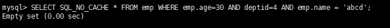


#### 最佳左前缀法则

如果索引了多列，要遵守最左前缀法则。指的是查询从索引的最左前列开始并且不跳过索引中的列。

```sql
EXPLAIN SELECT SQL_NO_CACHE * FROM emp WHERE emp.age=30   AND emp.name = 'abcd';
```


虽然可以正常使用，但是只有部分被使用到了。


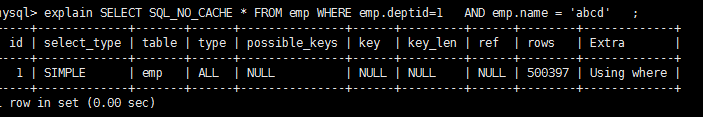

完全没有使用上索引。


**结论：**过滤条件要使用索引必须按照索引建立时的顺序，依次满足，一旦跳过某个字段，索引后面的字段都无法被使用


#### 不在索引列上做任何操作（计算、函数、(自动or手动)类型转换），会导致索引失效而转向全表扫描

```sql
EXPLAIN  SELECT SQL_NO_CACHE * FROM emp WHERE   emp.name  LIKE 'abc%';
```

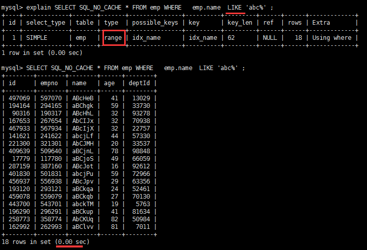


```sql
EXPLAIN SELECT SQL_NO_CACHE * FROM emp WHERE   LEFT(emp.name,3)  = 'abc';
```

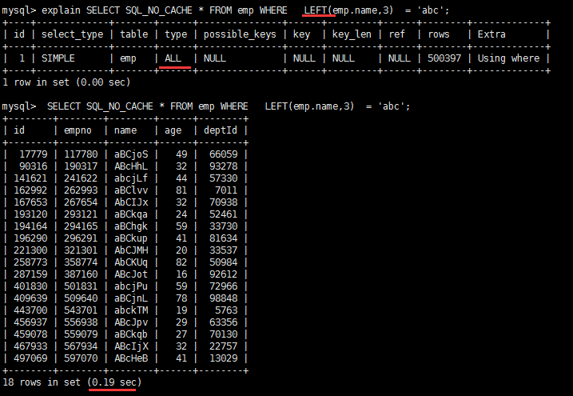


#### 存储引擎不能使用索引中范围条件右边的列

```sql
EXPLAIN SELECT  SQL_NO_CACHE * FROM emp WHERE emp.age=30 AND emp.deptId>20 AND emp.name = 'abc' ; 
```

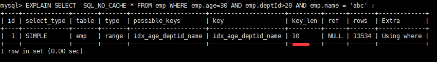

**只使用了 age 和 deptid 索引，没有使用name索引，以为name在 > 右边**


如果这种sql 出现较多应该建立：

```sql
create index idx_age_name_deptid on emp(age,name,deptid);
```

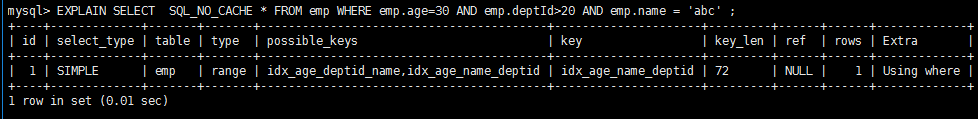


**删除索引**

```sql
drop index idx_age_name_deptid on emp;
```


#### mysql 在使用不等于(!= 或者<>)的时候无法使用索引会导致全表扫描

```sql
# 建立索引
CREATE INDEX idx_name ON emp(NAME);
# 分析语句
EXPLAIN SELECT SQL_NO_CACHE * FROM emp WHERE   emp.name <>  'abc';
```

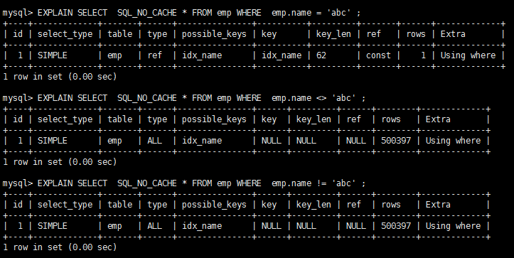


#### is not null 也无法使用索引,但是is null是可以使用索引的

```sql
EXPLAIN SELECT * FROM emp WHERE age IS NULL;
  
EXPLAIN SELECT * FROM emp WHERE age IS NOT NULL;
```

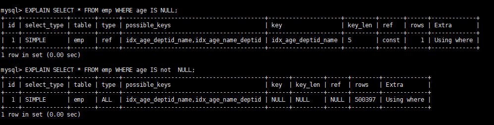


#### like以通配符开头('%abc...')mysql索引失效会变成全表扫描的操作

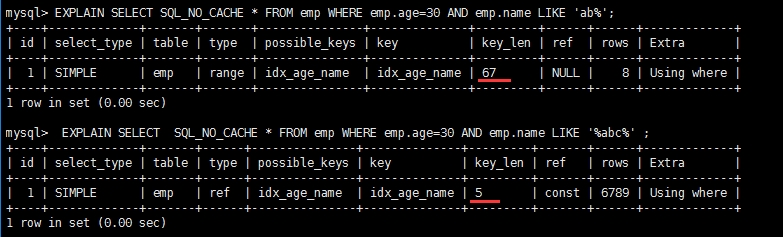


#### 字符串不加单引号索引失效

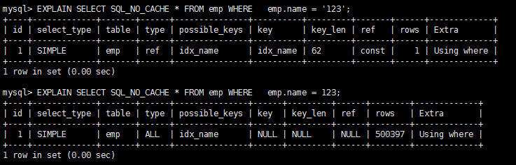


#### 总结

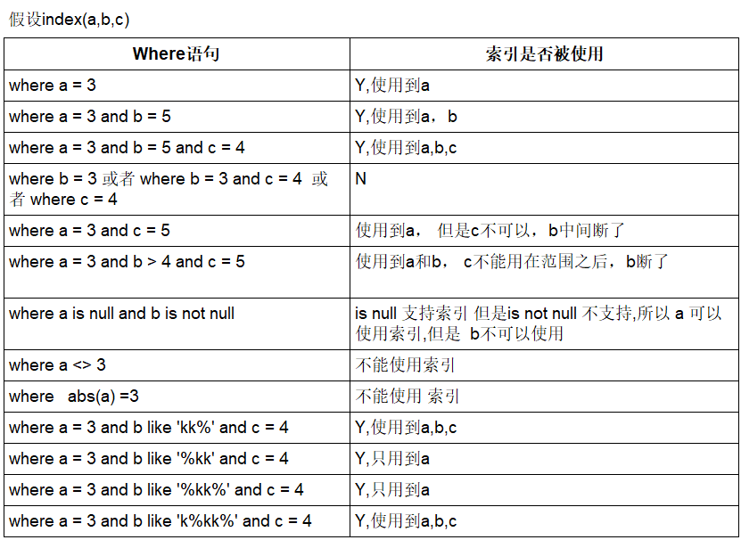


### 一般性建议

- 对于单键索引，尽量选择针对当前query过滤性更好的索引
- 在选择组合索引的时候，当前Query中过滤性最好的字段在索引字段顺序中，位置越靠前越好。
- 在选择组合索引的时候，尽量选择可以能够包含当前query中的where字句中更多字段的索引
- 在选择组合索引的时候，如果某个字段可能出现范围查询时，尽量把这个字段放在索引次序的最后面
- 书写sql语句时，尽量避免造成索引失效的情况