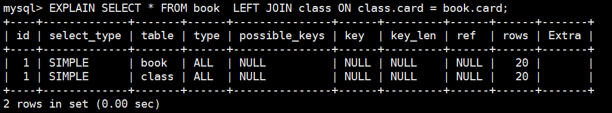
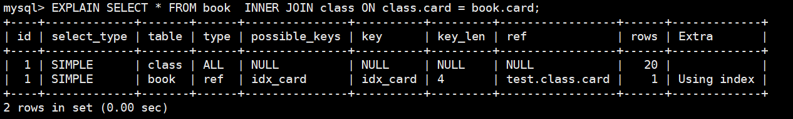
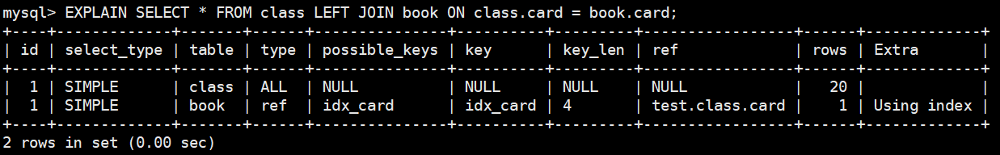
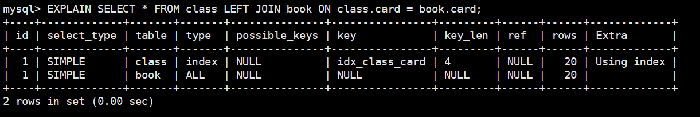

## Mysql关联查询优化

### 环境

- Centos 7.6
- xshell 6
- vmvare 15.5
- mysql 5.5
- navicat 15.9


### 建表SQL

```sql
CREATE TABLE IF NOT EXISTS `class` (
`id` INT(10) UNSIGNED NOT NULL AUTO_INCREMENT,
`card` INT(10) UNSIGNED NOT NULL,
PRIMARY KEY (`id`)
);

CREATE TABLE IF NOT EXISTS `book` (
`bookid` INT(10) UNSIGNED NOT NULL AUTO_INCREMENT,
`card` INT(10) UNSIGNED NOT NULL,
PRIMARY KEY (`bookid`)
);

 
INSERT INTO class(card) VALUES(FLOOR(1 + (RAND() * 20)));
INSERT INTO class(card) VALUES(FLOOR(1 + (RAND() * 20)));
INSERT INTO class(card) VALUES(FLOOR(1 + (RAND() * 20)));
INSERT INTO class(card) VALUES(FLOOR(1 + (RAND() * 20)));
INSERT INTO class(card) VALUES(FLOOR(1 + (RAND() * 20)));
INSERT INTO class(card) VALUES(FLOOR(1 + (RAND() * 20)));
INSERT INTO class(card) VALUES(FLOOR(1 + (RAND() * 20)));
INSERT INTO class(card) VALUES(FLOOR(1 + (RAND() * 20)));
INSERT INTO class(card) VALUES(FLOOR(1 + (RAND() * 20)));
INSERT INTO class(card) VALUES(FLOOR(1 + (RAND() * 20)));
INSERT INTO class(card) VALUES(FLOOR(1 + (RAND() * 20)));
INSERT INTO class(card) VALUES(FLOOR(1 + (RAND() * 20)));
INSERT INTO class(card) VALUES(FLOOR(1 + (RAND() * 20)));
INSERT INTO class(card) VALUES(FLOOR(1 + (RAND() * 20)));
INSERT INTO class(card) VALUES(FLOOR(1 + (RAND() * 20)));
INSERT INTO class(card) VALUES(FLOOR(1 + (RAND() * 20)));
INSERT INTO class(card) VALUES(FLOOR(1 + (RAND() * 20)));
INSERT INTO class(card) VALUES(FLOOR(1 + (RAND() * 20)));
INSERT INTO class(card) VALUES(FLOOR(1 + (RAND() * 20)));
INSERT INTO class(card) VALUES(FLOOR(1 + (RAND() * 20)));
 
INSERT INTO book(card) VALUES(FLOOR(1 + (RAND() * 20)));
INSERT INTO book(card) VALUES(FLOOR(1 + (RAND() * 20)));
INSERT INTO book(card) VALUES(FLOOR(1 + (RAND() * 20)));
INSERT INTO book(card) VALUES(FLOOR(1 + (RAND() * 20)));
INSERT INTO book(card) VALUES(FLOOR(1 + (RAND() * 20)));
INSERT INTO book(card) VALUES(FLOOR(1 + (RAND() * 20)));
INSERT INTO book(card) VALUES(FLOOR(1 + (RAND() * 20)));
INSERT INTO book(card) VALUES(FLOOR(1 + (RAND() * 20)));
INSERT INTO book(card) VALUES(FLOOR(1 + (RAND() * 20)));
INSERT INTO book(card) VALUES(FLOOR(1 + (RAND() * 20)));
INSERT INTO book(card) VALUES(FLOOR(1 + (RAND() * 20)));
INSERT INTO book(card) VALUES(FLOOR(1 + (RAND() * 20)));
INSERT INTO book(card) VALUES(FLOOR(1 + (RAND() * 20)));
INSERT INTO book(card) VALUES(FLOOR(1 + (RAND() * 20)));
INSERT INTO book(card) VALUES(FLOOR(1 + (RAND() * 20)));
INSERT INTO book(card) VALUES(FLOOR(1 + (RAND() * 20)));
INSERT INTO book(card) VALUES(FLOOR(1 + (RAND() * 20)));
INSERT INTO book(card) VALUES(FLOOR(1 + (RAND() * 20)));
INSERT INTO book(card) VALUES(FLOOR(1 + (RAND() * 20)));
INSERT INTO book(card) VALUES(FLOOR(1 + (RAND() * 20)));
```


### 案例

#### 第一explain分析

```sql
EXPLAIN SELECT * FROM book  LEFT JOIN class ON class.card = book.card;
```



**结论：type 有All**


**添加索引优化:**

```sql
ALTER TABLE `book` ADD INDEX idx_card( `card`);
```

**换成inner join**

```sql
EXPLAIN SELECT * FROM book  INNER JOIN class ON class.card = book.card;
```




### 第2次explain分析

```sql
EXPLAIN SELECT * FROM class LEFT JOIN book ON class.card = book.card;
```



可以看到第二行的 type 变为了 ref,rows 也变成了优化比较明显。
这是由左连接特性决定的。LEFT JOIN 条件用于确定如何从右表搜索行,左边一定都有,
所以右边是我们的关键点,一定需要建立索引


### 第3次explain分析

```sql
-- 删除原有的索引
DROP INDEX idx_card ON book;
-- 在class表添加索引
ALTER TABLE class ADD INDEX idx_class_card (card);
-- 使用explain分析，虽然使用了索引但依然是全表扫描了
EXPLAIN SELECT * FROM class LEFT JOIN book ON class.card = book.card;
```




### 建议

1、保证被驱动表的join字段已经被索引

2、left join 时，选择小表作为驱动表，大表作为被驱动表。

3、inner join 时，mysql会自己帮你把小结果集的表选为驱动表。

4、子查询尽量不要放在被驱动表，有可能使用不到索引。

5、能够直接多表关联的尽量直接关联，不用子查询。


