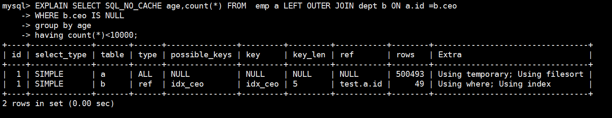
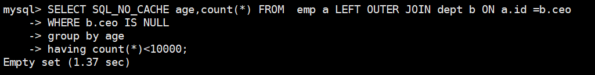

## Mysql的子查询优化

### 环境

- Centos 7.6
- xshell 6
- vmvare 15.5
- mysql 5.5
- navicat 15.9


### 尽量不要使用not in  或者 not exists

用`left outer join  on  xxx is null` 替代

```sql
EXPLAIN SELECT SQL_NO_CACHE age,count(*) FROM  emp a LEFT OUTER JOIN dept b ON a.id =b.ceo 
WHERE b.ceo IS NULL 
group by age  
having count(*)<10000
```





