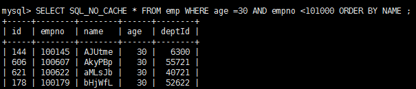

## Mysql的排序分组优化

### 环境

- Centos 7.6
- xshell 6
- vmvare 15.5
- mysql 5.5
- navicat 15.9


**ORDER BY子句，尽量使用Index方式排序,避免使用FileSort方式排序。**


### 索引的选择

执行案例前先清除emp上的索引，只留主键。

```sql
CALL proc_drop_index ( "test", "emp" );
```

查询 年龄为30岁的，且员工编号小于101000的用户，按用户名称排序

```sql
SELECT SQL_NO_CACHE * FROM emp WHERE age =30 AND empno <101000 ORDER BY NAME;
```



explain分析

```sql
explain SELECT SQL_NO_CACHE * FROM emp WHERE age =30 AND empno <101000 ORDER BY NAME ;
```


**结论：**很显然,type 是 ALL,即最坏的情况。Extra 里还出现了 Using filesort,也是最坏的情况。优化是必须的。


#### 开始优化：

思路：  尽量让where的过滤条件和排序使用上索引
但是一共两个字段(deptno,empno)上有过滤条件，一个字段(ename)有索引 

**1、我们建一个三个字段的组合索引可否？**

```sql
 CREATE INDEX idx_age_empno_name ON emp(age,empno,NAME);
```


我们发现using filesort 依然存在，所以name 并没有用到索引。
原因是因为empno是一个范围过滤，所以索引后面的字段不会再使用索引了。

所以我们建一个3值索引是没有意义的 ,

那么我们先删掉这个索引

```sql
DROP INDEX idx_age_empno_name ON emp;
```


为了去掉filesort我们可以把索引建成

```sql
CREATE INDEX idx_age_name ON emp(age,NAME);
```


也就是说empno 和name这个两个字段我只能二选其一。
 这样我们优化掉了 using filesort。
 执行一下sql


速度果然提高了4倍。


但是 
如果我们选择那个范围过滤，而放弃排序上的索引呢
建立 

```sql
DROP INDEX idx_age_name ON emp;
create index idx_age_eno on emp(age,empno); 
```


果然出现了filesort，而且type还是range光看字面其实并不美好。
我们来执行以下sql


结果竟然有 filesort的 sql 运行速度，超过了已经优化掉 filesort的 sql ，而且快了好多倍。何故？

原因是所有的排序都是在条件过滤之后才执行的，所以如果条件过滤了大部分数据的话，几百几千条数据进行排序其实并不是很消耗性能，即使索引优化了排序但实际提升性能很有限。  相对的 empno<101000 这个条件如果没有用到索引的话，要对几万条的数据进行扫描，这是非常消耗性能的，所以索引放在这个字段上性价比最高，是最优选择。


**结论： 当范围条件和group by 或者 order by  的字段出现二选一时 ，优先观察条件字段的过滤数量，如果过滤的数据足够多，而需要排序的数据并不多时，优先把索引放在范围字段上。反之，亦然。**


**如果不在索引列上，filesort有两种算法：
mysql就要启动双路排序和单路排序**


### 双路排序和单路排序


#### 双路排序

MySQL 4.1之前是使用双路排序,字面意思就是两次扫描磁盘，最终得到数据，
读取行指针和orderby列，对他们进行排序，然后扫描已经排序好的列表，按照列表中的值重新从列表中读取对应的数据输出

从磁盘取排序字段，在buffer进行排序，再从磁盘取其他字段。


**取一批数据，要对磁盘进行了两次扫描，众所周知，I\O是很耗时的，所以在mysql4.1之后，出现了第二种改进的算法，就是单路排序。**


#### 单路排序

从磁盘读取查询需要的所有列，按照order by列在buffer对它们进行排序，然后扫描排序后的列表进行输出，
它的效率更快一些，避免了第二次读取数据。并且把随机IO变成了顺序IO,但是它会使用更多的空间，
因为它把每一行都保存在内存中了。


#### 结论及引申出的问题

由于单路是后出的，总体而言好过双路.

但是用单路有问题:

​	在sort_buffer中，方法B比方法A要多占用很多空间，因为方法B是把所有字段都取出, 所以有可能取出的数据的总大小超出了sort_buffer的容量，导致每次只能取sort_buffer容量大小的数据，进行排序（创建tmp文件，多路合并），排完再取取sort_buffer容量大小，再排……从而多次I/O。

​	本来想省一次I/O操作，反而导致了大量的I/O操作，反而得不偿失。


#### 优化策略

- 增大sort_buffer_size参数的设置
- 增大max_length_for_sort_data参数的设置
- 减少select 后面的查询的字段。
- why
  - 提高Order By的速度

    1. Order by时select * 是一个大忌只Query需要的字段， 这点非常重要。在这里的影响是：
        1.1 当Query的字段大小总和小于max_length_for_sort_data 而且排序字段不是 TEXT|BLOB 类型时，会用改进后的算法——单路排序， 否则用老算法——多路排序。
        1.2 两种算法的数据都有可能超出sort_buffer的容量，超出之后，会创建tmp文件进行合并排序，导致多次I/O，但是用单路排序算法的风险会更大一些,所以要提高sort_buffer_size。

    2. 尝试提高 sort_buffer_size
    不管用哪种算法，提高这个参数都会提高效率，当然，要根据系统的能力去提高，因为这个参数是针对每个进程的  1M-8M之间调整

    3. 尝试提高 max_length_for_sort_data
    提高这个参数， 会增加用改进算法的概率。但是如果设的太高，数据总容量超出sort_buffer_size的概率就增大，明显症状是高的磁盘I/O活动和低的处理器使用率.                  1024-8192之间调整


### GROUP BY关键字优化

group by 使用索引的原则几乎跟order by一致 ，唯一区别是groupby 即使没有过滤条件用到索引，也可以直接使用索引。
