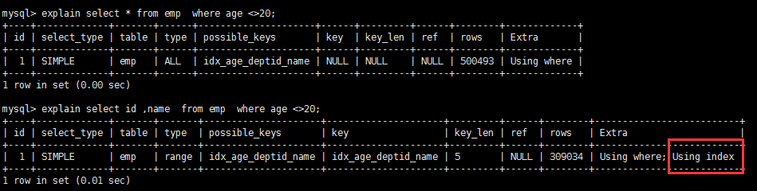
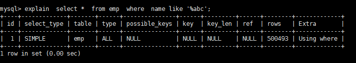
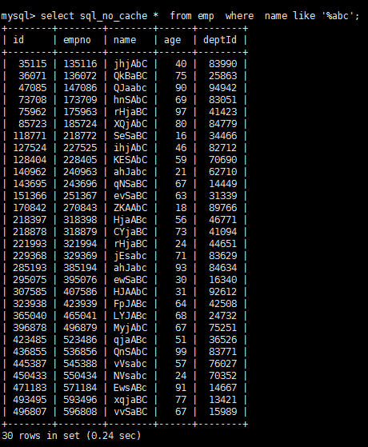
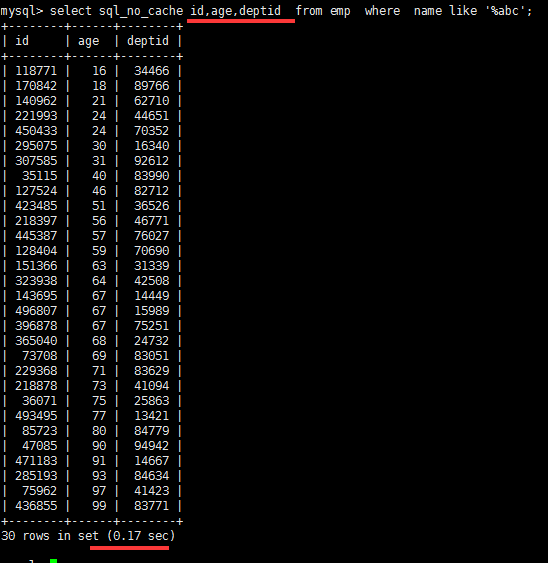

## Mysql的覆盖索引

### 环境

- Centos 7.6
- xshell 6
- vmvare 15.5
- mysql 5.5
- navicat 15.9


### 什么是覆盖索引？

简单说就是，select 到 from 之间查询的列 <=使用的索引列+主键




```sql
explain select * from emp where name like '%abc';
```






使用覆盖索引后



