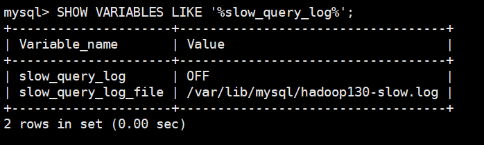
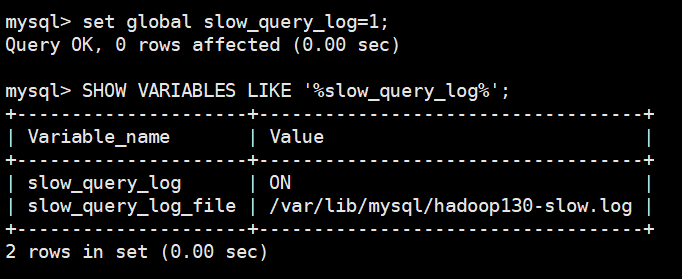
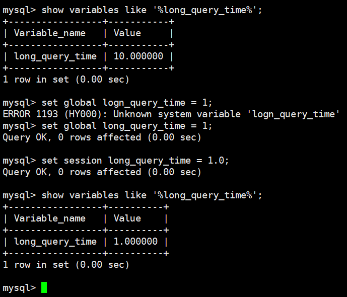
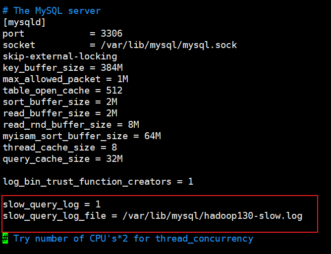
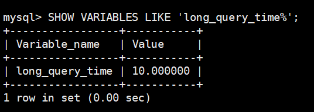
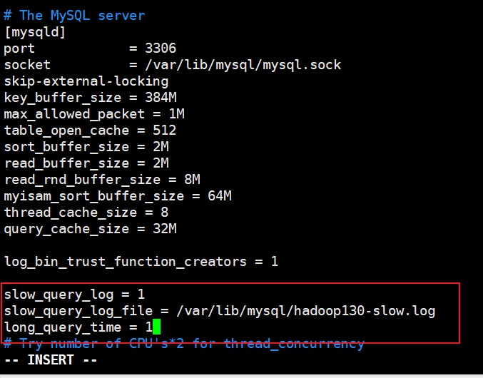
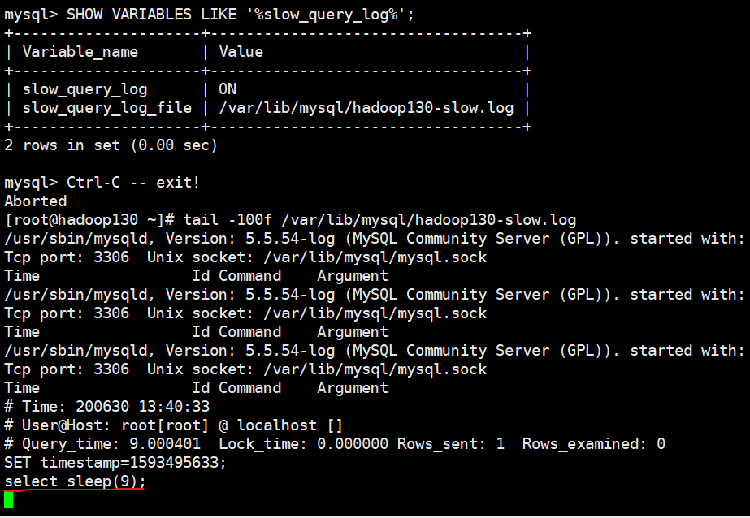
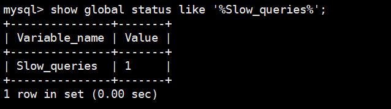
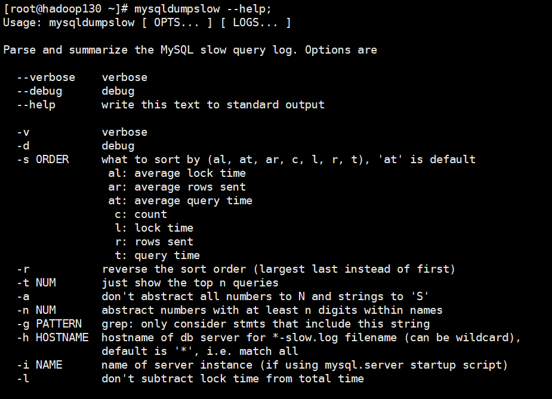
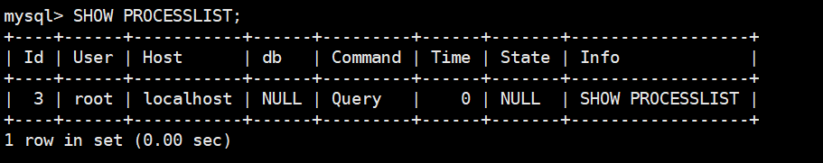

## Mysql慢日志查询

### 环境

- Centos 7.6
- xshell 6
- vmvare 15.5
- mysql 5.5
- navicat 15.9


### 概念理解

MySQL的慢查询日志是MySQL提供的一种日志记录，它用来记录在MySQL中响应时间超过阈值的语句，具体指运行时间超过long_query_time值的SQL，则会被记录到慢查询日志中。

具体指运行时间超过long_query_time值的SQL，则会被记录到慢查询日志中。long_query_time的默认值为10，意思是运行10秒以上的语句。

由他来查看哪些SQL超出了我们的最大忍耐时间值，比如一条sql执行超过5秒钟，我们就算慢SQL，希望能收集超过5秒的sql，结合之前explain进行全面分析。


### 说明

**默认情况下，MySQL数据库没有开启慢查询日志**，需要我们手动来设置这个参数。

**当然，如果不是调优需要的话，一般不建议启动该参数**，因为开启慢查询日志会或多或少带来一定的性能影响。慢查询日志支持将日志记录写入文件


### 查看是否开启慢查询日志

默认情况下slow_query_log的值为OFF，表示慢查询日志是禁用的，
可以通过设置slow_query_log的值来开启

```sql
SHOW VARIABLES LIKE '%slow_query_log%';
```




### 开启

使用set global slow_query_log=1;开启了慢查询日志只对当前数据库生效，
如果MySQL重启后则会失效。

```sql
set global slow_query_log=1;
```




### 设置慢查询时长

```sql
-- 查看当前慢查询时长
show variables like '%long_query_time%';
-- 全局变量设置，对当前连接不影响
set global logn_query_time = 1;
-- 对当前连接立刻生效
set session long_query_time = 1.0;
```



如果要永久生效，就必须修改配置文件my.cnf（其它系统变量也是如此）。

修改my.cnf文件，[mysqld]下增加或修改参数
slow_query_log 和slow_query_log_file后，然后重启MySQL服务器。也即将如下两行配置进my.cnf文件

slow_query_log =1
slow_query_log_file=/var/lib/mysql/atguigu-slow.log

```shell
[root@hadoop130 etc]# vim /etc/my.cnf
```



**重启mysql服务**

```shell
[root@hadoop130 etc]# service mysql restart
```

关于慢查询的参数slow_query_log_file ，它指定慢查询日志文件的存放路径，系统默认会给一个缺省的文件host_name-slow.log（如果没有指定参数slow_query_log_file的话）


### 那么开启了慢查询日志后，什么样的SQL才会记录到慢查询日志里面呢？

这个是由参数long_query_time控制，默认情况下long_query_time的值为10秒，

```sql
SHOW VARIABLES LIKE 'long_query_time%';
```



可以使用命令修改，也可以在my.cnf参数里面修改。



保存并重启mysql服务。

假如运行时间正好等于long_query_time的情况，并不会被记录下来。也就是说，
在mysql源码里是**判断大于long_query_time，而非大于等于**。


### 案例


#### 查看当前多少秒算慢

```sql
SHOW VARIABLES LIKE 'long_query_time%';
```


#### 设置慢的阙值时间

```sql
set  long_query_time=1;
```


#### 记录慢SQL并后续分析

```sql
SHOW VARIABLES LIKE 'long_query_time%';
```

 实验一条慢sql


跟踪日志信息




#### 查询当前系统中有多少条慢查询记录

```sql
show global status like '%Slow_queries%';
```




### 在配置文件中配置慢查询

 **my.cnf**
**【mysqld】下配置：**

```shell
slow_query_log=1;
slow_query_log_file=/var/lib/mysql/atguigu-slow.log
long_query_time=3;
log_output=FILE
```


### 日志分析工具mysqldumpslow


#### 查看mysqldumpslow的帮助信息

```shell
[root@hadoop130 ~]# mysqldumpslow --help;
```




- -s: 是表示按照何种方式排序；
  - c: 访问次数
  - l: 锁定时间
  - r: 返回记录
  - t: 查询时间
  - al:平均锁定时间
  - ar:平均返回记录数
  - at:平均查询时间
- -t:即为返回前面多少条的数据；
- -g:后边搭配一个正则匹配模式，大小写不敏感的；


#### 工作常用参考

- 得到返回记录集最多的10个SQL

  ```shell
  mysqldumpslow -s r -t 10 /var/lib/mysql/hadoop130-slow.log
  ```

- 得到访问次数最多的10个SQL

  ```shell
  mysqldumpslow -s c -t 10 /var/lib/mysql/hadoop130-slow.log
  ```

- 得到按照时间排序的前10条里面含有左连接的查询语句

  ```shell
  mysqldumpslow -s t -t 10 -g "left join" /var/lib/mysql/hadoop130-slow.log
  ```

- 另外建议在使用这些命令时结合 | 和more 使用 ，否则有可能出现爆屏情况

  ```shell
  mysqldumpslow -s r -t 10 /var/lib/mysql/hadoop130-slow.log | more
  ```

  


### SHOW PROCESSLIST

能干什么：**查询所有用户正在干什么**

如果出现不顺眼的 ==> kill [id]

```sql
SHOW PROCESSLIST;
```

