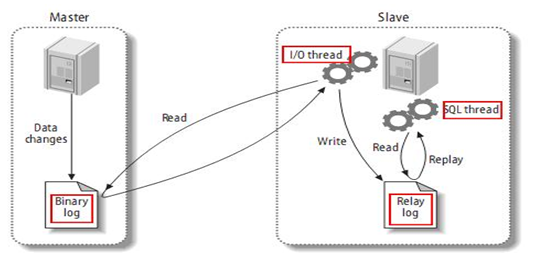

## Mysql的主从复制

### 环境

- Centos 7.6
- xshell 6
- vmvare 15.5
- mysql 5.5
- navicat 15.9


### 主从复制的基本原理

slave会从master读取binlog来进行数据同步。



- master将改变记录到二进制日志（binary log）。这些记录过程叫做二进制日志事件，binary log events
- slave将master的binary log events拷贝到它的中继日志（relay log）
- slave重做中继日志中的事件，将改变应用到自己的数据库中。 MySQL复制是异步的且串行化的


### 主从复制的基本原则

- 每个slave只有一个master
- 每个slave只能有一个唯一的服务器ID
- 每个master可以有多个salve


### 主从复制的最大问题

延时


### 一主一从常见配置


#### 准备

- master将操作语句记录到binlog日志中，然后授予slave远程连接的权限（master一定要开启binlog二进制日志功能；通常为了数据安全考虑，slave也开启binlog功能）

- slave开启两个线程：IO线程和SQL线程。其中：IO线程负责读取master的binlog内容到中继日志relay log里；SQL线程负责从relay log日志里读出binlog内容，并更新到slave的数据库里，这样就能保证slave数据和 master数据保持一致了。
- slave开启两个线程：IO线程和SQL线程。其中：IO线程负责读取master的binlog内容到中继日志relay log里；SQL线程负责从relay log日志里读出binlog内容，并更新到slave的数据库里，这样就能保证slave数据和 master数据保持一致了。
- Mysql复制最好确保master和slave服务器上的Mysql版本相同（如果不能满足版本一致，那么要保证master主节点的版本低于slave从节点的版本）
- master和slave两节点间时间需同步
- 关闭master与slave服务器的防火墙


### 环境准备

- mysql主服务器
  - ip: 192.168.204.130
  - user/pwd: root/root
  - version : 5.5  
- mysql从服务器
  - ip : 192.168.204.131
  - user/pwd : root/root
  - version : 5.5


### 向主(Master)机添加远程登录的授权用户


#### 向主(Master)服务器添加用户

- 用户名: slave
- 密  码: slave
- 允许自: 192.168.204.131 机器登录

```sql
-- 授权方式1: 此种授权是可远程登录Master，仅用于主从复制没有其它任何select insert update等权限【推荐】
mysql> grant replication slave on *.* to 'slave'@'192.168.204.131' identified by 'slave';

-- 授权方式2: 此种授权是对用户不但可远程登录Master，还可拥有对Master包括主从复制的其它所有select insert update等权限【不推荐】
mysql> grant all on *.* to 'slave'@'192.168.204.131' identified by 'slave';
```


#### 刷新授权表

```sql
mysql> flush privileges;
```


#### 查看授权结果

```sql
mysql> show grants for 'slave'@'192.168.204.131';
```


#### 测试从Slave端登录远程主(Master)机

```sql
mysql -uslave -pslave -h192.168.204.130
```


#### 从主(Master)机查看所有连接登录本机的客户端情况

```sql
mysql> show processlist \G;
```


### 主(Master)机配置

```shell
# 编辑主机mysql配置文件
vim /etc/my.cnf

在 【mysqld】 区域下添加如下配置
log-bin=mysql-bin    # 确认开启binlog日志
binlog_format=statement  # 确认binlog日志格式为mixd混合类型
server-id=1        # 在整个主从架构内指定一个唯一的server-id，范围：1^32
binlog-do-db=test  # 需要复制的主数据库名字
```


**server-id默认是1，注意不要重复配置**


### 从(Slave)机配置

```shell
# 编辑从机mysql配置文件
vim /etc/my.cnf

# 在 【mysqld】 区域下添加如下配置
log-bin=mysql-bin    # 确认开启binlog日志
binlog_format=statement  # 确认binlog日志格式为mixd混合类型
server-id=1        # 在整个主从架构内指定一个唯一的server-id，范围：1^32
replicate_do_db=test  # （可选）追加只复制test库
```


**server-id不能与主机重复，默认配置为1**


### 重启MySQL服务

更改配置后，需要重启服务

```shell
# 主机与从机都需要重启
service mysql restart
```


### 在主(Master)机端操作：执行命令刷新主机binlog日志记录，查看主机的最后日志文件及最后pos起始点

```sql
mysql> flush logs;
mysql> show master status;
+------------------+----------+--------------+------------------+
| File             | Position | Binlog_Do_DB | Binlog_Ignore_DB |
+------------------+----------+--------------+------------------+
| mysql-bin.000015 |      107 | test         |                  |
+------------------+----------+--------------+------------------+
1 row in set (0.00 sec)
```


### 在从(Slave)机启动slave服务

在从(Slave)上执行命令，动态改变连接到主(Master)机的配置，生成或更新master.info文件：

注: 在生产环境中，如果心跳感应到主机意外宕机，应用程序应该按预案选定出一台新主机，而其它的从机都需要执行一次下面的 change master to ...语句，切换自己从属到新主机，这样比较灵活，操作的实质是更新master.info文件，查看此文件也能发现MySQL其实是只能支持“一主多从”架构，而不能像Redis那样还可以支持多主一从架构。

```sql
mysql> change master to master_host='192.168.204.130', master_user='slave', master_password='slave', MASTER_LOG_FILE='mysql-bin.000015', MASTER_LOG_POS=107;
```


### 启动从服务器复制功能

```sql
mysql> start slave;
```


### 查看从机状态

```sql
mysql> show slave status \G;
```

如果看到如下状态说明同步成功：

Slave_IO_Running: Yes
Slave_SQL_Running: Yes
Seconds_Behind_Master: 0


### 测试主从同步

在主数据库上做的一些操作，也会体现在从数据库上。

```sql
CREATE TABLE `s1` (
  `id` int(11) NOT NULL AUTO_INCREMENT,
  `name` varchar(20) DEFAULT NULL,
  `age` int(3) DEFAULT NULL,
  `deptId` int(11) DEFAULT NULL,
  `empno` int(11) NOT NULL,
  PRIMARY KEY (`id`),
  KEY `idx_dept_id` (`deptId`)
) ENGINE=InnoDB AUTO_INCREMENT=11 DEFAULT CHARSET=utf8;


drop TABLE t1;
```


### 如何停止从服务复制功能

```sql
mysql> stop slave;
```

