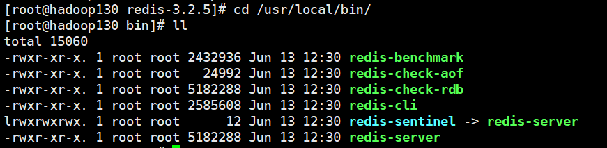
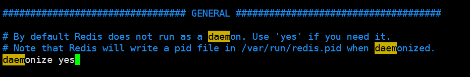

## Redis的介绍和安装

### 环境

- Centos 7.6
- xshell 6
- vmvare 15.5
- redis 3.2.5（先学着，后期更新到新版本）


### Redis介绍

Redis是一个开源的key-value存储系统。和Memcached类似，它支持存储的value类型相对更多，包括string(字符串)、list(链表)、set(集合)、zset(sorted set --有序集合)和hash（哈希类型）。这些数据类型都支持push/pop、add/remove及取交集并集和差集及更丰富的操作，而且这些操作都是原子性的。在此基础上，Redis支持各种不同方式的排序。与memcached一样，为了保证效率，数据都是缓存在内存中。区别的是Redis会周期性的把更新的数据写入磁盘或者把修改操作写入追加的记录文件，并且在此基础上实现了master-slave(主从)同步。


#### 作用

- 配合关系型数据库做高速缓存
  - 高频次，热门访问的数据，降低数据库IO
  - 分布式架构，做session共享
- 由于其拥有持久化能力,利用其多样的数据结构存储特定的数据
  - 最新N个数据 ==> 通过List实现按自然时间排序的数据 
  - 排行榜 ，Top N  ==> 利用zset(有序集合)
  - 时效性的数据，比如手机验证码 ==> Expire 过期
  - 计数器，秒杀 ==> 原子性，自增方法INCR、DECR
  - 去除大量数据中的重复数据 ==> 利用Set集合
  - 构建队列 ==> 利用list集合
  - 发布订阅消息系统 ==> pub/sub模式


### 网站

- Redis官方网站 
  - http://Redis.io
- Redis中文官方网站
  - http://www.Redis.net.cn/


### 安装步骤


#### 1、下载获得redis-3.2.5.tar.gz后将它放入我们的Linux目录/opt

```shell
[root@hadoop130 opt]# wget http://download.redis.io/releases/redis-3.2.5.tar.gz
```


#### 2、解压

```shell
[root@hadoop130 opt]# tar -zxvf redis-3.2.5.tar.gz
```


#### 3、解压完成后进入目录

```shell
[root@hadoop130 opt]# cd redis-3.2.5
```


#### 4、在redis-3.2.5目录下执行make命令

```shell
[root@hadoop130 redis-3.2.5]# make
```

 运行make命令时出现故障意出现的错误解析：**gcc：命令未找到**


**安装GCC**

```shell
[root@hadoop130 redis-3.2.5]# yum install gcc
[root@hadoop130 redis-3.2.5]# yum install gcc-c++
```


**再次执行make 命令**

```shell
[root@hadoop130 redis-3.2.5]# make
```

**jemalloc/jemalloc.h: No such file or directory**


**解决方案：运行make distclean之后再 make**

```shell
[root@hadoop130 redis-3.2.5]# make distclean
[root@hadoop130 redis-3.2.5]# make
```


#### 5、执行make install

```shell
[root@hadoop130 redis-3.2.5]# make install
```


#### 6、查看默认安装目录：usr/local/bin




- Redis-benchmark

  性能测试工具，可以在自己本子运行，看看自己本子性能如何(服务启动起来后执行)

- Redis-check-aof

  修复有问题的AOF文件，rdb和aof后面讲

- Redis-check-dump

  修复有问题的dump.rdb文件

- Redis-sentinel

  Redis集群使用

- redis-server

  Redis服务器启动命令

- redis-cli

  客户端，操作入口


### 启动redis


#### 1、备份redis.conf

```shell
[root@hadoop130 redis-3.2.5]# pwd
/opt/redis-3.2.5
[root@hadoop130 redis-3.2.5]# cp redis.conf redis.conf.backup
```


#### 2、修改redis.conf文件将里面的daemonize no 改成 yes，让服务在后台启动

```shell
[root@hadoop130 redis-3.2.5]# vim redis.conf
```




#### 3、启动命令

```shell
[root@hadoop130 redis-3.2.5]# cd /usr/local/bin/
[root@hadoop130 bin]# redis-server /opt/redis-3.2.5/redis.conf
```


#### 4、用客户端访问: redis-cli

```shell
[root@hadoop130 bin]# redis-cli 
127.0.0.1:6379>
```


#### 5、测试验证： ping

```shell
127.0.0.1:6379> ping
PONG
```


### 关闭redis


#### 1、单实例关闭

```shell
[root@hadoop130 bin]# pwd
/usr/local/bin
[root@hadoop130 bin]# redis-cli shutdown
# 查看redis进程已关闭
[root@hadoop130 bin]# ps -ef | grep redis
root       9652   1527  0 14:05 pts/0    00:00:00 grep --color=auto redis
```

**进入终端后关闭**

```shell
[root@hadoop130 bin]# redis-cli 
127.0.0.1:6379> shutdown
```


#### 2、多实例关闭，指定端口关闭

```shell
[root@hadoop130 bin]# redis-cli -p 6379 shutdown
```