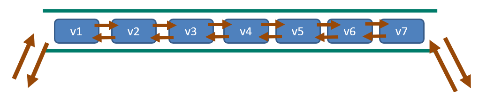

## List类型相关命令

### 环境

- Centos 7.6
- xshell 6
- vmvare 15.5
- redis 3.2.5


### List特性

- 单键多值
- Redis 列表是简单的字符串列表，按照插入顺序排序。你可以添加一个元素到列表的头部（左边）或者尾部（右边）。
- 它的底层实际是个双向链表，对两端的操作性能很高，通过索引下标的操作中间的节点性能会较差。




### List类型命令


#### lpush/rpush  <key>  <value1>  <value2>  <value3> ....

从左边/右边插入一个或多个值。

```shell
127.0.0.1:6379> lpush l1 v1 v2 v3 v4
(integer) 4
```


#### lpop/rpop  <key> 

从左边/右边吐出一个值	。
值在键在，值亡键亡。

```shell
127.0.0.1:6379> lpop l1
"v4"
```


#### rpoplpush  <key1>  <key2>  

从<key1>列表右边吐出一个值，插到<key2>列表左边。

```shell
127.0.0.1:6379> rpoplpush l1 l2
```


#### lrange <key> <start> <stop>

按照索引下标获得元素(从左到右)

```shell
127.0.0.1:6379> lrange l1 0 2
1) "v3"
2) "v2"
3) "v1"
```


#### lindex <key> <index>

按照索引下标获得元素(从左到右)

```shell
127.0.0.1:6379> lindex l1 0
"v3"
```


#### llen <key>

获得列表长度 

```shell
127.0.0.1:6379> llen l1
(integer) 3
```


#### linsert <key>  before <value>  <newvalue>   

在<value>的前面插入<newvalue> 

```shell
127.0.0.1:6379> linsert l1 before v2 v4
(integer) 4
```


#### lrem <key> <n>  <value>

从左边删除n个value(从左到右)

```shell
127.0.0.1:6379> lrem l1 1 v1
(integer) 1
```


