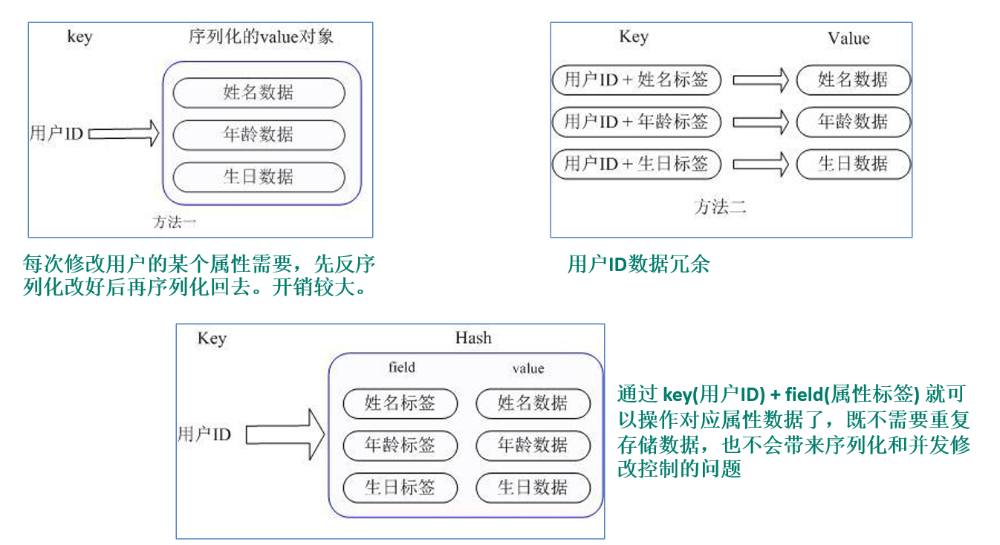

## Hash类型相关命令

### 环境

- Centos 7.6
- xshell 6
- vmvare 15.5
- redis 3.2.5


### Hash类型特性

- Redis  hash 是一个键值对集合。
- Redis hash是一个string类型的field和value的映射表，hash特别适合用于存储对象。
- 类似Java里面的Map<String,Object>

#### 示例：

用户ID为查找的key，存储的value用户对象包含姓名，年龄，生日等信息，如果用普通的key/value结构来存储，主要有以下2种存储方式：




### Hash类型命令

 

### hset <key>  <field>  <value>

给<key>集合中的  <field>键赋值<value>

```shell
127.0.0.1:6379> hset h1 f1 v1
(integer) 1
```


### hget <key1>  <field>   

从<key1>集合<field> 取出 value 

```shell
127.0.0.1:6379> hget h1 f1
"v1"
```


### hmset <key1>  <field1> <value1> <field2> <value2>...   

批量设置hash的值

```shell
127.0.0.1:6379> hmset h1 f1 v1 f2 v2 f2 v3 f4 v4
OK
```


### hexists key  <field>

查看哈希表 key 中，给定域 field 是否存在。 

```shell
127.0.0.1:6379> hexists h1 f1
(integer) 1
```


### hkeys <key>   

列出该hash集合的所有field

```shell
127.0.0.1:6379> hkeys h1
1) "f1"
2) "f2"
3) "f4"
```


### hvals <key>    

列出该hash集合的所有value

```shell
127.0.0.1:6379> hvals h1
1) "v1"
2) "v3"
3) "v4"
```


### hincrby <key> <field>  <increment> 

为哈希表 key 中的域 field 的值加上增量 increment 

```shell
127.0.0.1:6379> hincrby h1 f3 1
(integer) 1
127.0.0.1:6379> hget h1 f3
"1"
```


### hsetnx <key>  <field> <value>

将哈希表 key 中的域 field 的值设置为 value ，当且仅当域 field 不存在 

```shell
127.0.0.1:6379> hsetnx h1 f3 5
(integer) 0
127.0.0.1:6379> hsetnx h1 f5 5
(integer) 1
```


