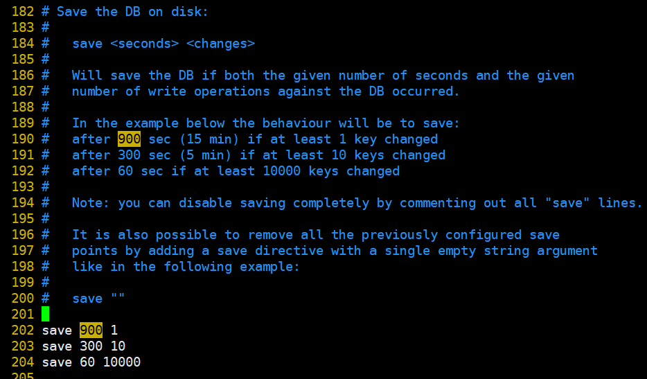
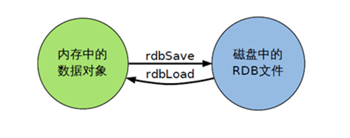
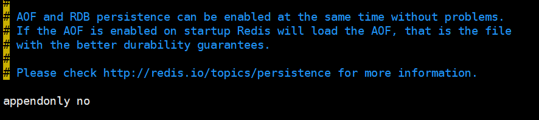
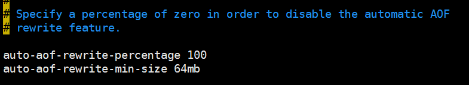

## Redis的持久化

### 环境

- Centos 7.6
- xshell 6
- vmvare 15.5
- redis 3.2.5


### 概述

Redis 提供了2个不同形式的持久化方式：

**RDB** （Redis DataBase）

**AOF** （Append Of File）


### RDB


#### 概述

在指定的时间间隔内将内存中的数据集快照写入磁盘，也就是行话讲的Snapshot快照，它恢复时是将快照文件直接读到内存里。


#### 备份是如何执行的

Redis会单独创建（fork）一个子进程来进行持久化，会先将数据写入到一个临时文件中，待持久化过程都结束了，再用这个临时文件替换上次持久化好的文件。整个过程中，主进程是不进行任何IO操作的，这就确保了极高的性能如果需要进行大规模数据的恢复，且对于数据恢复的完整性不是非常敏感，那RDB方式要比AOF方式更加的高效。RDB的缺点是最后一次持久化后的数据可能丢失。


#### 关于fork

在Linux程序中，fork()会产生一个和父进程完全相同的子进程，但子进程在此后多会exec系统调用，出于效率考虑，Linux中引入了“写时复制技术”，一般情况父进程和子进程会共用同一段物理内存，只有进程空间的各段的内容要发生变化时，才会将父进程的内容复制一份给子进程


#### rdb的保存的文件

- 在redis.conf中配置文件名称，默认为dump.rdb


- rdb文件的保存路径，也可以修改。默认为Redis启动时命令行所在的目录下


#### rdb的保存策略




#### 手动保存快照

`save` ：执行一个同步保存操作，将当前 Redis 实例的所有数据快照(snapshot)以 RDB 文件的形式保存到硬盘。

语法

```shell
127.0.0.1:6379> save
OK
```

`bgsave`: 执行之后立即返回 OK ，然后 Redis fork 出一个新子进程，原来的 Redis 进程(父进程)继续处理客户端请求，而子进程则负责将数据保存到磁盘，然后退出。

客户端可以通过 LASTSAVE 命令查看相关信息，判断 BGSAVE 命令是否执行成功。

```shell
127.0.0.1:6379> bgsave
Background saving started
```


#### 配置文件

##### stop-writes-on-bgsave-error yes

当Redis无法写入磁盘的话，直接关掉Redis的写操作


##### rdbcompression yes

进行rdb保存时，将文件压缩


##### rdbchecksum yes

在存储快照后，还可以让Redis使用CRC64算法来进行数据校验，但是这样做会增加大约10%的性能消耗，如果希望获取到最大的性能提升，可以关闭此功能


#### rdb的备份

- 先通过config get dir  查询rdb文件的目录 

  ```shell
  127.0.0.1:6379> config get dir
  1) "dir"
  2) "/opt/redis-3.2.5"
  ```

- 将*.rdb的文件拷贝到别的地方

  ```shell
  [root@hadoop130 redis-3.2.5]# ll
  total 252
  -rw-rw-r--.  1 root root 78892 Oct 26  2016 00-RELEASENOTES
  -rw-rw-r--.  1 root root    53 Oct 26  2016 BUGS
  -rw-rw-r--.  1 root root  1805 Oct 26  2016 CONTRIBUTING
  -rw-rw-r--.  1 root root  1487 Oct 26  2016 COPYING
  drwxrwxr-x.  7 root root   211 Jun 13 12:28 deps
  -rw-r--r--.  1 root root    76 Jun 15 19:43 dump.rdb
  -rw-rw-r--.  1 root root    11 Oct 26  2016 INSTALL
  -rw-rw-r--.  1 root root   151 Oct 26  2016 Makefile
  -rw-rw-r--.  1 root root  4223 Oct 26  2016 MANIFESTO	
  -rw-rw-r--.  1 root root  6834 Oct 26  2016 README.md
  -rw-rw-r--.  1 root root 46696 Jun 13 13:30 redis.conf
  -rw-r--r--.  1 root root 46695 Jun 13 13:27 redis.conf.backup
  -rwxrwxr-x.  1 root root   271 Oct 26  2016 runtest
  -rwxrwxr-x.  1 root root   280 Oct 26  2016 runtest-cluster
  -rwxrwxr-x.  1 root root   281 Oct 26  2016 runtest-sentinel
  -rw-rw-r--.  1 root root  7606 Oct 26  2016 sentinel.conf
  drwxrwxr-x.  2 root root  8192 Jun 13 12:29 src
  drwxrwxr-x. 10 root root   167 Oct 26  2016 tests
  drwxrwxr-x.  7 root root  4096 Oct 26  2016 utils
  [root@hadoop130 redis-3.2.5]# cp dump.rdb dump.rdb.bak
  ```


#### rdb的恢复

- 关闭Redis

  ```shell
  127.0.0.1:6379> shutdown
  ```

- 先把备份的文件拷贝到工作目录下

  ```shell
  [root@hadoop130 redis-3.2.5]# rm -f dump.rdb
  [root@hadoop130 redis-3.2.5]# cp dump.rdb.bak dump.rdb
  ```

- 启动Redis, 备份数据会直接加载

  ```shell
  [root@hadoop130 redis-3.2.5]# redis-server /opt/redis-3.2.5/redis.conf
  [root@hadoop130 redis-3.2.5]# redis-cli 
  127.0.0.1:6379>
  ```

  

#### rdb的优点

- 节省磁盘空间
- 恢复速度快



#### rdb的缺点

- 虽然Redis在fork时使用了写时拷贝技术,但是如果数据庞大时还是比较消耗性能。
- 在备份周期在一定间隔时间做一次备份，所以如果Redis意外down掉的话，就会丢失最后一次快照后的所有修改。


### AOF


#### 概述

以日志的形式来记录每个写操作，将Redis执行过的所有写指令记录下来(读操作不记录)，只许追加文件但不可以改写文件，Redis启动之初会读取该文件重新构建数据，换言之，Redis重启的话就根据日志文件的内容将写指令从前到后执行一次以完成数据的恢复工作。


#### 配置文件

##### AOF默认不开启，需要手动在配置文件中配置




##### 可以在redis.conf中配置文件名称，默认为 appendonly.aof 


##### AOF文件的保存路径，同RDB的路径一致。


#### AOF文件故障备份

AOF的备份机制和性能虽然和RDB不同, 但是备份和恢复的操作同RDB一样，都是拷贝备份文件，需要恢复时再拷贝到Redis工作目录下，启动系统即加载。

**AOF和RDB同时开启，系统默认取AOF的数据**

### 

#### AOF文件故障恢复

AOF文件的保存路径，同RDB的路径一致。

如遇到AOF文件损坏，可通过
     **redis-check-aof  --fix  appendonly.aof**   进行恢复

```shell
[root@hadoop130 redis-3.2.5]# redis-check-aof --fix appendonly.aof
```


#### AOF同步频率设置

- 始终同步，每次Redis的写入都会立刻记入日志
- 每秒同步，每秒记入日志一次，如果宕机，本秒的数据可能丢失
- 把不主动进行同步，把同步时机交给操作系统。


#### Rewrite

AOF采用文件追加方式，文件会越来越大为避免出现此种情况，新增了重写机制,当AOF文件的大小超过所设定的阈值时，Redis就会启动AOF文件的内容压缩，只保留可以恢复数据的最小指令集.可以使用命令bgrewriteaof。


#### Redis如何实现重写？

AOF文件持续增长而过大时，会fork出一条新进程来将文件重写(也是先写临时文件最后再rename)，遍历新进程的内存中数据，每条记录有一条的Set语句。重写aof文件的操作，并没有读取旧的aof文件，而是将整个内存中的数据库内容用命令的方式重写了一个新的aof文件，这点和快照有点类似。


#### 何时重写

重写虽然可以节约大量磁盘空间，减少恢复时间。但是每次重写还是有一定的负担的，因此设定Redis要满足一定条件才会进行重写。




系统载入时或者上次重写完毕时，Redis会记录此时AOF大小，设为base_size,如果Redis的AOF当前大小>= base_size +base_size*100% (默认)且当前大小>=64mb(默认)的情况下，Redis会对AOF进行重写。


#### AOF的优点

- 备份机制更稳健，丢失数据概率更低。
- 可读的日志文本，通过操作AOF稳健，可以处理误操作。


#### AOF的缺点

- 比起RDB占用更多的磁盘空间。

- 恢复备份速度要慢。
- 每次读写都同步的话，有一定的性能压力。
- 存在个别Bug，造成恢复不能。


### 如何选择 RDB 还是 AOF

- 官方推荐两个都启用。
- 如果对数据不敏感，可以选单独用RDB。
- 不建议单独用 AOF，因为可能会出现Bug。
- 如果只是做纯内存缓存，可以都不用。