## Redis的主从复制

### 环境

- Centos 7.6
- xshell 6
- vmvare 15.5
- redis 3.2.5


**一主二从的环境搭建**


### 关闭daemonize yes, Appendonly 关掉或者换名字

```shell
[root@hadoop130 redis-3.2.5]# pwd
/opt/redis-3.2.5
[root@hadoop130 redis-3.2.5]# vim redis.conf
```


### 新建多个redis.conf文件，并配置

```shell
[root@hadoop130 opt]# mkdir master-slave-redis
[root@hadoop130 opt]# cd master-slave-redis/
```

**配置一**

```shell
[root@hadoop130 master-slave-redis]# vim redis_6379.conf
# 内容如下
include /opt/redis-3.2.5/redis.conf
pidfile /var/run/redis_6379.pid
port 6379
dbfilename dump6379.rdb
dir /opt/master-slave-redis/6379/
```


**配置二**

```shell
[root@hadoop130 master-slave-redis]# vim redis_6380.conf
# 内容如下
include /opt/redis-3.2.5/redis.conf
pidfile /var/run/redis_6380.pid
port 6380
dbfilename dump6380.rdb
dir /opt/master-slave-redis/6380/
```


**配置三**

```shell
[root@hadoop130 master-slave-redis]# vim redis_6381.conf
# 内容如下
include /opt/redis-3.2.5/redis.conf
pidfile /var/run/redis_6381.pid
port 6381
dbfilename dump6381.rdb
dir /opt/master-slave-redis/6381/
```


**配置完成**


### 启动三个redis节点

```shell
# 6379
[root@hadoop130 /]# redis-server /opt/master-slave-redis/redis_6379.conf
# 6380
[root@hadoop130 /]# redis-server /opt/master-slave-redis/redis_6380.conf
# 6381
[root@hadoop130 /]# redis-server /opt/master-slave-redis/redis_6381.conf
```

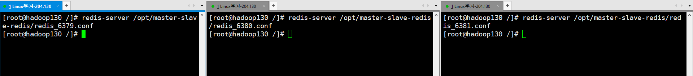


### 查看主从信息 info replication

打印主从复制的相关信息

```shell
127.0.0.1:6379> info replication
```

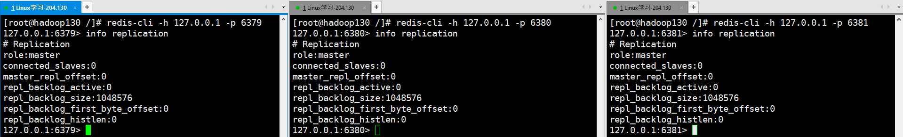


### 设置主从关系 slaveof  <ip>  <port>  

成为某个实例的从服务器

```shell
127.0.0.1:6380> slaveof 127.0.0.1 6379
127.0.0.1:6381> slaveof 127.0.0.1 6379
```


**再次查看主从复制关系**

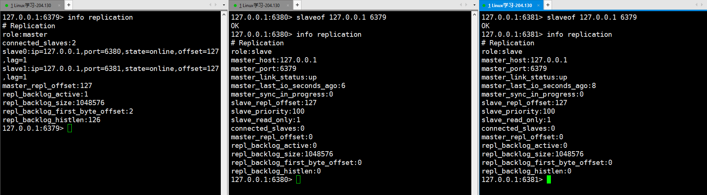


### 主节点插入数据，从节点获取数据

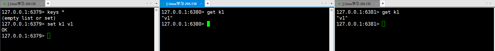


### 一主二仆模式相关问题


#### 1 切入点问题？slave1、slave2是从头开始复制还是从切入点开始复制?比如从k4进来，那之前的123是否也可以复制

```
回答：
slave1、slave2是从头开始复制
从k4进来，那之前的123是也可以复制
```


#### 从机是否可以写？set可否？

```
回答：
从机不可以写，不可以set
```


#### 主机shutdown后情况如何？从机是上位还是原地待命

```
回答：
未配置哨兵模式的情况下，从机不会自动上位。
```


#### 主机又回来了后，主机新增记录，从机还能否顺利复制？

```
回答:
从机可以顺利复制，并且会从头复制。
```


#### 其中一台从机down后情况如何？依照原有它能跟上大部队吗？

```
回答：
当从机重新连接上主机的时候，会重新复制主机的数据，并且是从头复制。可以与主机数据完全一致
```


### 复制原理

- 每次从机联通后，都会给主机发送sync指令
- 主机立刻进行存盘操作，发送RDB文件，给从机
- 从机收到RDB文件后，进行全盘加载
- 之后每次主机的写操作，都会立刻发送给从机，从机执行相同的命令

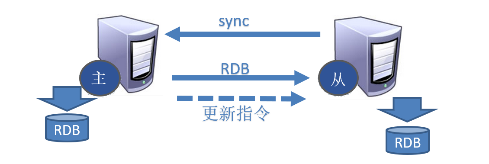


### 薪火相传  

- 上一个slave可以是下一个slave的Master，slave同样可以接收其他slaves的连接和同步请求，那么该slave作为了链条中下一个的master, 可以有效减轻master的写压力,去中心化降低风险。
- 用 slaveof  <ip>  <port>
- 中途变更转向:会清除之前的数据，重新建立拷贝最新的
- 风险是一旦某个slave宕机，后面的slave都没法备份


### 反客为主

- 当一个master宕机后，后面的slave可以立刻升为master，其后面的slave不用做任何修改。
- 用 slaveof  no one  将从机变为主机。


### 哨兵模式(sentinel)


#### 什么是哨兵模式

反客为主的自动版，能够后台监控主机是否故障，如果故障了根据投票数自动将从库转换为主库.

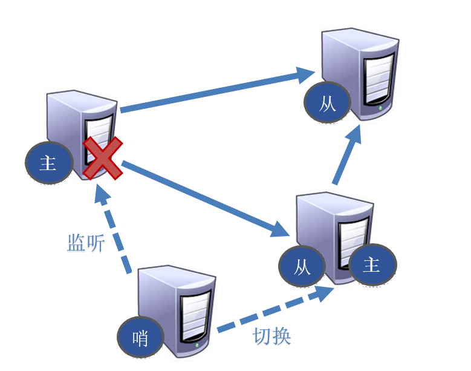


#### 配置哨兵

- 调整为一主二仆模式

  ```shell
  # 启动三个服务端
  [root@hadoop130 /]# redis-server /opt/master-slave-redis/redis_6379.conf
  [root@hadoop130 /]# redis-server /opt/master-slave-redis/redis_6380.conf
  [root@hadoop130 /]# redis-server /opt/master-slave-redis/redis_6381.conf
  
  # 启动三个客户端
  [root@hadoop130 /]# redis-cli -h 127.0.0.1 -p 6379
  [root@hadoop130 /]# redis-cli -h 127.0.0.1 -p 6380
  [root@hadoop130 /]# redis-cli -h 127.0.0.1 -p 6381
  
  # 调整为一主二仆模式
  127.0.0.1:6380> slaveof 127.0.0.1 6379
  127.0.0.1:6381> slaveof 127.0.0.1 6379
  ```


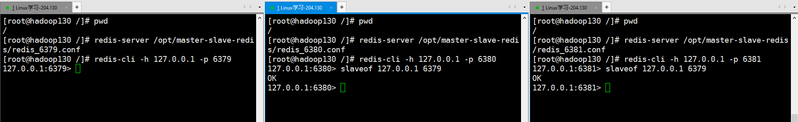


- 自定义的目录下新建sentinel.conf文件并配置内容

  ```shell
  [root@hadoop130 ~]# cd /opt/master-slave-redis/
  [root@hadoop130 master-slave-redis]# vim sentinel.conf
  
# 内容如下
  sentinel  monitor  mymaster  127.0.0.1  6379  1
  ```
  
  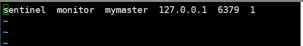

**其中 mymaster 为监控对象起的服务器名称， 1 为 至少有多少个哨兵统一迁移的数量。** 


#### 启动哨兵

- 执行redis-sentinel  /myredis/sentinel.conf 

  ```shell
  [root@hadoop130 master-slave-redis]# redis-sentinel /opt/master-slave-redis/sentinel.conf
  ```

  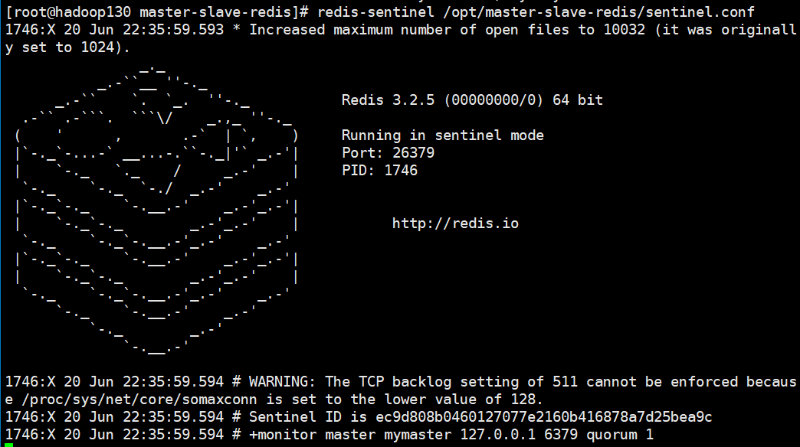


#### 故障恢复

- 新主登基

  从下线的主服务的所有从服务里面挑选一个从服务，将其转成主服务
  选择条件依次为：
  1、选择优先级靠前的 **(优先级在 redis.conf 中 slave-priority 100)**
  2、选择偏移量最大的
  3、选择runid最小的从服务

- 群仆俯首

  挑选出新的主服务之后，sentinel 向原主服务的从服务发送 slaveof 新主服务 的命令，复制新master

- 旧主俯首

  当已下线的服务重新上线时，sentinel会向其发送slaveof命令，让其成为新主的从


**演示哨兵模式**

- 首先6379为主节点，6380与6381为从节点

  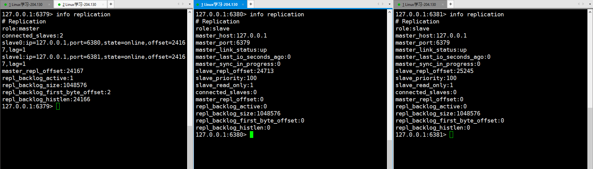


- 断开6379主节点，哨兵将自动从其它两个节点中选择一个为主节点，另一个没有成为主节点的节点，将成为它的从节点

  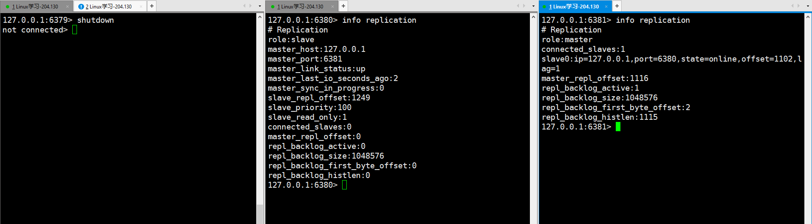


- 再次连接上6379节点，此时6379也将成为其中的一个从节点

  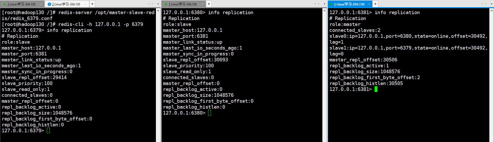