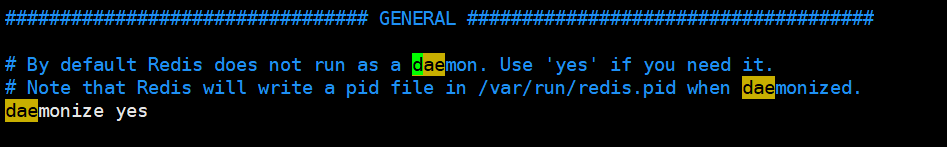
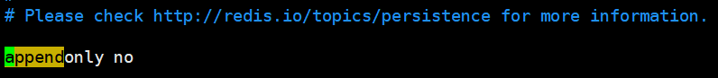
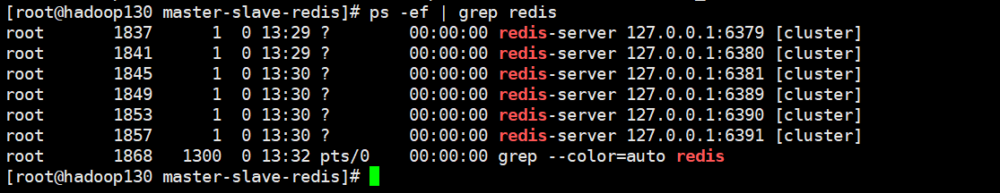
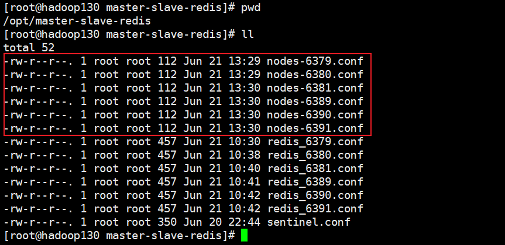
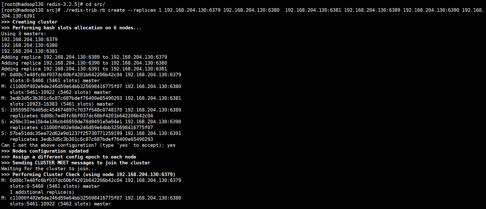
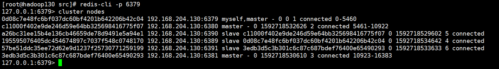
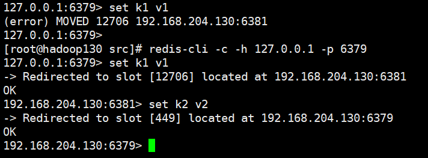
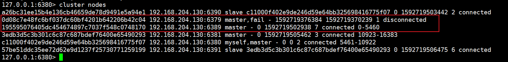
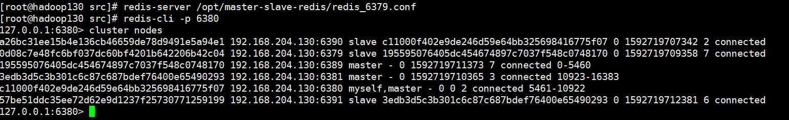

## Redis的集群

### 环境

- Centos 7.6
- xshell 6
- vmvare 15.5
- redis 3.2.5


### 集群概念

- Redis 集群实现了对Redis的水平扩容，即启动N个redis节点，将整个数据库分布存储在这N个节点中，每个节点存储总数据的1/N。
- Redis 集群通过分区（partition）来提供一定程度的可用性（availability）： 即使集群中有一部分节点失效或者无法进行通讯， 集群也可以继续处理命令请求。


### 配置集群环境


#### 安装ruby环境

- 执行yum install ruby

  ```shell
  [root@hadoop130 ~]# yum install ruby
  ```

- 执行yum install rubygems

  ```shell
  [root@hadoop130 ~]# yum install rubygems
  ```


#### 下载redis-3.2.0.gem到/opt目录下

*redis-version.gem是ruby的包管理工具*

```shell
[root@hadoop130 ~]# cd /opt/
[root@hadoop130 opt]# wget https://rubygems.org/downloads/redis-3.2.0.gem
```


#### 在opt目录下执行  gem install --local redis-3.2.0.gem

```shell
[root@hadoop130 opt]# gem install --local redis-3.2.0.gem
```


#### 配置6个redis实例，6379,6380,6381,6389,6390,6391

| 主节点         | 从节点         |
| -------------- | -------------- |
| 127.0.0.1:6379 | 127.0.0.1:6389 |
| 127.0.0.1:6380 | 127.0.0.1:6390 |
| 127.0.0.1:6381 | 127.0.0.1:6391 |


- 清除原有的 dump.rdb文件

  **先关闭redis，再做删除**

  ```shell
  [root@hadoop130 opt]# cd /opt/master-slave-redis/
  [root@hadoop130 master-slave-redis]# ll
  total 32
  -rw-r--r--. 1 root root  88 Jun 20 23:00 dump6379.rdb
  -rw-r--r--. 1 root root  88 Jun 20 23:00 dump6380.rdb
  -rw-r--r--. 1 root root  88 Jun 20 23:00 dump6381.rdb
  -rw-r--r--. 1 root root  76 Jun 20 10:10 dump.rdb
  -rw-r--r--. 1 root root 255 Jun 20 22:51 redis_6379.conf
  -rw-r--r--. 1 root root 255 Jun 20 22:44 redis_6380.conf
  -rw-r--r--. 1 root root 232 Jun 20 22:44 redis_6381.conf
  -rw-r--r--. 1 root root 350 Jun 20 22:44 sentinel.conf
  [root@hadoop130 master-slave-redis]# rm -f dump*
  [root@hadoop130 master-slave-redis]# ll
  total 16
  -rw-r--r--. 1 root root 255 Jun 20 22:51 redis_6379.conf
  -rw-r--r--. 1 root root 255 Jun 20 22:44 redis_6380.conf
  -rw-r--r--. 1 root root 232 Jun 20 22:44 redis_6381.conf
  -rw-r--r--. 1 root root 350 Jun 20 22:44 sentinel.conf
  ```

  

- 配置多个redis.conf文件

  ```shell
  [root@hadoop130 master-slave-redis]# pwd
  /opt/master-slave-redis
  # 配置 6379服务
  [root@hadoop130 master-slave-redis]# vim redis_6379.conf
  ######## 配置文件内容如下 #############
  # redis 原配置文件
  include /opt/redis-3.2.5/redis.conf
  # pid 文件路径
  pidfile "/var/run/redis_6379.pid"
  # 端口号
  port 6379
  # dump文件名称
  dbfilename "dump6379.rdb"
  # dump文件目录
  dir "/opt/master-slave-redis"
  # 打开集群模式
  cluster-enabled yes
  # 设置节点配置文件名
  cluster-config-file  nodes-6379.conf
  # 设定节点失联时间，超过该时间（毫秒），集群自动进行主从切换。
  cluster-node-timeout 15000
  
  # 同理，依次配置 6380、6381、6389、6390、6391 服务
  [root@hadoop130 master-slave-redis]# vim redis_6380.conf
  [root@hadoop130 master-slave-redis]# vim redis_6381.conf
  [root@hadoop130 master-slave-redis]# vim redis_6389.conf
  [root@hadoop130 master-slave-redis]# vim redis_6390.conf
  [root@hadoop130 master-slave-redis]# vim redis_6391.conf
  
  # 可以使用 cp 命令复制文件，
  [root@hadoop130 master-slave-redis]# cp redis_6379.conf redis_6381.conf
  # 并使用指令进行全局替换
  :%s/6379/6381
  ```

  

- 开启daemonize yes

  ```shell
  [root@hadoop130 master-slave-redis]# vim /opt/redis-3.2.5/redis.conf
  ```

  

  

- Appendonly 关掉或者换名字

  ```shell
  [root@hadoop130 master-slave-redis]# vim /opt/redis-3.2.5/redis.conf
  ```

  

  


### 启动所有的实例

```shell
# 启动redis实例
[root@hadoop130 master-slave-redis]# redis-server /opt/master-slave-redis/redis_6379.conf 
[root@hadoop130 master-slave-redis]# redis-server /opt/master-slave-redis/redis_6380.conf 
[root@hadoop130 master-slave-redis]# redis-server /opt/master-slave-redis/redis_6381.conf 
[root@hadoop130 master-slave-redis]# redis-server /opt/master-slave-redis/redis_6389.conf 
[root@hadoop130 master-slave-redis]# redis-server /opt/master-slave-redis/redis_6390.conf 
[root@hadoop130 master-slave-redis]# redis-server /opt/master-slave-redis/redis_6391.conf

# 查看redis实例是否都已启动
[root@hadoop130 master-slave-redis]# ps -ef | grep redis
root       1837      1  0 13:29 ?        00:00:00 redis-server 127.0.0.1:6379 [cluster]
root       1841      1  0 13:29 ?        00:00:00 redis-server 127.0.0.1:6380 [cluster]
root       1845      1  0 13:30 ?        00:00:00 redis-server 127.0.0.1:6381 [cluster]
root       1849      1  0 13:30 ?        00:00:00 redis-server 127.0.0.1:6389 [cluster]
root       1853      1  0 13:30 ?        00:00:00 redis-server 127.0.0.1:6390 [cluster]
root       1857      1  0 13:30 ?        00:00:00 redis-server 127.0.0.1:6391 [cluster]
root       1868   1300  0 13:32 pts/0    00:00:00 grep --color=auto redis
```




### 将六个节点合成一个集群

组合之前，请确保所有redis实例启动后，nodes-xxxx.conf文件都生成正常。




#### 合体

```shell
[root@hadoop130 master-slave-redis]# cd /opt/redis-3.2.5/src/

[root@hadoop130 src]# pwd
/opt/redis-3.2.5/src
# 执行合体命令，这里必须使用真实ip，不能使用127.0.0.1
[root@hadoop130 src]# ./redis-trib.rb create --replicas 1 192.168.204.130:6379 192.168.204.130:6380  192.168.204.130:6381 192.168.204.130:6389 192.168.204.130:6390 192.168.204.130:6391
```

**此处不要用127.0.0.1， 请用真实IP地址**




### cluster nodes 命令查看集群信息

```shell
[root@hadoop130 src]# redis-cli -p 6379
127.0.0.1:6379> cluster nodes
```




### redis cluster 如何分配这六个节点

- 一个集群至少要有三个主节点。
- 选项 --replicas 1 表示我们希望为集群中的每个主节点创建一个从节点。
- 分配原则尽量保证每个主数据库运行在不同的IP地址，每个从库和主库不在一个IP地址上。


### 什么是slots

- 一个 Redis 集群包含 16384 个插槽（hash slot）， 数据库中的每个键都属于这 16384 个插槽的其中一个， 集群使用公式 CRC16(key) % 16384 来计算键 key 属于哪个槽， 其中 CRC16(key) 语句用于计算键 key 的 CRC16 校验和 。
- 集群中的每个节点负责处理一部分插槽。 举个例子， 如果一个集群可以有主节点， 其中：
          节点 A 负责处理 0 号至 5500 号插槽。
          节点 B 负责处理 5501 号至 11000 号插槽。
          节点 C 负责处理 11001 号至 16383 号插槽。


### 在集群中录入值

- 在redis-cli每次录入、查询键值，redis都会计算出该key应该送往的插槽，如果不是该客户端对应服务器的插槽，redis会报错，并告知应前往的redis实例地址和端口。
- redis-cli客户端提供了 –c 参数实现自动重定向。
       如 redis-cli  -c –p 6379 登入后，再录入、查询键值对可以自动重定向。
- 不在一个slot下的键值，是不能使用mget,mset等多键操作。
- 可以通过{}来定义组的概念，从而使key中{}内相同内容的键值对放到一个slot中去。

```shell
[root@hadoop130 src]# redis-cli -c -h 127.0.0.1 -p 6379
```

	


### 查询集群中的值

- CLUSTER KEYSLOT <key> 计算键 key 应该被放置在哪个槽上。

  ```shell
  192.168.204.130:6379> cluster keyslot k1
  (integer) 12706
  ```

  

- CLUSTER COUNTKEYSINSLOT <slot> 返回槽 slot 目前包含的键值对数量。  

  ```shell
  192.168.204.130:6381> cluster countkeysinslot 12706
  (integer) 1
  # 在对应的节点才能查到
  192.168.204.130:6379> cluster countkeysinslot 12706
  (integer) 0
  ```

  

- CLUSTER GETKEYSINSLOT <slot> <count> 返回 count 个 slot 槽中的键。

  ```shell
  192.168.204.130:6379> cluster getkeysinslot 449 1
  1) "k2"
  ```

  


### 故障恢复

- 如果主节点下线？从节点能否自动升为主节点？

  **从节点会成为主节点**

  ```shell
  192.168.204.130:6379> shutdown
  not connected>
  [root@hadoop130 src]# redis-cli -p 6380
  127.0.0.1:6380> cluster nodes
  ```

  


- 主节点恢复后，主从关系会如何？

  **原来的主节点会变成从节点**

  ```shell
  [root@hadoop130 src]# redis-server /opt/master-slave-redis/redis_6379.conf 
  [root@hadoop130 src]# redis-cli -p 6380
  127.0.0.1:6380> cluster nodes
  ```

  


- 如果所有某一段插槽的主从节点都宕掉，redis服务是否还能继续?

  **主从节点都down掉，redis服务不可用**

  ```shell
  127.0.0.1:6379> config get cluster-require-full-coverage
  1) "cluster-require-full-coverage"
  2) "yes"
  127.0.0.1:6379> shutdown
  not connected> 
  [root@hadoop130 src]# redis-cli -c -h 127.0.0.1 -p 6389
  127.0.0.1:6389> shutdown
  not connected> 
  [root@hadoop130 src]# ps -ef | grep redis
  root       1907      1  0 13:44 ?        00:00:03 redis-server 0.0.0.0:6380 [cluster]
  root       1919      1  0 13:44 ?        00:00:03 redis-server 0.0.0.0:6390 [cluster]
  root       1975      1  0 14:14 ?        00:00:00 redis-server 0.0.0.0:6381 [cluster]
  root       1979      1  0 14:15 ?        00:00:00 redis-server 0.0.0.0:6391 [cluster]
  root       1988   1300  0 14:22 pts/0    00:00:00 grep --color=auto redis
  [root@hadoop130 src]# redis-cli -c -h 127.0.0.1 -p 6380
  127.0.0.1:6380> get k1
  (error) CLUSTERDOWN The cluster is down
  127.0.0.1:6380> get k2
  (error) CLUSTERDOWN The cluster is down
  127.0.0.1:6380>
  ```

  

- redis.conf中的参数  cluster-require-full-coverage 

  ```shell
  127.0.0.1:6379> config get cluster-require-full-coverage
  1) "cluster-require-full-coverage"
  2) "yes"
  ```

  - 当cluster-require-full-coverage为yes时，表示当负责一个插槽的主库下线且没有相应的从库进行故障恢复时，集群不可用。
  - 当cluster-require-full-coverage为no时，表示当负责一个插槽的主库下线且没有相应的从库进行故障恢复时，集群仍然可用。其中一个主节点宕机，此时非故障主节点正常服务，当key值位于故障节点的插槽时，无法进行正常操作，此时需要退出重连后才可进行对正常服务的主节点操作。

