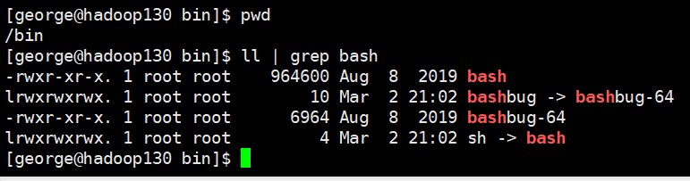

## Shell解释器

### 环境

- Centos 7.6
- xshell 6
- vmvare 15.5
- 非root用户


### Linux提供的shell解释器

```shell
[george@hadoop130 ~]$ cat /etc/shells 
/bin/sh
/bin/bash
/usr/bin/sh
/usr/bin/bash
```


### bash和sh的关系



`sh` 是 `bash` 的一个软连接，`sh` 执行的还是 `bash`


### Centos默认的解析器是bash

```shell
[george@hadoop130 /]$ echo $SHELL
/bin/bash
```


