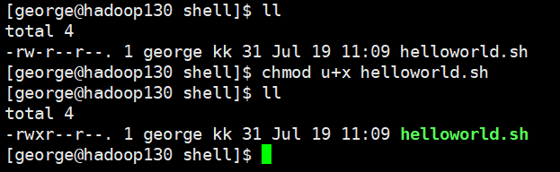

## Shell脚本入门

### 环境

- Centos 7.6
- xshell 6
- vmvare 15.5
- 非root用户


### 脚本格式

脚本以   **#!/bin/bash**   开头（指定解析器）


### 第一个Shell脚本：helloworld


#### 需求：创建一个Shell脚本，输出helloworld


#### 案例实操

```shell
[george@hadoop130 ~]$ pwd
/home/george
[george@hadoop130 ~]$ mkdir shell
[george@hadoop130 ~]$ cd shell/
[george@hadoop130 shell]$ touch helloworld.sh
[george@hadoop130 shell]$ vim helloworld.sh 

# 内容如下
#!/bin/bash
echo "hello world!"
```


### 脚本的常用执行方式


#### 第一种：采用bash或sh+脚本的相对路径或绝对路径（不用赋予脚本+x权限）

```shell
[george@hadoop130 shell]$ bash helloworld.sh 
hello world
```


##### sh+脚本的绝对路径

```shell
[george@hadoop130 shell]$ sh /home/george/shell/helloworld.sh 
hello world
```


##### bash+脚本的相对路径

```shell
[george@hadoop130 shell]$ bash /home/george/shell/helloworld.sh 
hello world
```


### 第二种：采用输入脚本的绝对路径或相对路径执行脚本（必须具有可执行权限+x）


#### 首先要赋予helloworld.sh 脚本的+x权限




#### 执行脚本

- 相对路径

```shell
[george@hadoop130 shell]$ ./helloworld.sh 
hello world
```


- 绝对路径

```shell
[george@hadoop130 shell]$ /home/george/shell/helloworld.sh 
hello world
```

**注意：第一种执行方法，本质是bash解析器帮你执行脚本，所以脚本本身不需要执行权限。第二种执行方法，本质是脚本需要自己执行，所以需要执行权限。**


### 第二个Shell脚本：多命令处理


#### 需求

在 /home/george/shell/ 目录下创建 test.txt,  在test.txt文件中增加  ”this is shell test“


#### 案例实操

```shell
[george@hadoop130 shell]$ pwd
/home/george/shell
[george@hadoop130 shell]$ vim test.sh

# 内容如下
#!/bin/bash
cd /home/george/shell
touch test.txt
echo "this is shell test" >> test.txt
```


#### 测试脚本

```shell
# 执行脚本前的文件夹内容
[george@hadoop130 shell]$ ll
total 8
-rwxr--r--. 1 george kk 31 Jul 19 11:09 helloworld.sh
-rw-r--r--. 1 george kk 75 Jul 19 11:22 test.sh

# 执行脚本
[george@hadoop130 shell]$ bash ./test.sh 

# 执行脚本后，查看脚本是否创建文件 test.txt
[george@hadoop130 shell]$ ll
total 8
-rwxr--r--. 1 george kk 31 Jul 19 11:09 helloworld.sh
-rw-r--r--. 1 george kk 75 Jul 19 11:22 test.sh
-rw-r--r--. 1 george kk  0 Jul 19 11:23 test.txt

#查看test.txt文本内容是否符合要求
[george@hadoop130 shell]$ cat test.txt
this is shell test
```

