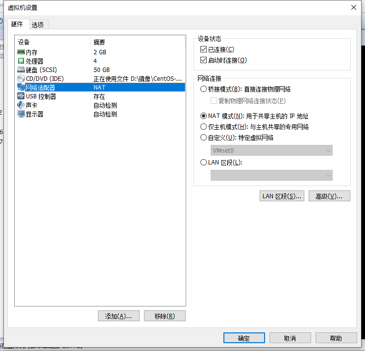
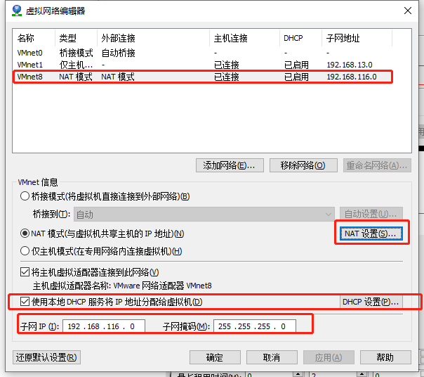
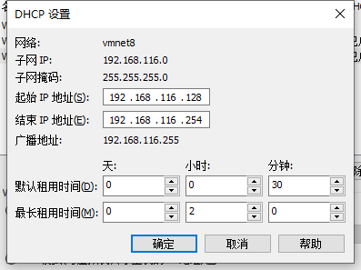
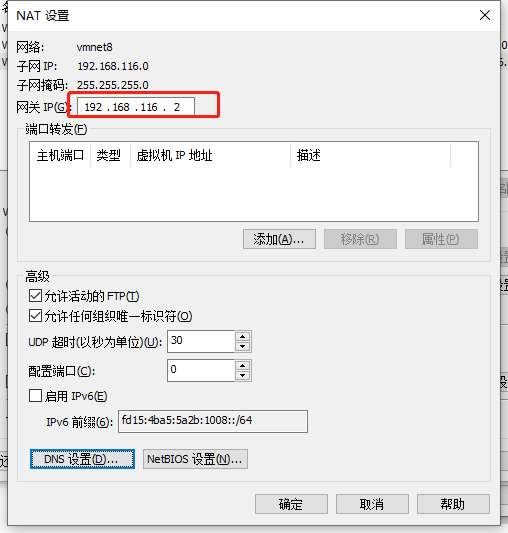
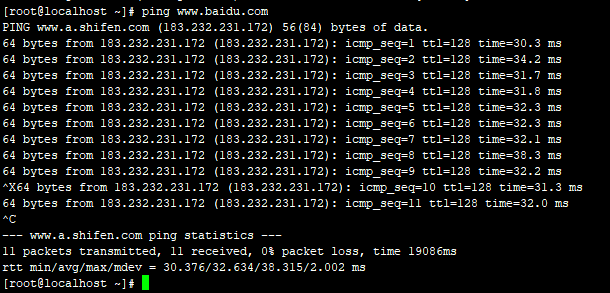
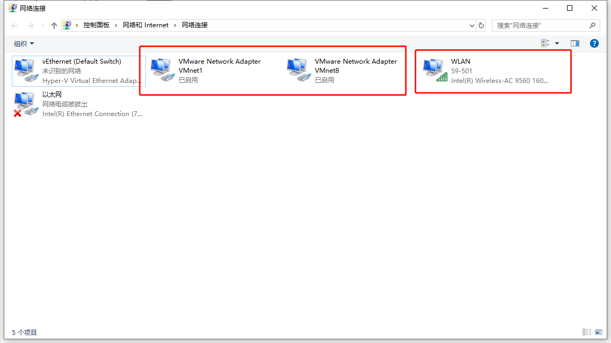

# Centos7配置静态IP

> 环境：Vmware14
>
> 系统：Centos7
>
> 网络连接方式：NAT模式


## 1.虚拟机设置

- 虚拟机网路设置，选择NAT模式

  

- 打开VMWare->编辑->虚拟网络编辑器->点击更改设置



​	*这里 勾选DHCP设置、记住子网IP和子网掩码*

- ​	点击【**DHCP设置**】



​		我们要设置的ip地址，除了网段跟子网IP相同外，ip地址范围需要在128——254之间，否则不能联网

- 查看网关地址，点击**NAT设置**

  

然后启动或重启虚拟机


## 2.编辑网络配置文件

- 编辑 ifcfg-ens33

```shell
vi /etc/sysconfig/network-scripts/ifcfg-ens33
```

*我的是 ifcfg-ens33，别的可能不同*

注意配置一下几项

```shell
BOOTPROTO=static # 静态
ONBOOT=yes # 开机启动
IPADDR=192.168.116.130 # ip地址，在DHCP设置的范围内
NETMASK=255.255.255.0 # 子网掩码
GATEWAY=192.168.116.2 # 网关
DNS1=8.8.8.8 # DNS
DNS2=8.8.4.4
```

完整配置如下：

```shell
TYPE=Ethernet
PROXY_METHOD=none
BROWSER_ONLY=no
BOOTPROTO=static
DEFROUTE=yes
IPV4_FAILURE_FATAL=no
IPV6INIT=yes
IPV6_AUTOCONF=yes
IPV6_DEFROUTE=yes
IPV6_FAILURE_FATAL=no
IPV6_ADDR_GEN_MODE=stable-privacy
NAME=ens33
UUID=59534708-f47c-4427-8e11-e4eb33cfe06a
DEVICE=ens33
ONBOOT=yes
IPADDR=192.168.116.130
NETMASK=255.255.255.0
GATEWAY=192.168.116.2
DNS1=8.8.8.8
DNS2=8.8.4.4
```

- DNS文件配置

```shell
vi /etc/resolv.conf 
```

配置如下：

```shell
nameserver 8.8.8.8
nameserver 8.8.4.4
```

保存退出

- 重启网络服务

  ```shell
  service network restart
  ```

- 测试

  ```shell
  ping www.baidu.com
  ```

  

可以连接外网了！


## 问题解决

如果出现 ping www.baidu.com 报name or service not known

1、首先检查宿主机的网络连接是否正常，虚拟网卡是否启用




2、查看电脑服务管理中，响应的虚拟机网络服务程序是否开启


​	如果服务不是处于运行状态，则虚拟机也是无法连接网络的。