# VMware14安装Centos7

- **新建虚拟机**

  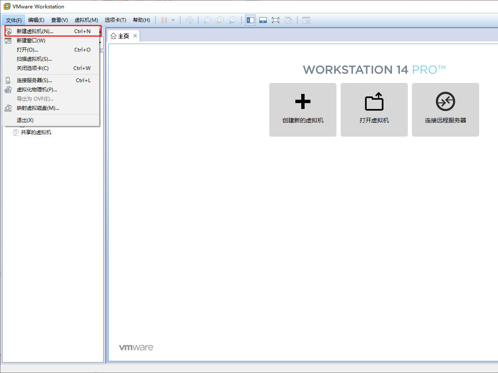

- **选择配置类型**

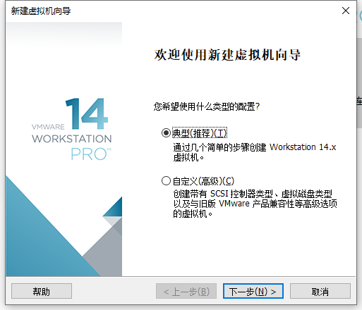

- **稍后安装操作系统**

  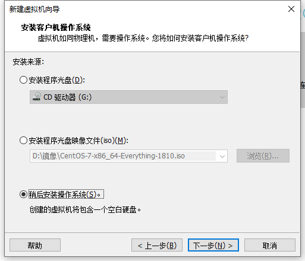

- **选择操作系统版本**

  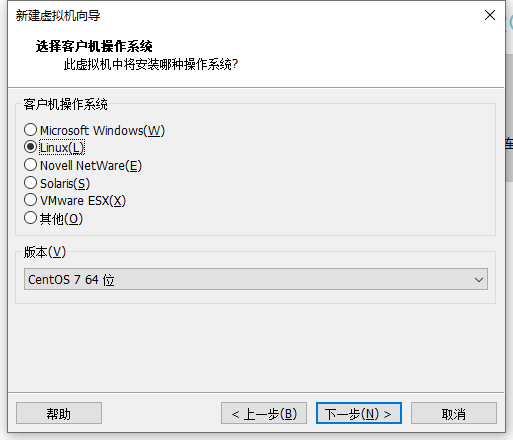

- **设置虚拟机名称和安装路径**

  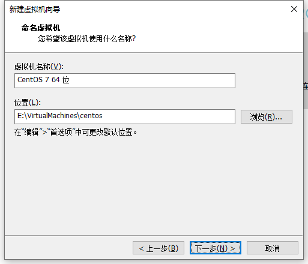

- **设置虚拟机磁盘**

  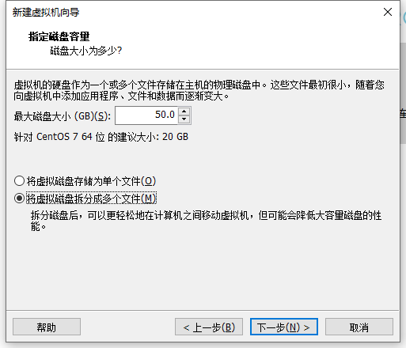

- **点击【完成】**

  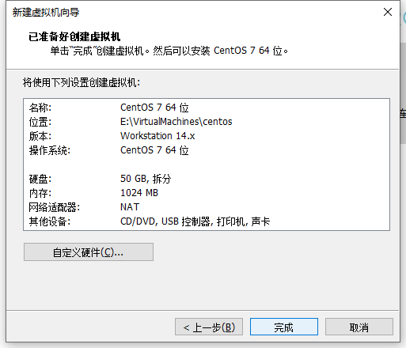

- **编辑虚拟机设置**

  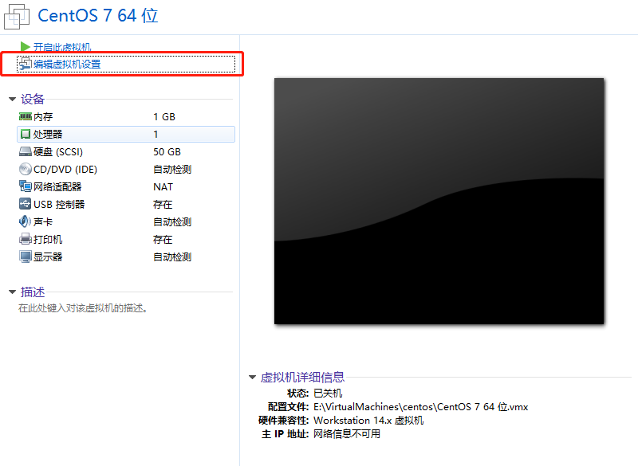

  1. 设置网路---> NAT模式

     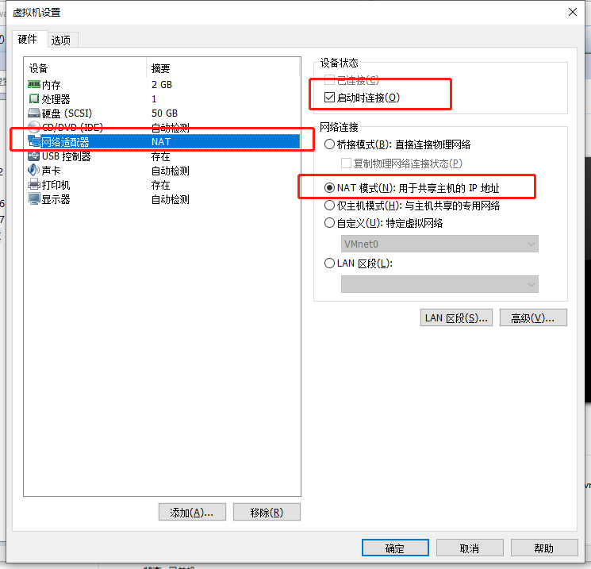

  2. 内存调大一点

     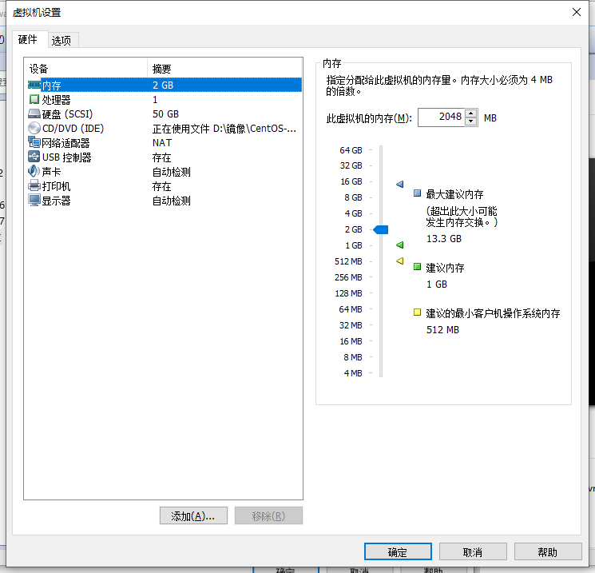

  3. 选择ISO镜像文件

     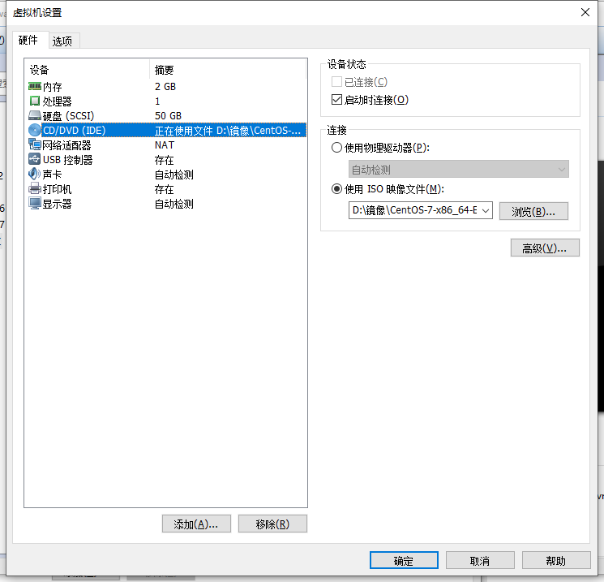

点击 **【确定】**

- **开始安装Centos7，点击【开启虚拟机】**

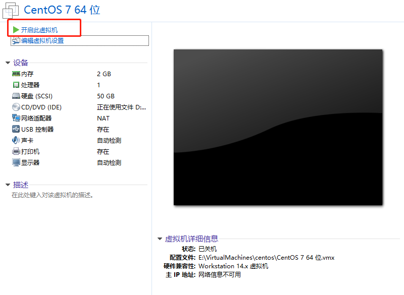

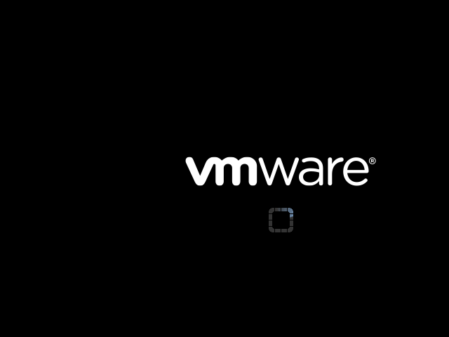

- **选择 Install Centos7，然后回车**

  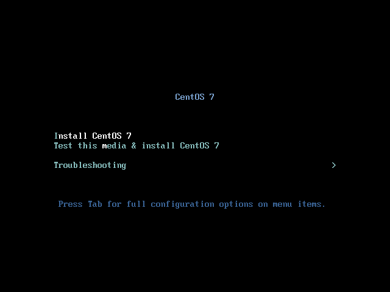

  进入安装页面后，会有文字提示，此时再回车

- **选择语言，点击【Continue】**

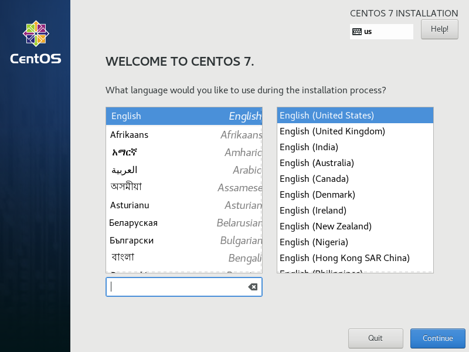

然后就是系统检查，此时需要选择磁盘

- **设置磁盘**

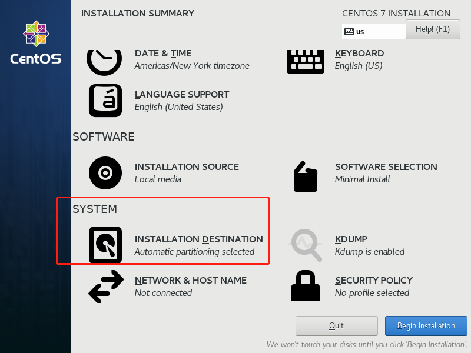

​	为了简化安装过程，这里选择自动配置磁盘，然后点击【**DONE**】

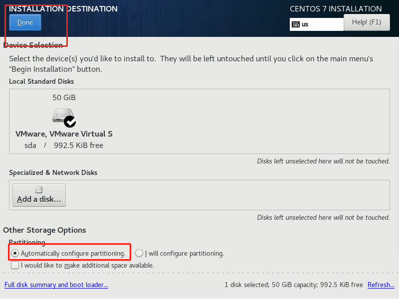

- **点击【Begin Installation】，开始安装**

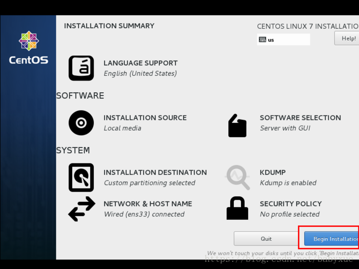

- **设置root账户密码，和新建新用户**

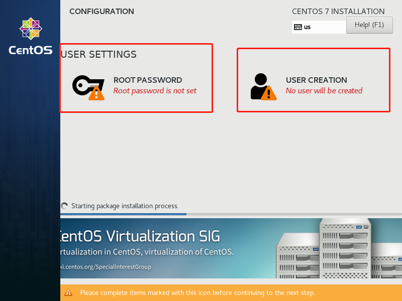

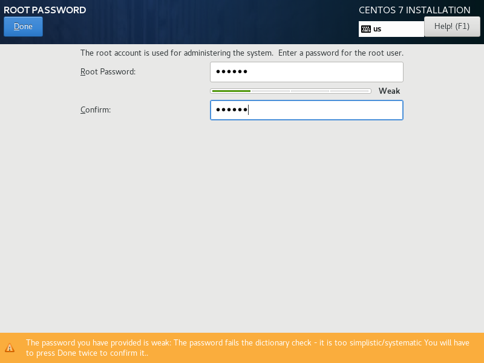

- **等待安装完成**

  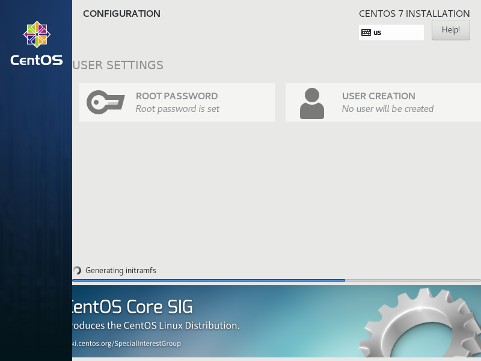

- **安装完成，点击【Robot】，重启虚拟机**

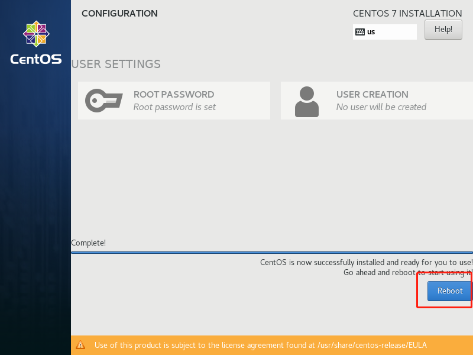

- 输入用户名密码，完成登录

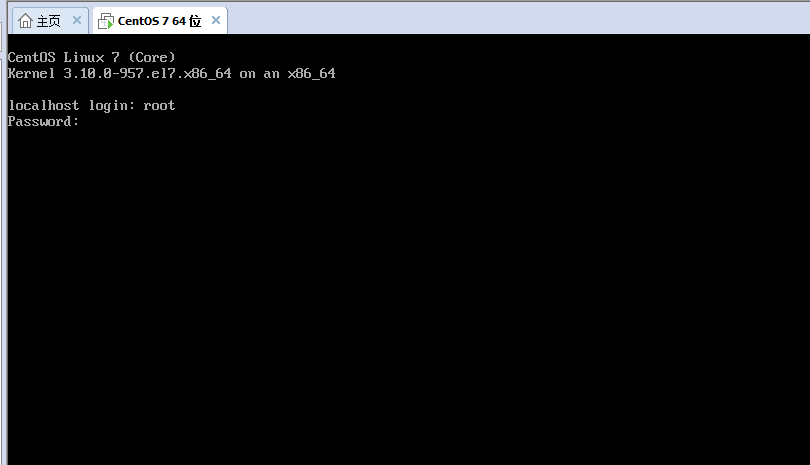